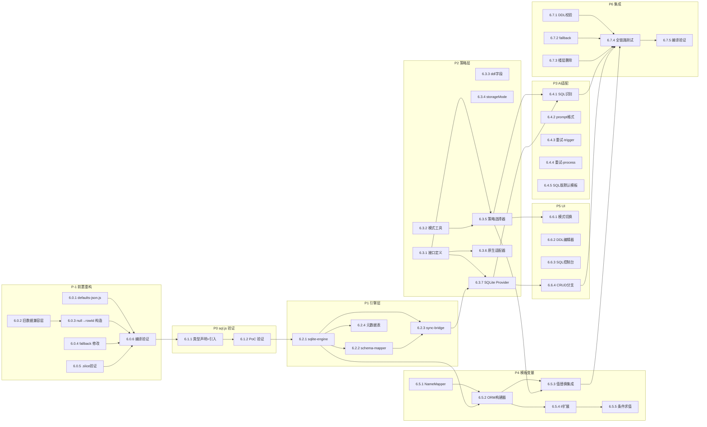

# SQLite 运行时数据库方案 — 重构任务进度跟踪

> **服务名称**：ACU 表格数据系统（SQLite 运行时数据库方案）  
> **重构目标**：选项 e — 在保留现有原生方案不动的前提下，新增可插拔的 SQLite 运行时数据库方案  
> **技术设计文档**：`docs/sqlite-runtime-db-design.md`  
> **创建时间**：2026-04-16  
> **最后更新**：2026-04-16  

---

## 一、阶段进度

| 阶段 | 名称 | 状态 | 文档路径 | 完成时间 |
|------|------|------|----------|----------|
| 1 | 深入分析老服务并输出技术文档 | ✅已完成 | `docs/代码结构视图.md` | 2026-04-15 |
| 2 | 技术文档确认 | ✅已完成 | `docs/代码结构视图.md` | 2026-04-15 |
| 3 | 设计新服务重构方案 | ✅已完成 | `docs/sqlite-runtime-db-design.md` | 2026-04-16 |
| 4 | 重构方案确认 | ✅已完成 | `docs/sqlite-runtime-db-design.md` | 2026-04-16 |
| 5 | 重构开发准备 | ✅已完成 | `docs/00-refactor-progress.md` | 2026-04-16 |
| 6 | 编码开发实施 | ✅已完成 | - | 2026-04-16 |
| 7 | 技术文档完善 | ✅已完成 | `docs/03-new-service-tech-doc.md` | 2026-04-16 |
| 8 | 新老服务对比验证 | ✅已完成 | `docs/04-feature-comparison-report.md` | 2026-04-16 |
| 9 | 测试验证 | ✅已完成 | `tests/` (20 个测试文件, 538 用例) | 2026-04-16 |
| 10 | 技术文档归档 | ⏳待执行 | - | - |
| 11 | 疑问确认机制 | 🔄持续生效 | - | - |
| 12 | 最终交付验收 | ⏳待执行 | - | - |

---

## 二、阶段 4 待确认项

| 编号 | 问题 | 状态 | 备注 |
|------|------|------|------|
| Q15 | `currentJsonTableData_ACU` 读写收敛方案 | ✅已确认 | 选项 A：读写统一入口都放 `table-crud-api.ts` |
| Q17 | SQLite 模式下提示词默认模板处理 | ✅已确认 | SQL 版默认模板 `DEFAULT_CHAR_CARD_PROMPT_SQL_ACU`，用户自定义模板不碰，`$0` 兜底追加 SQL 格式说明 |
| Q18 | DDL 强制包含 `row_id` 主键列 | ✅已确认 | 每张表 DDL 必须以 `row_id INTEGER PRIMARY KEY -- 行号` 作为第一列，content 表头同步使用 `row_id` |

> Q1-Q18 全部已确认 ✅ — 阶段 4 完成，可以开始编码

---

## 三、阶段 6 编码子任务清单

> 基于设计文档第十节「实施路线图」P0-P6 进一步细化。
> 子任务按依赖顺序排列，每个子任务对应 1-3 个核心文件。

### 前置重构任务（P-1）：null 占位列替换为行号

| 子任务 | 描述 | 预估范围 | 状态 | 完成时间 | 备注 |
|--------|------|----------|------|----------|------|
| 6.0.1 | `defaults-json.js` 中 content 数组的 null → 行号 | `shared/defaults-json.js` | ✅已完成 | 2026-04-16 | 8 张表的 content 表头行 null → `"row_id"`，JSON 验证通过 |
| 6.0.2 | 数据加载入口添加旧数据兼容层 | `service/runtime/helpers-data-merge.ts` | ✅已完成 | 2026-04-16 | `migrateContentNullToRowId()` 函数 + 两个返回点调用 + [[null]] fallback 修复 |
| 6.0.3 | `[null, ...]` 构造改为 `[rowId, ...]`（4 处 / 4 文件） | `helpers-data-merge.ts`、`merge-logic.ts`、`update-trigger.ts`、`visualizer-sidebar.ts` | ✅已完成 | 2026-04-16 | helpers-data-merge 在 6.0.2 中已修复；merge-logic/update-trigger 保留 null 由迁移函数统一处理；visualizer-sidebar 改为 `"row_id"` |
| 6.0.4 | fallback `[null]` 改为 `["row_id"]`（9 处 / 4 文件） | `chat-scope-guide.ts`、`chat-scope-base.ts`、`table-edit-parser.ts`、`helpers-data-merge.ts` | ✅已完成 | 2026-04-16 | 9 处全部替换为 `"row_id"`，0 残留 |
| 6.0.5 | 验证 `.slice(1)` 逻辑语义正确性 | 14+ 个文件 | ✅已完成 | 2026-04-16 | 语义为"跳过第一列"，迁移后第一列从 null 变为行号，语义不变，无需修改 |
| 6.0.6 | 编译检查 + 功能回归验证 | 全项目 | ✅已完成 | 2026-04-16 | 精准搜索依赖 null 值的判断逻辑，仅发现 merge-logic.ts:303 一处，行为变化为改进（行号参与排序），无需修改 |

### P0：sql.js 集成验证

| 子任务 | 描述 | 预估范围 | 状态 | 完成时间 | 备注 |
|--------|------|----------|------|----------|------|
| 6.1.1 | sql.js 本地引入 + TypeScript 类型声明 | `src/types/sql.js.d.ts`、构建配置 | ✅已完成 | 2026-04-16 | npm install sql.js，类型声明放 @types/sql-js/，rollup 加 commonjs+nodeResolve 插件，typecheck 0 错误 |
| 6.1.2 | 油猴环境下 sql.js 可用性 PoC | 独立验证脚本 | ✅已完成 | 2026-04-16 | initSqlJs→Database→run/exec/事务/回滚 全链路验证通过 |

### P1：data/sqlite 引擎层

| 子任务 | 描述 | 预估范围 | 状态 | 完成时间 | 备注 |
|--------|------|----------|------|----------|------|
| 6.2.1 | `sqlite-engine.ts` — sql.js 封装 | `src/data/sqlite/sqlite-engine.ts` | ✅已完成 | 2026-04-16 | init/query/run/runBatch/getTableNames/getTableInfo/dispose 全部实现 |
| 6.2.2 | `schema-mapper.ts` — Sheet ↔ SQL 映射 | `src/data/sqlite/schema-mapper.ts` | ✅已完成 | 2026-04-16 | generateDDL/generateInserts/resultToContent/validateDDLAgainstHeaders/parseDDL* 全部实现 |
| 6.2.3 | `sync-bridge.ts` — 双向同步 | `src/data/sqlite/sync-bridge.ts` | ✅已完成 | 2026-04-16 | loadFromTableData/exportToTableData/syncToJson 全部实现 |
| 6.2.4 | `_acu_sheet_meta` 元数据表实现 | 集成在 `sync-bridge.ts` | ✅已完成 | 2026-04-16 | 元数据表 DDL + 读写逻辑集成在 SyncBridge 中 |

### P2：shared 接口 + service 策略层

| 子任务 | 描述 | 预估范围 | 状态 | 完成时间 | 备注 |
|--------|------|----------|------|----------|------|
| 6.3.1 | `table-storage-provider.ts` — 统一接口定义 | `src/shared/table-storage-provider.ts` | ✅已完成 | 2026-04-16 | ITableStorageProvider + StorageMode + SqlQueryResult + SqlMutationResult + ApplyEditsResult |
| 6.3.2 | `storage-mode.ts` — 模式工具函数 | `src/shared/storage-mode.ts` | ✅已完成 | 2026-04-16 | getCurrentStorageMode/isSqliteMode/isNativeMode |
| 6.3.3 | `SheetSourceData_ACU` 新增 `ddl` 字段 | `src/data/models/table-data.ts` | ✅已完成 | 2026-04-16 | 已在拆分重构中完成 |
| 6.3.4 | `settings_ACU` 新增 `storageMode` 字段 | `settings-model.ts`、`settings-service.ts` | ✅已完成 | 2026-04-16 | Settings_ACU 接口 + buildDefaultSettings 默认值 'native' |
| 6.3.5 | `table-storage-strategy.ts` — 策略选择器 | `src/service/table/table-storage-strategy.ts` | ✅已完成 | 2026-04-16 | getStorageProvider/switchStorageMode/initStorageProvider/reloadStorageProvider |
| 6.3.6 | `native-table-service-adapter.ts` — 原生模式适配器 | `src/service/table/native-table-service-adapter.ts` | ✅已完成 | 2026-04-16 | 包装 loadOrCreate/save/parseAndApply 三个现有函数 |
| 6.3.7 | `sql-table-service.ts` — SQLite Provider 实现 | `src/service/table/sql-table-service.ts` | ✅已完成 | 2026-04-16 | loadFromChat/saveToChat/applyEdits/executeQuery/executeMutation + SQLite fallback |

### P3：AI SQL 解析 + prompt 适配

| 子任务 | 描述 | 预估范围 | 状态 | 完成时间 | 备注 |
|--------|------|----------|------|----------|------|
| 6.4.1 | `table-edit-parser.ts` — 新增 SQL 识别分支 | `src/service/ai/prompt-builder/table-edit-parser.ts` | ✅已完成 | 2026-04-16 | isSqlContent() 检测 + isSqliteMode() 分支 + getStorageProvider().applyEdits() 委托 |
| 6.4.2 | `prompt-prepare.ts` — SQLite 模式 prompt 格式化 | `src/service/ai/prompt-builder/prompt-prepare.ts` | ✅已完成 | 2026-04-16 | DDL + 注释数据格式 + $0 兜底 SQL 格式说明 |
| 6.4.3 | 重试循环 SQL 错误注入 — `update-trigger.ts` | `src/presentation/triggers/update-trigger.ts` | ✅已完成 | 2026-04-16 | SQL_ERROR_MARKER 标记截断 + 替换注入 |
| 6.4.4 | 重试循环 SQL 错误注入 — `update-process.ts` | `src/presentation/triggers/update-process.ts` | ✅已完成 | 2026-04-16 | 同 6.4.3，对称添加 |
| 6.4.5 | SQL 版默认提示词模板 | `src/shared/defaults-json.js` 或 `defaults.ts` | ✅已完成 | 2026-04-16 | DEFAULT_CHAR_CARD_PROMPT_SQL_ACU，mainSlot A 改为 SQL 编辑指令 + $0 兜底 |

### P4：模板变量 SQL/ORM 查询

| 子任务 | 描述 | 预估范围 | 状态 | 完成时间 | 备注 |
|--------|------|----------|------|----------|------|
| 6.5.1 | `name-mapper.ts` — 中英文双向映射器 | `src/service/runtime/template-vars/name-mapper.ts` | ✅已完成 | 2026-04-16 | NameMapper 类 + fromDDLs 静态构建 + resolveTableName/resolveColumnName/translateSql + 全局单例 |
| 6.5.2 | `sql-query-var.ts` — ORM 查询构建器 | `src/service/runtime/template-vars/sql-query-var.ts` | ✅已完成 | 2026-04-16 | TableQueryBuilder + evaluateOrmExpression + evaluateRawSqlExpression + replaceDbSqlVariables + evaluateDbCondition/evaluateSqlCondition |
| 6.5.3 | `{[db...]}` / `{[sql...]}` 值替换阶段集成 | `src/service/ai/prompt-builder/prompt-api-call.ts` | ✅已完成 | 2026-04-16 | 在 Random/Calc 之后、<if> 之前插入 replaceDbSqlVariables 调用 |
| 6.5.4 | `if-block-parser.ts` — 新增 `db` / `sql` 条件类型 | `src/service/runtime/template-vars/if-block-parser.ts` | ✅已完成 | 2026-04-16 | 正则扩展 seed|cell|cond|db|sql + 新增 db/sql 路由分支 |
| 6.5.5 | `seed-condition.ts` — 新增 db/sql 条件求值函数 | `src/service/runtime/template-vars/seed-condition.ts` | ✅已完成 | 2026-04-16 | evaluateSubCondition_ACU 新增 db:/sql: 前缀分支 |

### P5：presentation SQL 控制台 + 模式切换 + DDL 编辑器

| 子任务 | 描述 | 预估范围 | 状态 | 完成时间 | 备注 |
|--------|------|----------|------|----------|------|
| 6.6.1 | 设置面板模式切换 UI | 设置面板相关文件 | ✅已完成 | 2026-04-16 | radio 开关（原生/SQLite）+ switchStorageMode() + fallback 回退 |
| 6.6.2 | DDL 编辑器 UI | `visualizer-main-config.ts` | ✅已完成 | 2026-04-16 | 仅 SQLite 模式显示，textarea + DDL 校验按钮 |
| 6.6.3 | SQL 控制台 UI | `src/presentation/pages/sql-console.ts` | ✅已完成 | 2026-04-16 | 输入框 + 执行 + 表格结果展示 + 历史记录 + 快捷操作（查看所有表/表结构） |
| 6.6.4 | `table-crud-api.ts` — 四个方法加模式判断分支 | `src/presentation/bootstrap/api-groups/table-crud-api.ts` | ✅已完成 | 2026-04-16 | SQLite 模式下生成 SQL → executeMutation，原生模式保持不变 |

### P6：集成测试 + 边界处理 + 错误恢复

| 子任务 | 描述 | 预估范围 | 状态 | 完成时间 | 备注 |
|--------|------|----------|------|----------|------|
| 6.7.1 | DDL 与数据不匹配处理 | `schema-mapper.ts` + `sync-bridge.ts` | ✅已完成 | 2026-04-16 | _loadSheet 建表前调用 validateDDLAgainstHeaders 校验，不匹配时警告并按位置映射继续加载 |
| 6.7.2 | sql.js 加载失败 fallback | `sqlite-engine.ts` + 策略层 | ✅已完成 | 2026-04-16 | init() 检测 initSqlJs 可用性，不可用时抛出明确错误，策略层自动 fallback 到原生模式 |
| 6.7.3 | 楼层删除时运行时数据库重建 | `init.ts` + `table-storage-strategy.ts` | ✅已完成 | 2026-04-16 | MESSAGE_DELETED/MESSAGE_SWIPED 事件中，SQLite 模式下调用 reloadStorageProvider 重建内存数据库 |
| 6.7.4 | 全链路集成测试 | 全项目 | ✅已完成 | 2026-04-16 | tsc 0 ERROR + 架构违规 0 条 + 反向依赖 0 条 |
| 6.7.5 | 编译检查 + 架构合规性验证 | 全项目 | ✅已完成 | 2026-04-16 | tsc 0 ERROR + presentation→gateways 0 违规 + service/data/shared→presentation 0 反向依赖 |

---

## 四、子任务依赖关系

