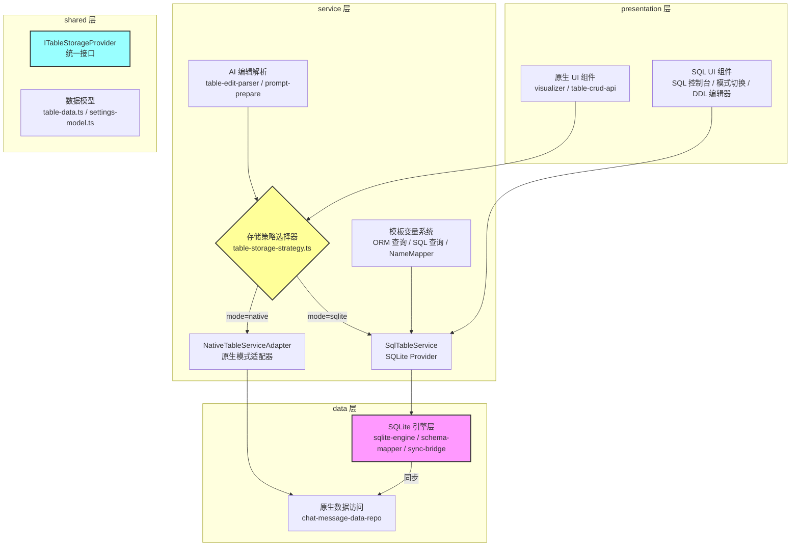
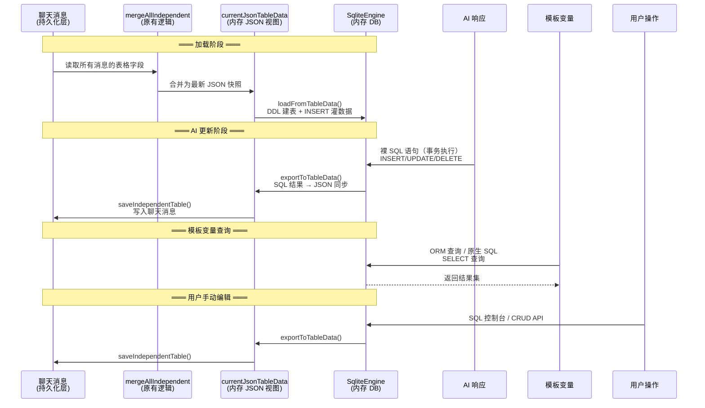

# ACU 表格数据系统 — 新服务技术文档

> **服务名称**：ACU 表格数据系统（SQLite 运行时数据库方案）  
> **版本**：v1.0  
> **创建时间**：2026-04-16  
> **对应设计文档**：`docs/sqlite-runtime-db-design.md`  
> **对应进度文档**：`docs/00-refactor-progress.md`

---

## 一、服务概述

### 1.1 服务定位

ACU（Auto Card Updater）表格数据系统是 SillyTavern 平台的油猴插件，用于管理 AI 角色扮演对话中的结构化表格数据（角色信息、背包物品、全局状态等）。

本次重构在**保留原有原生方案不动**的前提下，新增了**可插拔的 SQLite 运行时数据库方案**，通过策略模式实现两种存储模式的无缝切换。

### 1.2 核心能力

| 能力 | 原生模式 | SQLite 模式（新增） |
|------|---------|-------------------|
| 数据存储格式 | JSON 二维数组 (`content[][]`) | SQLite 内存数据库 + JSON 视图同步 |
| AI 编辑格式 | 自定义 DSL (`insertRow/updateRow/deleteRow`) | 标准 SQL (`INSERT/UPDATE/DELETE`) |
| 数据校验 | 无（全 string） | DDL 类型约束 (`INTEGER/TEXT/CHECK`) |
| 查询能力 | 按行列索引取值 | 完整 SQL（JOIN/聚合/子查询） |
| 模板变量 | `<if cell="表/行/列 == 值">` | ORM 链式查询 + 原生 SQL + `<if db/sql>` |
| 持久化 | JSON → ChatMessage | SQLite → JSON → ChatMessage（格式不变） |

### 1.3 技术栈

| 组件 | 技术 | 版本 |
|------|------|------|
| 运行环境 | 油猴脚本（Tampermonkey） | - |
| 宿主平台 | SillyTavern | - |
| 开发语言 | TypeScript | 5.x |
| 构建工具 | Rollup | - |
| SQLite 引擎 | sql.js（asm.js 版本） | 1.10.3 |
| 输出格式 | 单文件 IIFE bundle | - |

---

## 二、整体架构

### 2.1 四层架构

```
src/
├── presentation/   (19,184 行)  UI 层：页面渲染、事件绑定、用户交互
├── service/        (18,032 行)  业务逻辑层：表格操作、AI 调用、模板变量
├── data/            (2,770 行)  数据访问层：SQLite 引擎、宿主 API 网关
└── shared/          (2,421 行)  共享层：类型定义、常量、工具函数
```

**依赖方向**：`presentation → service → data`，`shared` 被所有层引用。**无反向依赖**。

### 2.2 架构图



### 2.3 数据流



---

## 三、模块详细说明

### 3.1 data 层 — SQLite 引擎 (`src/data/sqlite/`)

本次重构新增的核心模块，共 3 个文件 905 行。

#### 3.1.1 `sqlite-engine.ts` (264 行)

sql.js 的薄封装，管理内存数据库的生命周期。

| 方法 | 说明 |
|------|------|
| `init()` | 初始化 sql.js + 创建空内存数据库，启用外键约束 |
| `query(sql, params?)` | 执行 SELECT，返回 `{ columns, values }` |
| `run(sql, params?)` | 执行单条 DML/DDL，返回 `{ changes }` |
| `runBatch(statements)` | 事务批量执行，任何一条失败 → ROLLBACK + 抛出定位错误 |
| `getTableNames()` | 获取用户表名（排除 `_acu_` 前缀系统表） |
| `getTableInfo(tableName)` | PRAGMA table_info，返回列信息数组 |
| `getTableDDL(tableName)` | 从 sqlite_master 读取建表 DDL |
| `dispose()` | 关闭数据库，释放内存 |
| `exportBinary()` | 导出数据库为 Uint8Array（调试用） |

**关键设计**：
- `runBatch` 采用整批事务（BEGIN → 逐条执行 → COMMIT/ROLLBACK），保证原子性
- 错误信息格式化为 `"第 N 条语句失败: [SQL] → [错误]"`，供 AI 重试时注入 prompt
- 表名防注入：`getTableInfo` 校验表名只允许 `[a-zA-Z_][a-zA-Z0-9_]*`

#### 3.1.2 `schema-mapper.ts` (398 行)

Sheet ↔ SQL 的双向映射，处理 DDL 生成、INSERT 生成、结果转换。

| 函数 | 说明 |
|------|------|
| `generateDDL(sheet)` | 优先用 `sourceData.ddl`，fallback 自动生成全 TEXT DDL |
| `generateFallbackDDL(tableName, headers)` | 从 content[0] 表头生成 DDL，第一列强制 `row_id INTEGER PRIMARY KEY` |
| `generateInserts(sheet, tableName?)` | 从 content[1:] 生成 INSERT 语句数组 |
| `resultToContent(columns, values, chineseHeaders?)` | SQL 结果 → content 二维数组，自动类型转换 |
| `validateDDLAgainstHeaders(ddl, headers)` | 校验 DDL 列名与表头的一致性 |
| `parseDDLTableName(ddl)` | 解析英文表名 |
| `parseDDLChineseName(ddl)` | 解析第一行注释中的中文表名 |
| `parseDDLColumnNames(ddl)` | 解析所有列名（处理嵌套括号） |
| `parseDDLColumnComments(ddl)` | 解析列名 → 注释映射 |
| `buildColumnNameMap(ddl)` | 构建英文 ↔ 中文双向列名映射 |

**关键设计**：
- 值转换：`null/undefined → NULL`，纯数字 → 数字字面量，其他 → 单引号字符串
- 标识符清理：非法字符替换为下划线，防止 SQL 注入
- DDL 列定义分割：处理 `CHECK(...)` 等嵌套括号内的逗号

#### 3.1.3 `sync-bridge.ts` (243 行)

SQLite ↔ ChatMessage 的双向同步桥。

| 方法 | 说明 |
|------|------|
| `loadFromTableData(data)` | JSON → SQLite：建元数据表 → 遍历 sheet 建表灌数据 |
| `exportToTableData(mate)` | SQLite → JSON：读元数据 → SELECT 每张表 → 还原 Sheet_ACU |
| `syncToJson(originalData)` | 仅同步到 JSON 视图（不写聊天消息） |

**关键设计**：
- `_acu_sheet_meta` 元数据表存储 sheet 的配置信息（sourceData/updateConfig/exportConfig），对用户和 AI 不可见
- 单张表加载失败不影响其他表（try-catch 隔离）
- DDL 与表头不匹配时发出警告，按位置映射继续加载

### 3.2 shared 层 — 统一接口

#### 3.2.1 `table-storage-provider.ts` (111 行)

定义 `ITableStorageProvider` 统一接口，是策略模式的核心契约。

```typescript
export interface ITableStorageProvider {
  readonly mode: StorageMode;                    // 'native' | 'sqlite'
  loadFromChat(): Promise<LoadResult>;           // 从聊天消息加载
  saveToChat(sheetKeys?, groupKeys?): Promise<SaveResult>;  // 保存到聊天消息
  getCurrentData(): TableDataObject_ACU | null;  // 获取当前 JSON 视图
  applyEdits(edits, updateMode?): ApplyEditsResult;  // 应用 AI 编辑
  executeQuery(sql, params?): SqlQueryResult;    // SQL 查询（仅 sqlite）
  executeMutation(sql, params?): SqlMutationResult;  // SQL 变更（仅 sqlite）
  dispose(): void;                               // 清理资源
}
```

同时定义了 `StorageMode`、`SqlQueryResult`、`SqlMutationResult`、`ApplyEditsResult` 等类型。

#### 3.2.2 `models/table-data.ts` (89 行)

核心数据模型定义。本次重构新增 `SheetSourceData_ACU.ddl` 可选字段：

```typescript
export interface SheetSourceData_ACU {
  note: string;
  initNode: string;
  deleteNode: string;
  updateNode: string;
  insertNode: string;
  ddl?: string;  // [新增] SQLite 模式下的建表 DDL
}
```

### 3.3 service 层 — 策略与业务逻辑

#### 3.3.1 `table/table-storage-strategy.ts` (178 行)

策略选择器，是上层代码获取 Provider 的**唯一入口**。

| 函数 | 说明 |
|------|------|
| `getStorageProvider()` | 获取当前 Provider（懒初始化） |
| `initStorageProvider()` | 应用启动时初始化，SQLite 失败自动 fallback |
| `switchStorageMode(mode)` | 用户切换模式，销毁旧实例 → 创建新实例 → 加载数据 |
| `reloadStorageProvider()` | 楼层删除/回滚时重新加载（不切换模式） |
| `getCurrentProviderMode()` | 获取当前模式 |

**关键设计**：
- SQLite 模式初始化/切换失败时，自动 fallback 到原生模式
- `reloadStorageProvider` 在 SQLite 模式下会销毁并重建数据库实例

#### 3.3.2 `table/sql-table-service.ts` (363 行)

SQLite 模式的 `ITableStorageProvider` 实现。

| 方法 | 核心逻辑 |
|------|---------|
| `loadFromChat()` | `engine.init()` → `mergeAllIndependentTables_ACU()` → `syncBridge.loadFromTableData()` → 构建 NameMapper |
| `saveToChat()` | `syncBridge.exportToTableData()` → 更新 JSON 视图 → `saveIndependentTableToChatHistory_ACU()` |
| `getCurrentData()` | 从 SQLite 导出最新状态，同步更新 JSON 视图 |
| `applyEdits(sql)` | 清理 HTML 注释 → 按分号拆分 → `engine.runBatch()` 事务执行 → 同步 JSON → 返回受影响的 sheetKey |
| `executeQuery(sql)` | 直接委托 `engine.query()` |
| `executeMutation(sql)` | `engine.run()` + 自动 `syncToJson()` |
| `dispose()` | 销毁引擎 + 销毁 NameMapper |

**关键设计**：
- SQL 语句拆分处理字符串内的分号（状态机解析）
- 从 SQL 语句中提取受影响的表名（正则匹配 INSERT INTO/UPDATE/DELETE FROM/ALTER TABLE）
- 表名 → sheetKey 映射通过 DDL 中的表名匹配

#### 3.3.3 `table/native-table-service-adapter.ts` (96 行)

原生模式的适配器，将现有函数包装为 `ITableStorageProvider` 接口。

| 方法 | 委托目标 |
|------|---------|
| `loadFromChat()` | `loadOrCreateJsonTableFromChatHistory_ACU()` |
| `saveToChat()` | `saveIndependentTableToChatHistory_ACU()` |
| `getCurrentData()` | 直接返回 `currentJsonTableData_ACU` |
| `applyEdits()` | `parseAndApplyTableEdits_ACU()` |
| `executeQuery()` | 抛出 Error（不支持） |
| `executeMutation()` | 抛出 Error（不支持） |

#### 3.3.4 `table/storage-mode.ts` (33 行)

存储模式工具函数，从 `settings_ACU.storageMode` 读取当前模式。

| 函数 | 说明 |
|------|------|
| `getCurrentStorageMode()` | 返回 `'native'` 或 `'sqlite'` |
| `isSqliteMode()` | 判断是否为 SQLite 模式 |
| `isNativeMode()` | 判断是否为原生模式 |

#### 3.3.5 `runtime/template-vars/name-mapper.ts` (202 行)

中英文名称双向映射器，从 DDL 注释自动构建。

| 方法 | 说明 |
|------|------|
| `NameMapper.fromDDLs(ddlMap)` | 静态构建：解析所有表的 DDL 注释 |
| `resolveTableName(name)` | 中文表名 → 英文表名（英文直接透传） |
| `resolveColumnName(table, col)` | 中文列名 → 英文列名 |
| `translateSql(sql)` | 原生 SQL 中的中文名替换为英文名（跳过字符串值） |
| `getChineseTableName(en)` | 反向：英文 → 中文（用于展示） |

**关键设计**：
- `translateSql` 先提取单引号字符串用占位符替代，替换后再放回，避免误替换数据值
- 长名称优先替换，避免子串误匹配
- 全局单例通过 `buildGlobalNameMapper()` / `getNameMapper()` 管理

#### 3.3.6 `runtime/template-vars/sql-query-var.ts` (472 行)

ORM 查询构建器 + 原生 SQL 兜底 + 模板变量值替换 + `<if>` 条件求值。

**ORM 查询构建器 `TableQueryBuilder`**：

```typescript
// 链式 API 示例
db.背包物品表.where("物品名称", "铁剑").get("数量")
db.重要人物表.where("年龄", ">", 20).count()
db.重要人物表.where("状态", "存活").list("姓名")
```

| 终结方法 | 返回类型 | 说明 |
|---------|---------|------|
| `get(col)` | `string \| number \| null` | 第一行指定列的值 |
| `first()` | `Record \| null` | 第一行所有列 |
| `list(col)` | `(string \| number)[]` | 指定列的值列表 |
| `all()` | `Record[]` | 所有行 |
| `count()` | `number` | 行数 |
| `sum(col)` | `number` | 求和 |
| `exists()` | `boolean` | 是否存在 |

**关键设计**：
- 通过 `Proxy` + `new Function` 实现 `db.xxx` 自动创建 `TableQueryBuilder`，JS 引擎原生处理链式调用
- `where(col, null)` 自动转为 `IS NULL`
- `replaceDbSqlVariables(content)` 替换文本中的 `{[db...]}` 和 `{[sql...]}` 模板变量
- `evaluateDbCondition(expr)` / `evaluateSqlCondition(expr)` 为 `<if db/sql>` 提供条件求值

#### 3.3.7 AI 编辑解析适配

**`ai/prompt-builder/table-edit-parser.ts`**（修改）：
- 新增 `isSqlContent()` 检测函数，判断 `<tableEdit>` 内容是 SQL 还是 DSL
- SQLite 模式下委托 `getStorageProvider().applyEdits()` 执行 SQL

**`ai/prompt-builder/prompt-prepare.ts`**（修改）：
- SQLite 模式下，表格数据格式化为 DDL + 注释数据格式（而非原生的行列索引格式）
- `$0` 占位符末尾自动追加 SQL 编辑格式说明

**`presentation/triggers/update-trigger.ts` + `update-process.ts`**（修改）：
- 重试循环中新增 `SQL_ERROR_MARKER` 标记截断 + 替换注入机制
- SQL 执行失败时，将错误信息注入下次 AI 请求的 prompt

### 3.4 presentation 层 — SQL UI

#### 3.4.1 `pages/sql-console.ts` (新增)

SQL 控制台页面，提供：
- SQL 输入框（支持 Ctrl+Enter 执行）
- 结果表格渲染（SELECT 结果）
- 变更行数显示（DML 结果）
- 历史记录
- 快捷操作（查看所有表、查看表结构）

#### 3.4.2 模式切换 UI

在 `main-popup-status.ts` 中新增存储模式切换 radio 按钮，在 `popup-bindings-status.ts` 中绑定切换事件，调用 `switchStorageMode()` 并处理失败回退。

#### 3.4.3 DDL 编辑器

在 `visualizer-main-config.ts` 中新增 DDL 编辑区域，仅 SQLite 模式显示，包含 textarea 和 DDL 校验按钮。

#### 3.4.4 CRUD API 模式分支

`table-crud-api.ts` 的 4 个 CRUD 方法（updateCell/updateRow/insertRow/deleteRow）新增 SQLite 模式分支：生成对应 SQL → `executeMutation()` 执行。

---

## 四、核心接口说明

### 4.1 ITableStorageProvider — 统一存储接口

**文件**：`src/shared/table-storage-provider.ts`

这是整个策略模式的核心契约。上层代码通过 `getStorageProvider()` 获取当前 Provider，不需要知道底层是 JSON 操作还是 SQL 操作。

```typescript
interface ITableStorageProvider {
  readonly mode: StorageMode;

  // 加载：从聊天消息 → 运行时
  loadFromChat(): Promise<{
    loaded: boolean;
    source: 'merged' | 'initialized' | 'empty';
    error?: string;
  }>;

  // 保存：运行时 → 聊天消息
  saveToChat(
    targetSheetKeys?: string[] | null,
    updateGroupKeys?: string[] | null,
  ): Promise<{ saved: boolean; messageIndex?: number; error?: string }>;

  // 获取当前 JSON 视图
  getCurrentData(): TableDataObject_ACU | null;

  // 应用 AI 编辑（DSL 或 SQL）
  applyEdits(edits: string, updateMode?: string): ApplyEditsResult;

  // SQL 查询（仅 sqlite）
  executeQuery(sql: string, params?): SqlQueryResult;

  // SQL 变更（仅 sqlite）
  executeMutation(sql: string, params?): SqlMutationResult;

  // 清理资源
  dispose(): void;
}
```

### 4.2 TableQueryBuilder — ORM 查询 API

**文件**：`src/service/runtime/template-vars/sql-query-var.ts`

```typescript
// 创建查询（通过 Proxy 自动实例化）
db.表名                          // → new TableQueryBuilder("表名")

// 链式条件
.where("列名", "值")             // → WHERE 列名 = '值'
.where("列名", ">", 数值)        // → WHERE 列名 > 数值
.where("列名", null)             // → WHERE 列名 IS NULL
.orderBy("列名", "DESC")         // → ORDER BY 列名 DESC
.limit(10)                       // → LIMIT 10

// 终结方法
.get("列名")                     // → 单值
.first()                         // → 单行对象
.list("列名")                    // → 值数组
.all()                           // → 对象数组
.count()                         // → 行数
.sum("列名")                     // → 求和
.exists()                        // → 布尔值
```

### 4.3 NameMapper — 中英文映射 API

**文件**：`src/service/runtime/template-vars/name-mapper.ts`

```typescript
// 全局单例管理
buildGlobalNameMapper(ddlMap)     // SQLite 加载完成后调用
getNameMapper()                   // 获取全局实例
disposeGlobalNameMapper()         // 销毁

// 实例方法
mapper.resolveTableName("背包物品表")     // → "inventory"
mapper.resolveColumnName("inventory", "物品名称")  // → "item_name"
mapper.translateSql("SELECT 数量 FROM 背包物品表")  // → "SELECT quantity FROM inventory"
mapper.getChineseTableName("inventory")   // → "背包物品表"
```

---

## 五、配置项说明

### 5.1 Settings 新增字段

| 字段 | 类型 | 默认值 | 说明 |
|------|------|--------|------|
| `storageMode` | `'native' \| 'sqlite'` | `'native'` | 存储模式，用户在设置面板切换 |

### 5.2 SheetSourceData 新增字段

| 字段 | 类型 | 默认值 | 说明 |
|------|------|--------|------|
| `ddl` | `string \| undefined` | `undefined` | SQLite 建表 DDL，用户在 DDL 编辑器中编写 |

### 5.3 DDL 规范

- 表名和列名**必须全英文**（snake_case），中文含义写在行尾 `--` 注释中
- 每张表**必须**以 `row_id INTEGER PRIMARY KEY -- 行号` 作为第一列
- DDL 注释是 NameMapper 构建中英文映射的数据源
- DDL 是表结构的 single source of truth

**DDL 示例**：
```sql
CREATE TABLE inventory (          -- 背包物品表
  row_id INTEGER PRIMARY KEY,     -- 行号
  item_name TEXT NOT NULL,        -- 物品名称
  quantity INTEGER NOT NULL DEFAULT 1 CHECK(quantity > 0),  -- 数量
  description TEXT,               -- 描述/效果
  category TEXT NOT NULL           -- 类别
);
```

### 5.4 SQL 版默认提示词模板

`DEFAULT_CHAR_CARD_PROMPT_SQL_ACU`：与原生版结构一致，mainSlot A 中的编辑指令从 DSL 格式改为 SQL 格式。

- 用户未自定义模板 → 切换模式时自动切换默认模板
- 用户已自定义模板 → 不碰，`$0` 兜底追加 SQL 格式说明

---

## 六、与老服务主要变更对比

### 6.1 新增文件清单

| 文件 | 行数 | 说明 |
|------|------|------|
| `data/sqlite/sqlite-engine.ts` | 264 | sql.js 封装 |
| `data/sqlite/schema-mapper.ts` | 398 | Sheet ↔ SQL 映射 |
| `data/sqlite/sync-bridge.ts` | 243 | 双向同步桥 |
| `shared/table-storage-provider.ts` | 111 | 统一接口定义 |
| `service/table/sql-table-service.ts` | 363 | SQLite Provider |
| `service/table/table-storage-strategy.ts` | 178 | 策略选择器 |
| `service/table/native-table-service-adapter.ts` | 96 | 原生适配器 |
| `service/table/storage-mode.ts` | 33 | 模式工具函数 |
| `service/runtime/template-vars/sql-query-var.ts` | 472 | ORM 查询 + 值替换 |
| `service/runtime/template-vars/name-mapper.ts` | 202 | 中英文映射 |
| `presentation/pages/sql-console.ts` | ~350 | SQL 控制台 UI |
| **合计** | **~2,710** | |

### 6.2 修改文件清单

| 文件 | 修改类型 | 说明 |
|------|---------|------|
| `shared/models/table-data.ts` | 新增字段 | `SheetSourceData_ACU.ddl` |
| `data/models/settings-model.ts` | 新增字段 | `Settings_ACU.storageMode` |
| `service/settings/settings-service.ts` | 新增默认值 | `buildDefaultSettings` 中 `storageMode: 'native'` |
| `service/ai/prompt-builder/table-edit-parser.ts` | 新增分支 | `isSqlContent()` 检测 + SQLite 模式委托 |
| `service/ai/prompt-builder/prompt-prepare.ts` | 新增分支 | SQLite 模式的 prompt 格式化 |
| `service/ai/prompt-builder/prompt-api-call.ts` | 新增调用 | `replaceDbSqlVariables()` 插入值替换阶段 |
| `service/runtime/template-vars/if-block-parser.ts` | 新增类型 | `db` / `sql` 条件类型识别和路由 |
| `service/runtime/template-vars/seed-condition.ts` | 新增分支 | `db:` / `sql:` 前缀条件求值 |
| `presentation/triggers/update-trigger.ts` | 新增逻辑 | SQL 错误标记截断 + 替换注入 |
| `presentation/triggers/update-process.ts` | 新增逻辑 | 同上 |
| `presentation/pages/main-popup-status.ts` | 新增 UI | 模式切换 radio |
| `presentation/pages/popup-bindings-status.ts` | 新增绑定 | 切换事件处理 |
| `presentation/pages/visualizer-main-config.ts` | 新增 UI | DDL 编辑器 |
| `presentation/bootstrap/api-groups/table-crud-api.ts` | 新增分支 | CRUD 方法的 SQLite 模式分支 |
| `presentation/bootstrap/init.ts` | 新增逻辑 | MESSAGE_DELETED/SWIPED 事件中 SQLite 重建 |
| `shared/defaults-json.js` | 数据修改 | content 中 null → row_id |
| `service/runtime/helpers-data-merge.ts` | 新增函数 | `migrateContentNullToRowId()` 旧数据兼容 |

### 6.3 前置重构（P-1）

将 `content[*][0]` 从无意义的 `null` 占位替换为行号 `row_id`：

- **修改前**：`[null, "物品名称", "数量"]` → `[null, "铁剑", "1"]`
- **修改后**：`["row_id", "物品名称", "数量"]` → `["1", "铁剑", "1"]`

影响 20 个文件，现有 `.slice(1)` 逻辑语义从"跳过 null"变为"跳过行号列"，行为不变。旧数据通过 `migrateContentNullToRowId()` 自动兼容。

### 6.4 原生模式行为变化

**零变化**。所有修改在原生模式下通过 `if (isSqliteMode())` 分支隔离，原生模式的代码路径完全不受影响。唯一的例外是 P-1 的 null → row_id 替换，但这是数据格式改进，不影响功能行为。

---

## 七、错误处理策略

### 7.1 SQL 执行错误 → AI 重试

```
AI 返回 SQL → runBatch 事务执行 → 失败 → ROLLBACK → 抛出错误
→ 上层重试循环捕获 → 错误信息注入下次 prompt → AI 重写 SQL
→ 重试最多 N 次 → 仍失败 → toast 提示用户
```

错误信息格式：`"第 2 条语句失败: INSERT INTO ... → UNIQUE constraint failed: ..."`

### 7.2 sql.js 加载失败 → 自动 fallback

`SqliteEngine.init()` 检测 `initSqlJs` 是否可用，不可用时抛出明确错误。`table-storage-strategy.ts` 捕获后自动 fallback 到原生模式。

### 7.3 DDL 与数据不匹配 → 警告 + 按位置映射

`sync-bridge.ts` 的 `_loadSheet` 在建表前调用 `validateDDLAgainstHeaders` 校验，不匹配时发出 console.warn 并按位置映射继续加载。

### 7.4 楼层删除 → 重建数据库

`init.ts` 中 MESSAGE_DELETED/MESSAGE_SWIPED 事件触发时，SQLite 模式下调用 `reloadStorageProvider()` 销毁并重建内存数据库。

---

## 八、构建配置

### 8.1 依赖

```json
{
  "dependencies": {
    "sql.js": "^1.10.3"
  }
}
```

### 8.2 Rollup 配置

- `@rollup/plugin-commonjs` + `@rollup/plugin-node-resolve` 处理 sql.js 的 CommonJS 格式
- sql.js asm 版本（纯 JS，不依赖 WASM）直接打包进 IIFE bundle

### 8.3 TypeScript 类型声明

`src/types/sql.js.d.ts` 提供 sql.js 的类型声明（`initSqlJs`、`Database`、`QueryExecResult` 等）。

---

## 九、代码量统计

| 层 | 行数 | 占比 |
|----|------|------|
| presentation | 19,184 | 45.2% |
| service | 18,032 | 42.5% |
| data | 2,770 | 6.5% |
| shared | 2,421 | 5.7% |
| **总计** | **42,407** | 100% |

**SQLite 相关新增代码**：~2,710 行（占总代码量 6.4%）

| 模块 | 行数 |
|------|------|
| data/sqlite（引擎层） | 905 |
| service/table（策略层） | 670 |
| service/runtime/template-vars（ORM + NameMapper） | 674 |
| presentation（SQL 控制台 + UI） | ~460 |
| **合计** | **~2,710** |

---

## 十、架构合规性

### 10.1 依赖方向

| 检查项 | 结果 |
|--------|------|
| presentation → gateways 直接引用 | 0 处 ✅ |
| service → presentation 反向依赖 | 0 处 ✅ |
| data → presentation 反向依赖 | 0 处 ✅ |
| shared → presentation 反向依赖 | 0 处 ✅ |

### 10.2 编译检查

- TypeScript 类型检查：0 错误 ✅
- 构建输出：单文件 IIFE bundle ✅

### 10.3 可插拔性验证

- 关闭 SQLite 模式（`storageMode: 'native'`）时，系统行为与重构前**完全一致**
- SQLite 相关代码通过 `if (isSqliteMode())` 分支隔离，原生模式不执行任何 SQLite 代码路径
