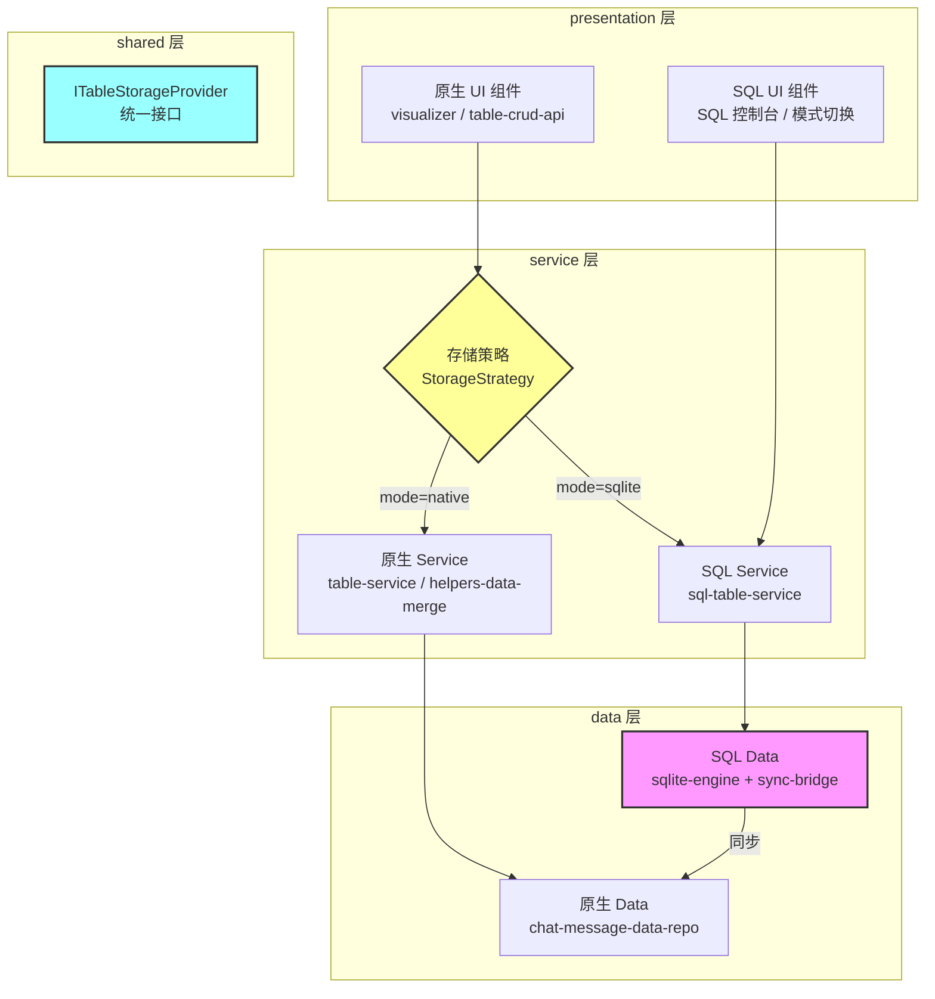
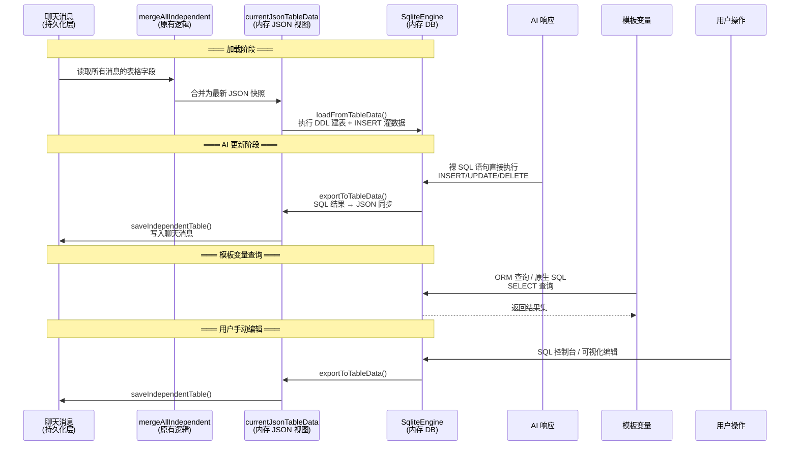
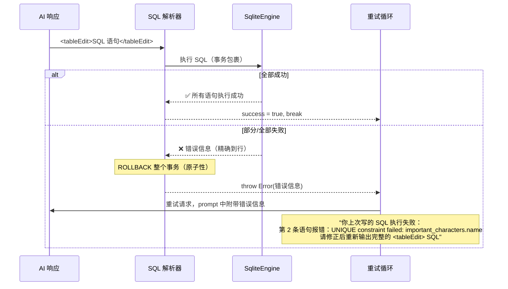

# SQLite 运行时数据库方案 — 技术设计文档

> **版本**: v1.0  
> **日期**: 2026-04-15  
> **状态**: 设计评审中

---

## 一、需求概述

### 1.1 背景

当前系统使用 JSON 对象（`TableDataObject_ACU`）作为表格数据的运行时表示，数据以 `(string|null)[][]` 二维数组形式存储在 `Sheet_ACU.content` 中。AI 通过自定义 DSL（`insertRow`/`updateRow`/`deleteRow`）更新表格数据。

该方案存在以下局限：

1. **AI 更新准确性差** — 自定义 DSL 依赖行索引定位，AI 容易写错索引；不支持条件更新
2. **无数据校验** — 所有值都是字符串，无法在引擎层面做类型约束
3. **查询能力弱** — 无法做跨表 JOIN、聚合统计、条件过滤等复杂查询
4. **模板变量系统受限** — 当前 `<if cell="表名/行名/列名 == 值">` 语法表达力不足

### 1.2 目标

在**保留现有原生方案不动**的前提下，提供一套**可插拔的 SQLite 运行时数据库方案**：

- 数据来源不变：从聊天消息中获取最新表快照
- 数据持久化不变：变更后同步回聊天消息
- 底层使用 sql.js（SQLite 内存数据库）处理数据操作
- AI 通过标准 SQL 语句更新表格（比自定义 DSL 更准确）
- 支持强类型 Schema（DDL 定义列类型、约束）
- 支持 ORM 风格模板变量 + 原生 SQL 兜底查询
- 用户可在设置中切换「原生方案」或「SQLite 方案」

### 1.3 设计原则

- **可插拔**：通过策略模式切换，关闭 SQL 模式时，系统行为与当前**完全一致**——这是「非侵入性」的核心定义。为了支持 SQL 模式，允许在关键路径上对现有代码做最小化适配修改（如新增分支、扩展接口参数），但这些修改在原生模式下**不改变任何现有行为**
- **向后兼容**：持久化格式不变，仍然是 JSON 写入聊天消息字段
- **数据格式兼容**：`currentJsonTableData_ACU` 作为 JSON 视图保留，所有读取该变量的现有代码零改动

---

## 二、已确认的关键决策

| 决策项 | 结论 | 理由 |
|--------|------|------|
| SQLite 引擎 | sql.js（asm.js 版本） | 成熟稳定，油猴完全兼容，无 WASM 依赖 |
| 加载方式 | `@require` CDN 引入 `sql-asm-memory-growth.js` | 脚本体积增量为 0，浏览器缓存加载 |
| DDL 存储位置 | `SheetSourceData_ACU.ddl` 字段 | 与 note/initNode 同级，prompt 构建时直接取用 |
| DDL 定义方式 | 用户直接写 `CREATE TABLE` 语句 | 不需要中间表示，SQLite 自身就是最好的 schema 解析器 |
| AI 编辑格式 | 保留 `<tableEdit>` 容器，内部为裸 SQL | 自动判断 SQL vs DSL，两种模式可共存 |
| 模板变量 | ORM 风格为主 + `{[sql "..."]}`  原生 SQL 兜底 | ORM 简洁，SQL 万能 |
| `currentJsonTableData_ACU` | 保留 | 作为 JSON 视图，保证现有代码零改动 |
| 持久化方式 | SQLite → JSON → ChatMessage | 不做独立持久化，数据格式向后兼容 |

---

## 三、整体架构

### 3.1 架构图



### 3.2 数据流全景



---

## 四、数据模型变更

### 4.1 `SheetSourceData_ACU` 新增 `ddl` 字段

**文件**: `src/data/models/table-data.ts`

```typescript
/** 单个表格的源数据描述 */
export interface SheetSourceData_ACU {
  note: string;
  initNode: string;
  deleteNode: string;
  updateNode: string;
  insertNode: string;
  /** SQLite 模式下的建表 DDL（可选，仅 sqlite 模式使用） */
  ddl?: string;
}
```

**设计说明**：

- `ddl` 是一个完整的 `CREATE TABLE` 语句字符串
- 用户在 UI 配置面板中直接编写，不需要中间表示
- 加载时 `engine.run(ddl)` 直接建表
- 没有 `ddl` 时（用户未配置 / 原生模式），fallback 从 `content[0]` 表头自动生成全 TEXT 的 DDL
- `ddl` 同时作为 prompt 的一部分传给 AI，AI 看到类型约束就知道该怎么写 SQL

**DDL 示例**：

```sql
-- 背包物品表
CREATE TABLE inventory (
  row_id INTEGER PRIMARY KEY,       -- 行号
  item_name TEXT NOT NULL,          -- 物品名称
  quantity INTEGER NOT NULL DEFAULT 1 CHECK(quantity > 0),  -- 数量
  description TEXT,                 -- 描述/效果
  category TEXT NOT NULL            -- 类别
);

-- 全局数据表
CREATE TABLE global_state (
  row_id INTEGER PRIMARY KEY,       -- 行号
  current_location TEXT NOT NULL,   -- 主角当前所在地点
  cur_time TEXT NOT NULL,            -- 当前时间
  prev_scene_time TEXT,             -- 上轮场景时间
  elapsed_time TEXT                 -- 经过的时间
);

-- 重要角色表
CREATE TABLE important_characters (
  row_id INTEGER PRIMARY KEY,       -- 行号
  name TEXT NOT NULL UNIQUE,        -- 姓名
  gender_age TEXT NOT NULL,         -- 性别/年龄
  brief_intro TEXT CHECK(LENGTH(brief_intro) <= 45),  -- 一句话介绍
  appearance TEXT,                  -- 外貌特征
  key_items TEXT,                   -- 持有的重要物品
  is_absent INTEGER NOT NULL DEFAULT 0,  -- 是否离场
  past_experience TEXT              -- 过往经历
);
```

> **强制规范**：每张表的 DDL **必须**以 `row_id INTEGER PRIMARY KEY -- 行号` 作为第一列。`row_id` 对应 `content[*][0]` 的 `_acu_row_id`，是 AI 做 UPDATE/DELETE 时精确定位行的主键。没有主键的表不是表。

**DDL 命名规范**：

- 表名和列名**必须全英文**（snake_case），中文含义写在行尾注释中
- DDL 注释是 AI 理解列含义的唯一来源，必须写清楚
- DDL 中的列顺序与 `content` 表头一一对应
- DDL 是表结构的 single source of truth

### 4.2 `Sheet_ACU` 不变

`Sheet_ACU` 接口本身不需要修改。`ddl` 存在 `sourceData` 内部，通过 `sheet.sourceData.ddl` 访问。

### 4.3 `SheetGuideData_ACU` 不变

Guide 数据不需要存 DDL。DDL 是表级元数据，跟 `note`/`initNode` 同级，存 `sourceData` 最自然。Guide 只负责表头、seedRows、参数等结构化元数据。

---

## 五、分层详细设计

### 5.1 data 层 — SQLite 引擎

**新增目录**: `src/data/sqlite/`

#### 5.1.1 `sqlite-engine.ts` — sql.js 封装

```typescript
/**
 * SQLite 运行时引擎
 * 管理 sql.js 的 Database 实例生命周期
 * 
 * 职责：
 * - 初始化 sql.js（从 @require 全局变量获取）
 * - 创建/销毁内存数据库
 * - 提供 query/run 的薄封装
 * - 不涉及业务逻辑
 */
export class SqliteEngine {
  private db: Database | null = null;

  /** 初始化（从全局 initSqlJs 创建内存数据库） */
  async init(): Promise<void>;

  /** 
   * 从 TableDataObject 构建所有表
   * 1. 有 DDL → 直接 run(ddl)
   * 2. 无 DDL → 从 content[0] 自动生成全 TEXT 的 CREATE TABLE
   * 3. 灌入 content[1:] 的数据行
   */
  loadFromTableData(data: TableDataObject_ACU): void;

  /** 
   * 将当前 DB 状态导出为 TableDataObject
   * SELECT * FROM 每张表 → 还原为 content 二维数组
   * 元数据（sourceData/updateConfig/exportConfig）从 _acu_meta 表读取
   */
  exportToTableData(): TableDataObject_ACU;

  /** 执行 SELECT，返回列名 + 结果集 */
  query(sql: string, params?: any[]): { columns: string[]; values: any[][] };

  /** 执行 INSERT/UPDATE/DELETE，返回受影响行数 */
  run(sql: string, params?: any[]): { changes: number };

  /** 
   * 批量执行多条 SQL（整批事务，原子性）
   * 任何一条失败 → ROLLBACK 整个事务 → 抛出包含详细报错的 Error
   * 报错信息格式："第 N 条语句失败: [原始SQL] → [SQLite错误信息]"
   * 上层重试循环捕获后，将报错注入 AI prompt 触发重写
   */
  runBatch(statements: string[]): { totalChanges: number };

  /** 获取所有用户表名 */
  getTableNames(): string[];

  /** 获取指定表的列信息（PRAGMA table_info） */
  getTableInfo(tableName: string): ColumnInfo[];

  /** 销毁数据库实例，释放内存 */
  dispose(): void;
}
```

#### 5.1.2 `schema-mapper.ts` — Sheet ↔ SQL 映射

```typescript
/**
 * Sheet_ACU ↔ SQL 表的双向映射
 * 
 * 职责：
 * - Sheet → SQL：生成 DDL + INSERT 语句
 * - SQL → Sheet：SELECT 结果 → content 二维数组
 * - 处理 content[*][0] 的 null 占位列
 * - 处理类型亲和性转换（content 全是 string，SQL 有类型）
 */

/** 
 * 从 Sheet 生成建表 DDL
 * 优先使用 sourceData.ddl，fallback 为全 TEXT
 */
export function generateDDL(sheet: Sheet_ACU): string;

/** 
 * 从 Sheet 生成 INSERT 语句（灌入 content 数据）
 * content[0] 是表头，content[1:] 是数据行
 * content[*][0] 是 null 占位列，跳过
 */
export function generateInserts(sheet: Sheet_ACU): string[];

/**
 * 从 SQL 查询结果还原为 content 二维数组
 * 自动补回 content[*][0] 的 null 占位
 * 自动将 SQL 类型值转为 string（content 的存储格式）
 */
export function resultToContent(
  columns: string[], 
  values: any[][], 
  headers: (string | null)[]
): (string | null)[][];

/**
 * 校验 DDL 列名与 content[0] 表头是否匹配
 * 返回不匹配的列名列表
 */
export function validateDDLAgainstHeaders(
  ddl: string, 
  headers: (string | null)[]
): { valid: boolean; mismatches: string[] };

/**
 * 从 content[0] 表头自动生成全 TEXT 的 fallback DDL
 */
export function generateFallbackDDL(tableName: string, headers: (string | null)[]): string;
```

#### 5.1.3 `sync-bridge.ts` — 双向同步

```typescript
/**
 * SQLite ↔ ChatMessage 双向同步桥
 * 
 * 加载方向：ChatMessage → mergeAll → JSON → SQLite
 * 保存方向：SQLite → JSON → saveIndependentTable → ChatMessage
 * 
 * 关键：复用现有的 mergeAllIndependentTables_ACU 和 
 *       saveIndependentTableToChatHistory_ACU，不重新实现持久化逻辑
 */
export class SyncBridge {
  constructor(private engine: SqliteEngine);

  /** 
   * 从聊天消息加载到 SQLite
   * 1. 调用 mergeAllIndependentTables_ACU() 获取 JSON 快照
   * 2. engine.loadFromTableData(jsonSnapshot) 建表 + 灌数据
   * 3. 返回 JSON 快照（同步更新 currentJsonTableData_ACU）
   */
  async loadFromChatToSqlite(): Promise<TableDataObject_ACU | null>;

  /** 
   * 从 SQLite 导出并写入聊天消息
   * 1. engine.exportToTableData() 导出最新状态
   * 2. 更新 currentJsonTableData_ACU
   * 3. 调用 saveIndependentTableToChatHistory_ACU() 写入聊天
   */
  async saveFromSqliteToChat(
    targetSheetKeys?: string[], 
    updateGroupKeys?: string[]
  ): Promise<{ saved: boolean; error?: string }>;

  /**
   * 仅同步 SQLite → JSON（不写聊天消息）
   * 用于 AI 编辑后立即更新内存视图，但延迟持久化
   */
  syncToJson(): TableDataObject_ACU;
}
```

### 5.2 shared 层 — 统一接口

**新增文件**: `src/shared/table-storage-provider.ts`

```typescript
/** 存储模式 */
export type StorageMode = 'native' | 'sqlite';

/** SQL 查询结果 */
export interface SqlQueryResult {
  columns: string[];
  values: any[][];
  rowCount: number;
}

/** SQL 变更结果 */
export interface SqlMutationResult {
  changes: number;
  errors: string[];
}

/** 统一的表格存储提供者接口 */
export interface ITableStorageProvider {
  /** 模式标识 */
  readonly mode: StorageMode;

  /** 从聊天消息加载表格数据到运行时 */
  loadFromChat(): Promise<TableDataObject_ACU | null>;

  /** 保存当前运行时数据到聊天消息 */
  saveToChat(
    targetSheetKeys?: string[], 
    updateGroupKeys?: string[]
  ): Promise<{ saved: boolean; error?: string }>;

  /** 获取当前运行时的完整表格数据（JSON 格式） */
  getCurrentData(): TableDataObject_ACU | null;

  /** 
   * 应用 AI 返回的编辑指令
   * native 模式：解析 DSL（insertRow/updateRow/deleteRow）
   * sqlite 模式：执行 SQL 语句
   */
  applyEdits(
    edits: string, 
    updateMode?: string
  ): { success: boolean; modifiedKeys: string[]; appliedEdits: number };

  /** 
   * 执行 SQL 查询（仅 sqlite 模式支持）
   * native 模式调用时抛出 UnsupportedOperationError
   */
  executeQuery(sql: string, params?: any[]): SqlQueryResult;

  /** 
   * 执行 SQL 变更语句（仅 sqlite 模式支持）
   * native 模式调用时抛出 UnsupportedOperationError
   */
  executeMutation(sql: string, params?: any[]): SqlMutationResult;

  /** 销毁/清理资源 */
  dispose(): void;
}
```

**新增文件**: `src/shared/storage-mode.ts`

```typescript
import type { StorageMode } from './table-storage-provider';

/** 获取当前存储模式（从 settings 读取） */
export function getCurrentStorageMode(): StorageMode;

/** 判断当前是否为 SQLite 模式 */
export function isSqliteMode(): boolean;
```

### 5.3 service 层 — SQL 表格服务

#### 5.3.1 `table-storage-strategy.ts` — 策略选择器

**新增文件**: `src/service/table/table-storage-strategy.ts`

```typescript
import type { ITableStorageProvider, StorageMode } from '../../shared/table-storage-provider';

/**
 * 表格存储策略选择器（核心枢纽）
 * 
 * 根据用户设置选择 native 或 sqlite 模式的 Provider
 * 提供全局单例访问点
 */

let currentProvider: ITableStorageProvider | null = null;

/** 获取当前存储提供者 */
export function getStorageProvider(): ITableStorageProvider;

/** 切换存储模式（用户在设置中切换时调用） */
export async function switchStorageMode(mode: StorageMode): Promise<void>;

/** 初始化存储提供者（应用启动时调用） */
export async function initStorageProvider(): Promise<void>;
```

#### 5.3.2 `sql-table-service.ts` — SQLite Provider 实现

**新增文件**: `src/service/table/sql-table-service.ts`

```typescript
import type { ITableStorageProvider, SqlQueryResult, SqlMutationResult } from '../../shared/table-storage-provider';
import { SqliteEngine } from '../../data/sqlite/sqlite-engine';
import { SyncBridge } from '../../data/sqlite/sync-bridge';

/**
 * SQLite 模式下的 ITableStorageProvider 实现
 * 
 * 核心职责：
 * - 管理 SqliteEngine 和 SyncBridge 的生命周期
 * - 将 AI 返回的 SQL 语句路由到引擎执行
 * - 维护 currentJsonTableData_ACU 的同步
 */
export class SqlTableService implements ITableStorageProvider {
  readonly mode = 'sqlite' as const;
  private engine: SqliteEngine;
  private syncBridge: SyncBridge;

  async loadFromChat(): Promise<TableDataObject_ACU | null> {
    // 1. syncBridge.loadFromChatToSqlite()
    //    内部调用 mergeAllIndependentTables_ACU() 获取 JSON 快照
    //    然后 engine.loadFromTableData() 建表 + 灌数据
    // 2. 返回 JSON 快照
  }

  async saveToChat(targetSheetKeys?, updateGroupKeys?): Promise<...> {
    // 1. syncBridge.saveFromSqliteToChat()
    //    内部调用 engine.exportToTableData() 导出
    //    然后 saveIndependentTableToChatHistory_ACU() 写入聊天
  }

  getCurrentData(): TableDataObject_ACU | null {
    // 从 engine 导出最新状态为 JSON
    // 同时更新 currentJsonTableData_ACU
  }

  applyEdits(sqlStatements: string, updateMode?: string) {
    // 1. BEGIN TRANSACTION
    // 2. 拆分多条 SQL 语句（按分号分割）
    // 3. 逐条执行 engine.run(sql)，任何一条失败 → ROLLBACK + throw Error(详细报错)
    //    报错信息会被上层重试循环捕获，注入到下次 AI 请求的 prompt 中
    //    AI 看到精确的 SQLite 报错后重写 SQL（复用现有 update-trigger 重试机制）
    // 4. 全部成功 → COMMIT
    // 5. 收集受影响的表名 → 映射为 sheetKey
    // 6. syncBridge.syncToJson() 同步到 JSON 视图
    // 7. 返回 { success, modifiedKeys, appliedEdits }
  }

  executeQuery(sql: string, params?: any[]): SqlQueryResult {
    return this.engine.query(sql, params);
  }

  executeMutation(sql: string, params?: any[]): SqlMutationResult {
    const result = this.engine.run(sql, params);
    this.syncBridge.syncToJson(); // 同步到 JSON 视图
    return result;
  }

  dispose(): void {
    this.engine.dispose();
  }
}
```

#### 5.3.3 `native-table-service-adapter.ts` — 原生模式适配器

**新增文件**: `src/service/table/native-table-service-adapter.ts`

```typescript
/**
 * 原生模式的 ITableStorageProvider 适配器
 * 
 * 将现有的 table-service.ts 中的函数包装为 ITableStorageProvider 接口
 * 不修改 table-service.ts 的任何代码，只做适配
 */
export class NativeTableServiceAdapter implements ITableStorageProvider {
  readonly mode = 'native' as const;

  async loadFromChat() {
    // 委托给 loadOrCreateJsonTableFromChatHistory_ACU()
  }

  async saveToChat(targetSheetKeys?, updateGroupKeys?) {
    // 委托给 saveIndependentTableToChatHistory_ACU()
  }

  getCurrentData() {
    // 直接返回 currentJsonTableData_ACU
  }

  applyEdits(edits: string, updateMode?: string) {
    // 委托给 parseAndApplyTableEdits_ACU()
  }

  executeQuery(sql: string) {
    throw new Error('SQL 查询仅在 SQLite 模式下可用');
  }

  executeMutation(sql: string) {
    throw new Error('SQL 变更仅在 SQLite 模式下可用');
  }

  dispose() {
    // 原生模式无需清理
  }
}
```

### 5.4 service 层 — AI 编辑解析适配

#### 5.4.1 `<tableEdit>` 内容自动判断

**影响文件**: `src/service/ai/prompt-builder/table-edit-parser.ts`（新增分支，不改原有逻辑）

```
提取 <tableEdit> 内容后的判断逻辑：

1. 检查内容是否以 SQL 关键字开头（INSERT/UPDATE/DELETE/ALTER/BEGIN）
   → 是：走 SQL 执行路径（engine.runBatch）
   → 否：走现有 DSL 解析路径（parseAndApplyTableEdits_ACU）

2. SQL 路径的处理：
   a. 按分号拆分为多条语句
   b. 逐条执行 engine.run(sql)
   c. 收集受影响的表名
   d. syncBridge.syncToJson() 同步到 JSON 视图
   e. 返回 { success, modifiedKeys, appliedEdits }
```

#### 5.4.2 prompt 格式适配

**影响文件**: `src/service/ai/prompt-builder/prompt-prepare.ts`（新增分支）

SQLite 模式下，`prepareAIInput_ACU` 中表格数据的格式化方式改变：

**原生模式（不变）**：
```
[0:重要人物表]
  Columns: [0:姓名], [1:年龄], [2:状态]
  - Note: 记录重要人物的信息
  - Insert Trigger: 新角色出现时添加
  - Update Trigger: 角色状态变化时更新
  - Delete Trigger: 角色死亡时删除
  [0] 角色A, 25, 存活
  [1] 角色B, 30, 死亡
```

**SQLite 模式（新增）**：
```sql
-- 背包物品表
CREATE TABLE inventory (
  row_id INTEGER PRIMARY KEY,       -- 行号
  item_name TEXT NOT NULL,          -- 物品名称
  quantity INTEGER NOT NULL DEFAULT 1 CHECK(quantity > 0),  -- 数量
  description TEXT,                 -- 描述/效果
  category TEXT NOT NULL            -- 类别
);
-- Note: 记录主角拥有的所有物品、装备
-- INSERT: 主角获得背包中没有的全新物品时添加
-- UPDATE: 获得已有的物品使数量增加时更新
-- DELETE: 物品被完全消耗、丢弃或摧毁时删除

-- 当前数据 (3 rows)
-- | row_id | item_name | quantity | description | category |
-- | 1 | 铁剑 | 1 | 普通的铁制长剑 | 武器 |
-- | 2 | 治疗药水 | 5 | 恢复少量生命值 | 消耗品 |
-- | 3 | 旧地图 | 1 | 标记了某个洞穴的位置 | 杂物 |
```

> AI 看到 `row_id` 列后，UPDATE/DELETE 时会自然使用 `WHERE row_id = N` 精确定位行，不再需要猜测用哪个字段定位。

**关键**：DDL 本身就是最好的 schema 提示词。AI 看到 `INTEGER NOT NULL CHECK(...)` 就知道这列只能填数字。类型约束即提示词。

### 5.5 service 层 — 模板变量系统

#### 5.5.1 ORM 风格查询（主力）

**新增文件**: `src/service/runtime/template-vars/sql-query-var.ts`

```typescript
/**
 * SQL 查询模板变量
 * 
 * ORM 风格语法：
 *   {[db.表名.where("列名", "值").get("列名")]}
 *   {[db.表名.where("列名", ">", 数值).count()]}
 *   {[db.表名.where("列名", "值").list("列名")]}
 *   {[db.表名.all()]}
 * 
 * 原生 SQL 兜底：
 *   {[sql "SELECT 列名 FROM 表名 WHERE 条件"]}
 * 
 * ORM 内部实现就是拼 SQL 然后调 engine.query()
 */

/** ORM 查询构建器 */
export class TableQueryBuilder {
  private tableName: string;
  private conditions: WhereClause[] = [];
  private orderByClause?: string;
  private limitClause?: number;

  constructor(tableName: string);

  where(column: string, value: any): this;
  where(column: string, operator: string, value: any): this;

  orderBy(column: string, direction?: 'ASC' | 'DESC'): this;
  limit(n: number): this;

  /** 获取单个值 */
  get(column: string): string | number | null;

  /** 获取单行（所有列） */
  first(): Record<string, any> | null;

  /** 获取某列的值列表 */
  list(column: string): (string | number)[];

  /** 获取所有行 */
  all(): Record<string, any>[];

  /** 计数 */
  count(): number;

  /** 求和 */
  sum(column: string): number;

  /** 判断是否存在 */
  exists(): boolean;

  /** 生成 SQL（调试用） */
  toSQL(): string;
}

/** 
 * 解析模板中的 ORM 表达式
 * 输入: "db.重要人物表.where("姓名", "角色A").get("状态")"
 * 输出: 执行结果字符串
 */
export function evaluateOrmExpression(expr: string, engine: SqliteEngine): string;

/**
 * 解析模板中的原生 SQL 表达式
 * 输入: 'sql "SELECT 状态 FROM 重要人物表 WHERE 姓名=\'角色A\'"'
 * 输出: 执行结果字符串
 */
export function evaluateRawSqlExpression(expr: string, engine: SqliteEngine): string;
```

#### 5.5.2 模板变量语法示例

```
<!-- ORM 风格（主力，简洁） -->
{[db.重要人物表.where("姓名", "角色A").get("状态")]}
{[db.重要人物表.where("年龄", ">", 20).count()]}
{[db.重要人物表.where("状态", "存活").list("姓名")]}
{[db.背包物品表.where("类别", "武器").all()]}
{[db.背包物品表.sum("数量")]}
{[db.重要人物表.where("姓名", "角色A").exists()]}

<!-- 原生 SQL 兜底（万能，复杂场景） -->
{[sql "SELECT 状态 FROM 重要人物表 WHERE 姓名='角色A'"]}
{[sql "SELECT COUNT(*) FROM 重要人物表 WHERE 年龄 > 20 AND 状态='存活'"]}
{[sql "SELECT a.姓名, b.事件 FROM 重要人物表 a JOIN 事件表 b ON a.姓名 = b.相关人物"]}
```

#### 5.5.3 `<if>` 条件判断 — 新增 `db` / `sql` 条件类型

**核心设计**：`<if>` 只做路由器，不做任何比较运算。条件判断的能力完全依赖对应引擎。

**影响文件**: `src/service/runtime/template-vars/if-block-parser.ts`、`src/service/runtime/template-vars/seed-condition.ts`

##### 现有条件类型（不动）

| 类型 | 语法 | 引擎 |
|------|------|------|
| `seed` | `<if seed="战斗">` | 关键词匹配 |
| `cell` | `<if cell="表名/行名/列名 > 50">` | JSON 表取值 + 简单比较 |
| `cond` | `<if cond="seed:战斗 & cell:表/行/列 == 值">` | 组合条件 |

##### 新增条件类型

| 类型 | 语法 | 引擎 | 布尔判定规则 |
|------|------|------|-------------|
| `db` | `<if db="ORM表达式">` | ORM 引擎 | 返回值非零/非空/非false = true |
| `sql` | `<if sql="SQL语句">` | SQLite 引擎 | 返回值非零/非空 = true |

##### `<if db="...">` 示例

```html
<!-- 存在性判断 — ORM 天然支持 -->
<if db="重要人物表.where('姓名','角色A').exists()">角色A存在</if>

<!-- 空值判断 — ORM 天然支持 -->
<if db="重要人物表.where('状态', null).exists()">有人状态为空</if>

<!-- 数值比较 — ORM 自己算 -->
<if db="重要人物表.where('生命值','>', 50).exists()">有人血量大于50</if>

<!-- 聚合判断 -->
<if db="重要人物表.where('阵营','敌方').count() > 3">敌方人数超过3</if>

<!-- 多条件组合 -->
<if db="重要人物表.where('阵营','友方').where('状态','存活').exists()">还有友方存活</if>
```

##### `<if sql="...">` 示例

```html
<!-- 任意复杂条件，SQL 原生支持 -->
<if sql="SELECT EXISTS(SELECT 1 FROM characters WHERE hp > 50 AND status IS NOT NULL)">
还有活人
</if>

<!-- 跨表 JOIN 判断 -->
<if sql="SELECT COUNT(*) > 0 FROM characters c JOIN items i ON c.name = i.owner WHERE i.type = '武器'">
有人持有武器
</if>
```

##### 值替换 + 条件判断组合使用

```html
<!-- <if> 条件由 db 引擎判断，内部内容用 {[db...]} 做值替换 -->
<if db="重要人物表.where('姓名','角色A').exists()">
角色A当前状态：{[db.重要人物表.where('姓名','角色A').get('状态')]}
生命值：{[db.重要人物表.where('姓名','角色A').get('生命值')]}
</if>
```

##### 执行顺序

```
$0/$1/$6/$8/$U/$C 替换 → EjsTemplate → Random/Calc 标签 → {[db...]}/{[sql...]} 值替换 → <if> 块解析
```

- `{[db...]}` / `{[sql...]}` 在 `<if>` **之前**执行（普通文本中的值替换）
- `<if>` 解析阶段，遇到 `db` / `sql` 类型条件时，调用对应引擎求值拿布尔值
- `<if>` 条件成立后，内部内容再走一遍 `{[db...]}` 替换（递归处理）

##### 与 `cond` 组合条件的关系

`cond` 类型支持 `seed:` 和 `cell:` 的组合。SQLite 模式下，`db` 和 `sql` 不需要塞进 `cond` 里——因为 SQL 本身就能写任意复杂的组合条件（`AND` / `OR` / `NOT` / 子查询），不需要 `cond` 的 `&` `,` `!` 语法来组合。

```html
<!-- 不需要这样写 -->
<if cond="db:表.where(...).exists() & seed:战斗">

<!-- 直接用 sql 写完整条件即可 -->
<if sql="SELECT EXISTS(SELECT 1 FROM characters WHERE status = '存活' AND hp > 50)">
```

如果确实需要混合 `seed` 和 `db` 条件，可以嵌套 `<if>`：

```html
<if seed="战斗">
  <if db="重要人物表.where('状态','存活').exists()">
  战斗中还有存活角色的提示词
  </if>
</if>
```

#### 5.5.4 中英文名称双向映射（NameMapper）

##### 问题背景

DDL 建表语句中，表名和列名**必须全英文**（snake_case），中文含义写在行尾注释中。但中国用户在写模板变量时，更习惯使用中文表名和列名。需要同时支持中英文两种格式，让用户随意选择。

##### 核心设计

在 ORM 引擎和 SQL 引擎**执行前**，加一层**名称解析**。从 DDL 注释中自动构建中英文双向映射，用户输入中文名时自动翻译为英文名，英文名直接透传。

**新增文件**: `src/service/runtime/template-vars/name-mapper.ts`

```typescript
/**
 * 中英文名称双向映射器
 * 从 DDL 注释中自动构建
 */
export class NameMapper {
  // 表名映射：中文 → 英文
  private tableNameMap: Map<string, string>;  // "背包物品表" → "inventory"
  // 列名映射：表英文名.中文列名 → 英文列名
  private columnNameMap: Map<string, string>; // "inventory.物品名称" → "item_name"
  // 反向映射：英文 → 中文（用于展示）
  private reverseTableMap: Map<string, string>;  // "inventory" → "背包物品表"
  private reverseColumnMap: Map<string, string>;  // "inventory.item_name" → "物品名称"

  /** 从 DDL 注释解析构建映射 */
  static fromDDL(ddl: string): NameMapper;

  /** 解析表名（中文→英文，英文直接返回） */
  resolveTableName(name: string): string;

  /** 解析列名（需要先确定表名，中文→英文，英文直接返回） */
  resolveColumnName(tableName: string, columnName: string): string;

  /** 反向：英文表名→中文（用于展示给用户） */
  getChineseTableName(englishName: string): string;

  /** 反向：英文列名→中文（用于展示给用户） */
  getChineseColumnName(tableName: string, englishName: string): string;

  /** 将原生 SQL 中的中文名替换为英文名（跳过字符串值） */
  translateSql(sql: string): string;
}
```

##### DDL 注释解析规则

```sql
CREATE TABLE inventory (          -- 背包物品表
  item_name TEXT NOT NULL,        -- 物品名称
  quantity INTEGER DEFAULT 1,     -- 数量
  description TEXT,               -- 描述/效果
  category TEXT NOT NULL          -- 类别
);
```

- `CREATE TABLE xxx (` 后面同行的 `-- xxx` → 表的中文名
- 列定义后面同行的 `-- xxx` → 列的中文名

##### 用户体验：中英文随意混用

```html
<!-- 全中文（对中国用户最友好） -->
{[db.背包物品表.where("物品名称","铁剑").get("数量")]}

<!-- 全英文（程序员偏好） -->
{[db.inventory.where("item_name","铁剑").get("quantity")]}

<!-- 混用也行 -->
{[db.背包物品表.where("item_name","铁剑").get("数量")]}

<!-- <if> 条件也一样 -->
<if db="背包物品表.where('物品名称','铁剑').exists()">你有铁剑</if>

<!-- 原生 SQL 也支持中文表名/列名 -->
{[sql "SELECT 数量 FROM 背包物品表 WHERE 物品名称='铁剑'"]}
```

##### 翻译时机与调用链

```
用户输入                                    实际执行
──────────────────────────────────────────────────────────
db.背包物品表.where("物品名称",...)  →  db.inventory.where("item_name",...)
sql "SELECT 数量 FROM 背包物品表"    →  sql "SELECT quantity FROM inventory"
```

1. **DDL 解析阶段**（`loadFromChatToSqlite` 时）：解析 DDL 注释，构建 `NameMapper` 实例
2. **ORM 引擎**：`TableQueryBuilder` 构造时，表名和列名先过 `NameMapper.resolveTableName()` / `resolveColumnName()`
3. **SQL 引擎**：原生 SQL 字符串执行前，调用 `NameMapper.translateSql()` 做中文→英文替换
4. **`<if>` 条件**：`<if db="...">` 和 `<if sql="...">` 执行前同样过 NameMapper

##### `translateSql` 的安全替换策略

中文字符不可能出现在 SQL 关键字、数字、运算符中，所以全文替换不会误伤。但**字符串值**里的中文不能被替换（如 `WHERE item_name = '背包物品表'` 中的 `'背包物品表'` 是值不是表名），因此替换时需要**跳过单引号包裹的内容**：

```typescript
translateSql(sql: string): string {
  // 1. 先把单引号字符串提取出来，用占位符替代
  const strings: string[] = [];
  let safeSql = sql.replace(/'[^']*'/g, (match) => {
    strings.push(match);
    return `__STR_${strings.length - 1}__`;
  });

  // 2. 在安全的 SQL 上做中文→英文替换（长名称优先，避免子串误匹配）
  const sortedTableNames = [...this.tableNameMap.entries()]
    .sort((a, b) => b[0].length - a[0].length);
  for (const [cn, en] of sortedTableNames) {
    safeSql = safeSql.replaceAll(cn, en);
  }
  // 列名同理...

  // 3. 把字符串值放回去
  safeSql = safeSql.replace(/__STR_(\d+)__/g, (_, i) => strings[Number(i)]);
  return safeSql;
}
```

##### 对现有模块的影响

| 模块 | 变化 |
|------|------|
| `name-mapper.ts`（新增） | `NameMapper` 类，DDL 注释解析 + 中英文双向映射 |
| `sql-query-var.ts` | `TableQueryBuilder` 构造时调用 `NameMapper.resolve*()` |
| `sql-query-var.ts` | `evaluateRawSqlExpression` 执行前调用 `NameMapper.translateSql()` |
| `if-block-parser.ts` | `<if db="...">` 和 `<if sql="...">` 执行前过 NameMapper |
| `SqliteEngine` | **不变**，它只认英文名，翻译在上层完成 |
| DDL 规范 | **不变**，仍然是英文表名 + 中文注释 |

##### 为什么不直接用中文建表？

SQLite 支持中文标识符（用双引号包裹），但不采用，原因：
1. **AI 写 SQL 时容易出错** — 中文标识符必须用双引号包裹，AI 经常忘记，导致语法错误
2. **SQL 注入风险** — 中文标识符的转义处理更复杂
3. **跨系统兼容性** — 英文标识符是通用的

保持 DDL 英文建表 + 注释中文的设计不变，在**应用层**做中英文翻译，是最干净的方案。

### 5.6 presentation 层 — SQL UI

#### 5.6.1 SQL 控制台

**新增文件**: `src/presentation/pages/sql-console.ts`

```
功能：
- 文本输入框，用户输入 SQL 语句
- 执行按钮，调用 engine.query() 或 engine.run()
- 结果展示区（表格形式展示 SELECT 结果，文本展示变更行数）
- 历史记录（最近执行的 SQL 语句）
- 快捷操作（查看所有表、查看表结构）
```

#### 5.6.2 模式切换

**影响文件**: 设置面板相关文件

```
在设置面板中新增：
- 存储模式切换开关（原生 / SQLite）
- 切换时调用 switchStorageMode()
- 切换后自动重新加载数据
```

#### 5.6.3 DDL 编辑器

**影响文件**: 表格配置面板相关文件

```
在每张表的配置面板中新增：
- DDL 编辑文本框（仅 SQLite 模式下显示）
- 语法高亮（可选，简单的 SQL 关键字着色）
- 校验按钮（检查 DDL 列名与表头是否匹配）
- 预览按钮（显示 DDL 生成的表结构）
```

---

## 六、元数据存储方案

### 6.1 问题

SQLite 内存数据库中只有用户数据表。但 `Sheet_ACU` 还包含大量元数据（`sourceData`、`updateConfig`、`exportConfig`、`uid`、`orderNo`），这些信息在 `exportToTableData()` 时需要还原。

### 6.2 方案：`_acu_sheet_meta` 元数据表

在 SQLite 中创建一张内部元数据表：

```sql
CREATE TABLE _acu_sheet_meta (
  sheet_key TEXT PRIMARY KEY,        -- 如 "sheet_0"
  table_name TEXT NOT NULL,          -- 如 "背包物品表"
  uid TEXT,
  source_data_json TEXT,             -- JSON 序列化的 sourceData
  update_config_json TEXT,           -- JSON 序列化的 updateConfig
  export_config_json TEXT,           -- JSON 序列化的 exportConfig
  order_no INTEGER
);
```

- 加载时：将每个 Sheet 的元数据 INSERT 到 `_acu_sheet_meta`
- 导出时：从 `_acu_sheet_meta` 读取元数据，与 SELECT 出的数据行合并还原为 `Sheet_ACU`
- 这张表对用户和 AI 不可见（不出现在 prompt 中，不出现在 `getTableNames()` 结果中）

---

## 七、错误处理

### 7.1 SQL 执行错误 — 复用现有重试机制

AI 写的 SQL 可能有语法错误或违反约束。**核心策略：把 SQLite 报错信息反馈给 AI，触发重试让 AI 重写 SQL。**

#### 7.1.1 为什么用重试而不是跳过

1. **现有重试机制已经很成熟** — `update-trigger.ts` 和 `update-process.ts` 中，API 调用、空回检测、解析失败已统一进入重试循环（最多 N 次，间隔 5 秒）
2. **SQLite 报错信息极其精确** — AI 拿到这种级别的错误提示，再写错的概率极低：
   - `UNIQUE constraint failed: 重要人物表.姓名` → AI 立刻知道是插了重复名字
   - `datatype mismatch` → AI 知道类型写错了
   - `no such column: 年纪` → AI 知道列名打错了，应该是"年龄"
   - `near "INSRET": syntax error` → AI 知道拼写错误
3. **跳过策略会导致数据不一致** — 比如 AI 写了 3 条 SQL（INSERT + UPDATE + DELETE），第 2 条失败跳过了，第 3 条基于第 2 条的结果，最终数据就乱了

#### 7.1.2 重试流程



#### 7.1.3 错误信息注入 prompt 的格式

重试时，在 prompt 中追加错误反馈（复用现有的重试 prompt 注入机制）：

```
[SQL 执行失败反馈]
你上次返回的 SQL 语句执行失败，错误信息如下：
- 第 2 条语句: INSERT INTO important_characters (name, age, status) VALUES ('角色A','25','存活')
  错误: UNIQUE constraint failed: important_characters.name
  原因: "角色A" 已存在于表中，违反了 UNIQUE 约束

请根据以上错误信息修正 SQL，重新输出完整的 <tableEdit> 内容。
```

#### 7.1.4 事务原子性

SQL 执行采用**整批事务**，而非逐条执行：

```sql
BEGIN TRANSACTION;
  INSERT INTO important_characters ...;
  UPDATE inventory SET ...;
  DELETE FROM events WHERE ...;
COMMIT;
-- 任何一条失败 → ROLLBACK 整个事务 → 触发重试
```

**为什么不用 SAVEPOINT 逐条回滚**：因为 AI 写的多条 SQL 之间通常有逻辑依赖关系，部分成功部分失败会导致数据不一致。要么全成功，要么全回滚重来。

#### 7.1.5 重试耗尽后的 fallback

如果重试 N 次后仍然失败（极端情况）：

```
1. 记录完整的错误日志（所有尝试的 SQL + 报错信息）
2. toast 提示用户："AI 多次尝试更新表格均失败，请检查表结构定义（DDL）是否正确"
3. 不修改任何数据（事务已回滚，数据保持原样）
4. 可选：在 SQL 控制台中显示失败的 SQL，方便用户手动修正执行
```

### 7.2 DDL 与数据不匹配

用户修改了 DDL（比如删了一列），但历史数据中还有该列的数据。处理策略：

```
1. 加载时检测到 DDL 列数 < content 列数
   → 警告用户，多余的列数据会被丢弃

2. 加载时检测到 DDL 列数 > content 列数
   → 新增的列用 DEFAULT 值填充（如果有），否则 NULL

3. 加载时检测到 DDL 列名与 content[0] 不匹配
   → 报错提示用户修正 DDL 或表头
```

### 7.3 sql.js 加载失败

CDN 不可达或 `@require` 加载失败时：

```
1. 检测 window.initSqlJs 是否存在
2. 不存在 → 自动 fallback 到原生模式
3. 在 UI 上显示提示："SQLite 引擎加载失败，已切换到原生模式"
```

---

## 八、文件结构规划

```
src/
├── shared/
│   ├── table-storage-provider.ts      # [新增] ITableStorageProvider 接口
│   ├── storage-mode.ts                # [新增] StorageMode 枚举 + 工具函数
│   ├── constants.ts                   # [不动]
│   ├── data-constants.ts              # [不动]
│   ├── defaults-json.js               # [不动]
│   ├── defaults.ts                    # [不动]
│   └── ...
│
├── data/
│   ├── sqlite/                        # [新增] SQLite 引擎目录
│   │   ├── sqlite-engine.ts           # sql.js 封装
│   │   ├── schema-mapper.ts           # Sheet ↔ SQL 映射
│   │   └── sync-bridge.ts            # 双向同步
│   ├── models/
│   │   ├── table-data.ts             # [修改] SheetSourceData_ACU 新增 ddl 字段
│   │   └── ...                        # [不动]
│   ├── gateways/                      # [不动]
│   ├── repositories/                  # [不动]
│   └── storage/                       # [不动]
│
├── service/
│   ├── table/
│   │   ├── table-service.ts                  # [不动] 原有逻辑
│   │   ├── sql-table-service.ts              # [新增] SQLite Provider 实现
│   │   ├── native-table-service-adapter.ts   # [新增] 原生模式适配器
│   │   └── table-storage-strategy.ts         # [新增] 策略选择器
│   ├── ai/
│   │   └── prompt-builder/
│   │       ├── prompt-prepare.ts             # [修改] 新增 SQLite 模式的格式化分支
│   │       ├── table-edit-parser.ts          # [修改] 新增 SQL 识别分支
│   │       └── ...                           # [不动]
│   └── runtime/
│       └── template-vars/
│           ├── sql-query-var.ts              # [新增] SQL/ORM 查询变量
│           └── ...                           # [不动]
│
├── presentation/
│   ├── pages/
│   │   └── sql-console.ts                    # [新增] SQL 控制台
│   └── components/
│       └── sql-mode-toggle.ts                # [新增] 模式切换组件
```

---

## 九、构建配置

### 9.1 油猴脚本头

```javascript
// ==UserScript==
// @require  https://cdnjs.cloudflare.com/ajax/libs/sql.js/1.10.3/sql-asm-memory-growth.js
// ==UserScript==
```

### 9.2 rollup 配置

```javascript
// sql.js 通过 @require 外部引入，不打包进 IIFE
external: ['sql.js'],
output: {
  globals: {
    'sql.js': 'initSqlJs'  // @require 后的全局变量名
  }
}
```

### 9.3 TypeScript 类型声明

```typescript
// src/types/sql.js.d.ts
declare function initSqlJs(config?: any): Promise<SqlJsStatic>;

interface SqlJsStatic {
  Database: new (data?: ArrayLike<number>) => Database;
}

interface Database {
  run(sql: string, params?: any[]): Database;
  exec(sql: string, params?: any[]): QueryExecResult[];
  prepare(sql: string): Statement;
  getRowsModified(): number;
  close(): void;
}

interface QueryExecResult {
  columns: string[];
  values: any[][];
}
```

---

## 十、实施路线图

| 阶段 | 内容 | 预估工作量 | 依赖 | 产出 |
|------|------|-----------|------|------|
| **P0** | sql.js 集成验证 | 1-2 天 | 无 | 油猴环境下 sql.js 可用的 PoC |
| **P1** | data/sqlite 引擎层 | 3-4 天 | P0 | sqlite-engine + schema-mapper + sync-bridge |
| **P2** | shared 接口 + service 策略层 | 2-3 天 | P1 | ITableStorageProvider + 策略选择器 + 两个适配器 |
| **P3** | AI SQL 解析 + prompt 适配 | 3-4 天 | P2 | table-edit-parser SQL 分支 + prompt-prepare SQL 格式 |
| **P4** | 模板变量 SQL/ORM 查询 | 2-3 天 | P2 | sql-query-var + ORM 构建器 |
| **P5** | presentation SQL 控制台 + 模式切换 + DDL 编辑器 | 2-3 天 | P2 | UI 组件 |
| **P6** | 集成测试 + 边界处理 + 错误恢复 | 2-3 天 | P3-P5 | 完整可用 |

**总预估**: 15-22 天

---

## 十一、风险与缓解

| 风险 | 影响 | 缓解措施 |
|------|------|---------|
| sql.js CDN 不可达 | SQLite 模式不可用 | 自动 fallback 到原生模式 + 多 CDN 备选 |
| AI 写出的 SQL 有语法错误 | 单次执行失败 | 整批事务回滚 + 错误信息反馈给 AI 重试（复用现有重试循环） |
| 大表性能问题（>1000 行） | 加载/导出变慢 | 分批 INSERT + 事务包裹 + 性能监控 |
| DDL 与数据不匹配 | 数据丢失/加载失败 | 校验机制 + 用户确认 + 自动修复 |
| 内存占用增加 | 浏览器卡顿 | sql.js 内存数据库本身很轻量，几百行数据 < 1MB |

---

## 十二、FAQ

### Q: 为什么不用 IndexedDB 或 OPFS 做持久化？
A: 数据持久化仍然走聊天消息（这是核心需求——数据跟随对话）。SQLite 只是运行时引擎，不做独立持久化。每次加载从聊天消息构建，每次保存写回聊天消息。

### Q: 为什么 DDL 存 `sourceData` 而不是 Guide？
A: DDL 是表的语义定义，跟 `note`（表说明）、`initNode`（初始化触发条件）是同一层级的信息。而且 prompt 构建时需要直接取 DDL，存 `sourceData` 最方便。Guide 负责的是结构化元数据（表头、seedRows、参数），DDL 是用户手写的 SQL 文本，性质不同。

### Q: 为什么不用 `ColumnSchema_ACU` 中间表示？
A: `CREATE TABLE` 语句本身就是最好的 schema 定义语言。再发明一套 `{ name, type, nullable, check }` 的中间表示，然后写 `generateDDL()` 去拼接，纯属多余。用户直接写 DDL，加载时 `engine.run(ddl)` 一行代码建表，不需要解析。

### Q: SQLite 模式下 `currentJsonTableData_ACU` 还有用吗？
A: 有用。它作为 JSON 视图继续存在，保证所有读取 `currentJsonTableData_ACU` 的现有代码零改动。SQLite 模式下，数据源从"直接操作 JSON"变为"从 SQLite 导出"，但对外暴露的 JSON 视图不变。

### Q: 两种模式可以混用吗？
A: 不建议。但 `<tableEdit>` 内容的自动判断机制（SQL vs DSL）使得技术上可以混用。切换模式时会自动重新加载数据，不会丢失。

---

## 十三、待澄清问题清单

> **状态说明**：⬜ 待讨论 / ✅ 已确认 / ❌ 已否决

---

### 🔴 P0 — 必须在动手前解决

#### Q1：重试机制如何注入 SQL 错误信息给 AI？ ✅ 已确认

**现状**：`update-trigger.ts` 第 112 行，`dynamicContent` 在重试循环**外部**构建。重试循环（第 117 行 `for (let attempt = 1; attempt <= maxRetries; attempt++)`）内每次重试使用的是**完全相同的 prompt**。

**问题**：SQL 执行失败后，SQLite 的精确报错信息（如 `UNIQUE constraint failed: 重要人物表.姓名`）无处注入到下一次 AI 请求中。AI 收到一模一样的输入，大概率输出一模一样的错误 SQL，重试变成无意义的重复。

**同样的问题存在于** `update-process.ts` 的重试循环（第 472-519 行）。

**确认方案：方案 C — 标记截断 + 替换注入**

在重试循环内，通过标记截断的方式修改 `dynamicContent.tableDataText`：
- 定义 `SQL_ERROR_MARKER = '\n\n<!-- SQL_ERROR_FEEDBACK -->\n'`
- SQL 执行失败时，记录 `lastSqlError = error.message`
- 下次重试前：
  1. 先截断上一次的错误信息（查找 `SQL_ERROR_MARKER` 位置，截断其后内容）
  2. 再追加本次的错误信息
- 每次重试 AI 只看到**最新一条**错误信息，不会被历史错误误导
- `tableDataText` 长度不会膨胀

```typescript
const SQL_ERROR_MARKER = '\n\n<!-- SQL_ERROR_FEEDBACK -->\n';
let lastSqlError: string | null = null;

for (let attempt = 1; attempt <= maxRetries; attempt++) {
    if (lastSqlError && storageMode === 'sqlite') {
        // 先截断上一次的错误信息
        const markerIndex = dynamicContent.tableDataText.indexOf(SQL_ERROR_MARKER);
        if (markerIndex !== -1) {
            dynamicContent.tableDataText = dynamicContent.tableDataText.substring(0, markerIndex);
        }
        // 再追加本次的错误信息
        dynamicContent.tableDataText += `${SQL_ERROR_MARKER}[SQL执行错误，请修正后重新输出]\n错误信息: ${lastSqlError}`;
    }
    
    try {
        aiResponse = await callCustomOpenAI_ACU(dynamicContent, ...);
        // ... SQL 执行逻辑
    } catch (error) {
        lastSqlError = error.message;
        // ... 重试等待逻辑
    }
}
```

**需要修改的文件**：`update-trigger.ts`、`update-process.ts`（两处重试循环均需适配）

---

#### Q2：用户手动编辑（table-crud-api）在 SQLite 模式下如何同步？ ✅ 已确认

**现状**：`table-crud-api.ts` 中的 `updateCell`/`updateRow`/`insertRow`/`deleteRow` 直接操作 `currentJsonTableData_ACU` 的 `content` 数组，然后调用 `saveCurrentDataForTable_ACU` 持久化。

**问题**：SQLite 模式下，这些 API 绕过了 SQLite 引擎。用户通过 UI 手动编辑表格后：
1. JSON 视图被直接修改了
2. SQLite 内存数据库不知道这个变更
3. 下次 AI 查询 SQLite 时拿到旧数据
4. 下次 `exportToTableData()` 时 SQLite 的旧数据会覆盖用户的手动编辑

**确认方案：方案 A — 统一修改入口**

所有写操作统一走策略层，SQLite 是 single source of truth：

1. **`table-crud-api.ts` 的四个方法加模式判断分支**：
   - SQLite 模式下：生成对应 SQL → `executeMutation()` 执行 → `syncToJson()` 自动更新 JSON 视图
   - 原生模式下：走原有逻辑，行为完全不变（满足可插拔原则）

2. **行定位方式 — DDL 强制包含主键列**：
   - SQLite 模式下，DDL 中必须定义 `INTEGER PRIMARY KEY` 列（如 `id`）
   - 所有 CRUD 操作通过主键精确定位行：`WHERE id = ?`
   - 不需要 OFFSET 定位，不需要隐藏列，不需要 rowIndex ↔ rowid 映射
   - `content` 数组中主键列就是普通的一列数据，前端可选择隐藏显示

3. **SQL 映射示例**：

| CRUD 方法 | 对应 SQL |
|-----------|----------|
| `updateCell(tableName, rowIndex, colName, value)` | `UPDATE table_name SET col_name = ? WHERE id = ?` |
| `updateRow(tableName, rowIndex, data)` | `UPDATE table_name SET col1 = ?, col2 = ? WHERE id = ?` |
| `insertRow(tableName, data)` | `INSERT INTO table_name (col1, col2) VALUES (?, ?)` |
| `deleteRow(tableName, rowIndex)` | `DELETE FROM table_name WHERE id = ?` |

> 注：这里的 `rowIndex` 在 SQLite 模式下实际上是主键 `id` 的值，不再是 content 数组的索引。

4. **持久化逻辑不需要改**：`saveToLatestFloorAndRefresh` / `saveCurrentDataForTable_ACU` 读的是 `currentJsonTableData_ACU`，而 `syncToJson()` 已经更新了它。

**需要修改的文件**：`table-crud-api.ts`（四个方法各加一个 `if (isSqliteMode())` 分支）

---

#### Q3：`parseAndApplyTableEdits_ACU` 的 `isImportMode` 参数如何处理？ ✅ 已确认

**现状**：`parseAndApplyTableEdits_ACU(aiResponse, updateMode, isImportMode)` 有三个参数。

**关键发现**：`isImportMode` 在 `parseAndApplyTableEdits_ACU` 函数体内**根本没有被使用**（只出现在签名上，函数体内无任何引用）。实际控制导入模式行为的是**调用方**：
- `update-trigger.ts` 第 206 行：`if (!isImportMode)` 判断是否保存到聊天记录
- `update-process.ts` 第 546 行：同上

也就是说，`isImportMode` 控制的是**持久化行为**（是否保存到聊天消息），而不是**解析/应用行为**。`parseAndApplyTableEdits_ACU` 本身不关心这个参数。

**确认方案：方案 A — `applyEdits` 不需要 `isImportMode`，也不需要预留扩展口**

**核心理由**：导入模式跟 SQLite 运行时数据库**完全无关**。

SQLite 是运行时数据库，每次从聊天消息的最新快照**全量重建**。导入模式做的事情是把多条聊天消息中的表编辑指令批量执行后统一保存到聊天消息——这是数据**进入聊天消息**的过程。而 SQLite 关心的是**从聊天消息加载**的过程。

导入完成后，SQLite 只需要 `loadFromChat()` 重新加载一次就拿到最新数据了。导入过程本身不需要经过 SQLite 的 `applyEdits`。

因此：
- `ITableStorageProvider.applyEdits(edits, updateMode)` 保持两个参数
- 导入模式的持久化控制仍然在调用方（`update-trigger.ts` / `update-process.ts`）的 `if (!isImportMode)` 分支中处理
- 不需要预留 `options` 扩展口，因为不存在「SQLite 模式下导入行为有特殊处理」的场景

---

### 🟠 P1 — 实现前需要明确

#### Q4：`settings_ACU` 中 `storageMode` 字段的位置和默认值？ ✅ 已确认

**确认方案**：

| 项目 | 结论 |
|------|------|
| 字段名 | `storageMode` |
| 类型 | `'native' \| 'sqlite'` |
| 默认值 | `'native'`（新功能需用户主动开启，保证现有用户升级后行为不变） |
| 存储位置 | `state-manager.ts`（运行时默认值）+ `settings-service.ts` 的 `buildDefaultSettings_ACU()`（持久化默认值）+ `settings-model.ts` 的 `Settings_ACU` 接口（类型定义） |
| 切换确认 | 需要，简单 `confirm('切换存储模式将重新加载数据，是否继续？')` |
| UI 控件 | checkbox 或 radio，跟现有设置项同风格（参考 `toastMuteEnabled`、`streamingEnabled` 等 checkbox 的绑定模式） |

---

#### Q5：`SyncBridge.loadFromChatToSqlite` 的触发时机和频率？ ✅ 已确认

**确认方案：初始化时加载一次，运行时 SQLite 为 single source of truth**

触发时机与 `currentJsonTableData_ACU` 全量重建时机一致：
- 应用启动 / 切换聊天时：`mergeAllIndependentTables` 重建 JSON → 紧接着 `loadFromChatToSqlite` 重建 SQLite
- 导入完成后：同上

运行时的增量操作（AI 更新、用户编辑）直接在 SQLite 上执行后 `syncToJson()` 同步回 JSON 视图，不需要反复从聊天消息重建。SQLite 内存数据库在运行时就是最新的。

---

#### Q6：用户删除楼层时，运行时数据库如何保持与聊天快照一致？ ✅ 已确认

**之前的理解有误**：之前把这个问题理解成了 `sendLatestRows` 的 prompt 展示限制问题，完全搞错了方向。

**正确理解**：

每层聊天消息都可能包含某张表的快照。运行时数据库中的数据应该始终是**当前聊天消息中最新的表快照**。当用户删除楼层时，最新快照可能发生变化（被删的楼层可能就是某张表的最新快照），此时必须：

1. 用删除后的当前聊天消息重新合并出最新快照
2. 基于新的快照重新生成运行时数据库

**核心原则**：SQLite 运行时数据库 = 当前聊天消息中各表的最新快照。聊天消息变了（删楼层、回滚等），运行时数据库必须跟着变。

**需要确认的设计**：
- 删除楼层后的处理流程：删楼层 → `mergeAllIndependentTables` 重新合并 → `loadFromChatToSqlite` 重建 SQLite
- 这个流程跟 Q5 的初始化加载是同一条路径，只是触发时机不同
- `sendLatestRows` 在 SQLite 模式下的 prompt 展示限制是另一个独立问题（保持原生模式的逻辑即可）

**需要冈部确认**：以上理解是否正确？

---

#### Q7：`updateMode` 过滤逻辑在 SQLite 模式下是否保留？ ✅ 已确认

**现状**：`prompt-prepare.ts` 中根据 `updateMode`（standard/summary/unified）决定是否在 prompt 中展示某张表的数据。纪要表在 standard 模式下被跳过，标准表在 summary 模式下被跳过。

**问题**：SQLite 模式下的 prompt 格式化是否需要保留同样的过滤逻辑？

**建议**：保留。这是业务逻辑，跟存储模式无关。

**需要冈部确认**：是否保留？

---

#### Q8：多表 AI 更新时，如何从 SQL 表名映射回 `sheetKey`？ ✅ 已确认

**确认方案：从 DDL 建表语句的注释中获取映射关系**

- DDL 中 `CREATE TABLE inventory` 本身就定义了表名（英文），中文名称在注释中（如 `-- 背包物品表`）
- DDL 注释中可以携带 sheetKey 等元信息（如 `-- sheetKey: sheet_0`）
- 建表时表名就已经确定，不需要额外搞一张映射表
- `_acu_sheet_meta` 中的 `sheet_key ↔ table_name` 映射在建表时自然就有了，直接从 DDL 解析即可

---

#### Q9：`seedRows` 在 SQLite 模式下如何处理？ ✅ 已确认

**确认方案：seedRows 作为初版快照写入 SQLite**

- 如果表是空表但有 seedRows（初始数据），那 seedRows 就是这张表的**初版快照**
- 初版快照当然应该写进运行时数据库——它就是初始状态的真实数据
- 之前「seedRows 不当作真实数据」的理解是错的
- 加载流程：空表 + 有 seedRows → INSERT seedRows 到 SQLite → 这就是表的初始数据

---

### 🟡 P2 — 实现时需要注意

#### Q10：`sql.js` 的引入方式？ ✅ 已确认

**确认方案：先按离线方式做**

- 先把 sql.js 本地引入（直接打包或本地文件），确保能跑通
- 不引入 CDN、`@require` 等外部因素，减少排障难度
- 跑通后再考虑优化引入方式（CDN / `@require` 等）

---

#### Q11：`content[*][0]` 的 null 占位列 — 替换为行号 ✅ 已确认

**冈部决策：null 占位列毫无意义，在 SQLite 模式这一版中将其替换为行号（`_acu_row_id`）**

**现状**：`content` 二维数组中，每行 index 0 固定为 `null`，是历史遗留的无意义占位设计。代码中有 50+ 处 `.slice(1)` 用于跳过它，分布在 14+ 个文件中。

**修复后的 content 格式**：
```json
"content": [
  ["_acu_row_id", "物品名称", "数量", "描述"],   // 表头行，第一列是行号
  ["1", "铁剑", "1", "普通铁剑"],                 // 数据行，第一列是行号值
  ["2", "药水", "5", "恢复生命值"]
]
```

**关键设计**：
- `content[*][0]` 从无意义的 `null` 变为有意义的行号 `_acu_row_id`
- 行号是数据表的固有属性，不是 SQLite 模式的专属概念
- 现有代码中 `.slice(1)` 跳过 null 的逻辑改为跳过行号列（语义从「跳过无意义占位」变为「跳过行号列」）
- SQLite 建表时 `_acu_row_id` 直接映射为 `INTEGER PRIMARY KEY`

**迁移方案**：作为 SQLite 模式的前置重构任务独立执行，详见「附录 B：null 占位列替换为行号迁移方案」。

---

#### Q12：`SheetGuideData_ACU.headers` 与 DDL 列名的一致性维护？ ✅ 已确认

**确认方案：DDL 建表语句是 single source of truth**

- DDL 注释里就有列名信息，直接从建表语句中解析
- 不需要额外搞一套 headers ↔ DDL 的校验机制
- DDL 就是表结构的唯一定义来源

---

#### Q13：`_acu_sheet_meta` 元数据表的维护时机？ ✅ 已确认

**背景说明**：`_acu_sheet_meta` 是 SQLite 内存数据库中的一张内部表，用来存 `Sheet_ACU` 的元数据（`sourceData`、`updateConfig`、`exportConfig`、`uid`、`orderNo`）。因为 SQLite 里只有用户数据表（如"背包物品表"），但 `exportToTableData()` 导出时需要还原完整的 `Sheet_ACU` 对象，那些配置信息得有地方存。

简单说：用户数据存在用户表里，表的配置信息存在 `_acu_sheet_meta` 这张内部表里。对用户和 AI 不可见。

**建议**：`loadFromChatToSqlite` 时全量重建。表数量通常 < 20 张，性能可忽略。

**需要冈部确认**：这个方案可以吗？

---

#### Q14：ORM 模板变量 `{[db...]}` 和 `{[sql...]}` 的解析入口和执行顺序？ ✅ 已确认

**核心设计原则：`<if>` 只做路由器，条件判断能力完全依赖原生引擎**

之前的错误思路是把 `{[db...]}` 的值替换结果塞进 `<if>` 的 `cond` 解析器里做比较——这导致 `<if>` 的 cond 解析器成了能力天花板。ORM/SQL 写得再花哨，如果 `<if>` 不支持空值比较、不支持数组判断、不支持聚合结果，那就全白搭。

**正确思路**：让专业的引擎做专业的事。`<if>` 只是一个路由器，识别条件类型后把表达式原封不动丢给对应引擎，拿回布尔值决定是否渲染。`<if>` 自己不做任何比较运算。

**确认方案：两层分离 + `<if>` 新增 `db` / `sql` 条件类型**

##### 1. 值替换层（`{[db...]}` / `{[sql...]}`）— 独立于 `<if>` 存在

纯粹的文本值替换，跟 `$0` `$1` 是同一层面的东西，只不过数据源从 JSON 变成了 SQLite。在 `<if>` 之前执行。

```
<!-- 在普通文本中做值替换 -->
角色A的生命值是 {[db.重要人物表.where("姓名","角色A").get("生命值")]}

<!-- 在 <if> 内部也能用（值替换，不是条件判断） -->
<if db="重要人物表.where('姓名','角色A').exists()">
角色A当前状态：{[db.重要人物表.where('姓名','角色A').get('状态')]}
</if>
```

##### 2. 条件判断层（`<if>` 标签）— 只做路由

`<if>` 新增 `db` 和 `sql` 两种条件类型，与现有的 `seed` / `cell` / `cond` 并列：

```
┌─────────────────────────────────────────────────┐
│                  <if> 标签（路由器）               │
│  识别类型 → 分发给对应引擎 → 拿回 true/false      │
└──────┬──────────┬──────────┬──────────┬──────────┘
       │          │          │          │
  ┌────▼────┐ ┌──▼───┐ ┌───▼────┐ ┌───▼────┐
  │cell引擎 │ │seed  │ │ORM引擎 │ │SQL引擎 │
  │(原有)   │ │引擎  │ │(新增)  │ │(新增)  │
  │简单取值  │ │标签  │ │链式查询│ │原生SQL │
  │简单比较  │ │匹配  │ │全能力  │ │全能力  │
  └─────────┘ └──────┘ └────────┘ └────────┘
```

- **`cell` 引擎**：保持原样不动，做它原来能做的简单取值比较
- **`db` 引擎**：ORM 的全部能力（空值判断、存在性、聚合、多条件组合...），这些是 ORM 与生俱来的
- **`sql` 引擎**：SQLite 原生 SQL 的全部能力（图灵完备，什么判断都能做）

##### 3. `<if>` 各条件类型示例

```html
<!-- cell 引擎 — 保持原样 -->
<if cell="重要人物表/角色A/生命值 > 50">角色A还活着</if>

<!-- db 引擎 — ORM 全能力 -->
<if db="重要人物表.where('姓名','角色A').exists()">角色A存在</if>
<if db="重要人物表.where('状态', null).exists()">有人状态为空</if>
<if db="重要人物表.where('生命值','>', 50).exists()">有人血量大于50</if>
<if db="重要人物表.where('阵营','敌方').count() > 3">敌方人数超过3</if>
<if db="重要人物表.where('阵营','友方').where('状态','存活').exists()">还有友方存活</if>

<!-- sql 引擎 — SQL 全能力 -->
<if sql="SELECT EXISTS(SELECT 1 FROM characters WHERE hp > 50 AND status IS NOT NULL)">
还有活人
</if>
<if sql="SELECT COUNT(*) > 0 FROM characters c JOIN items i ON c.name = i.owner WHERE i.type = '武器'">
有人持有武器
</if>
```

**关键**：`<if>` 不做任何比较运算。`db` 类型把表达式交给 ORM 引擎求值，`sql` 类型把表达式交给 SQLite 引擎求值。引擎返回的结果非零/非空 = true，零/空 = false。

##### 4. 为什么这是真正的超集

| 能力 | cell 引擎 | db/sql 引擎 |
|------|----------|-------------|
| 取单值放进提示词 | ❌ 做不到 | `{[db.表.where(...).get(...)]}` |
| 取列表放进提示词 | ❌ 做不到 | `{[db.表.where(...).list(...)]}` |
| 聚合计算放进提示词 | ❌ 做不到 | `{[db.表.sum("数量")]}` |
| 跨表 JOIN 放进提示词 | ❌ 做不到 | `{[sql "SELECT..."]}` |
| 简单条件判断 | `<if cell="表/行/列 > 50">` | `<if db="表.where('列','>',50).exists()">` |
| 空值判断 | ❌ 做不到 | `<if db="表.where('状态', null).exists()">` |
| 存在性判断 | ❌ 做不到 | `<if db="表.where(...).exists()">` |
| 聚合条件判断 | ❌ 做不到 | `<if db="表.where(...).count() > 3">` |
| 跨表条件判断 | ❌ 做不到 | `<if sql="SELECT EXISTS(SELECT 1 FROM a JOIN b ...)">` |
| 复杂逻辑组合 | ❌ 做不到 | `<if sql="SELECT ... AND ... OR ...">` |

`cell:` 只能在 `<if>` 里做简单比较，连取个值放到提示词文本里都做不到。`{[db...]}` 是通用值替换，哪里都能用；`<if db="...">` / `<if sql="...">` 自带完整的查询和判断引擎。**超集不是因为能在 `<if>` 的框架里写更复杂的表达式，而是因为引擎自身就有完整的判断能力，`<if>` 只是借用它们的能力。**

##### 5. 执行顺序

```
$0/$1/$6/$8/$U/$C 替换 → EjsTemplate → Random/Calc 标签 → {[db...]}/{[sql...]} 值替换 → <if> 块解析
```

- `{[db...]}` / `{[sql...]}` 在 `<if>` **之前**执行值替换（普通文本中的取值）
- `<if>` 解析阶段，遇到 `db` / `sql` 类型条件时，调用对应引擎求值拿布尔值
- `<if>` 条件成立后，内部内容再走一遍 `{[db...]}` 替换（`parseIfBlocksInContent_ACU` 是递归的，选中分支的内容会再次走解析流程）

##### 6. 各层职责边界

| 层 | 职责 | 不做什么 |
|---|---|---|
| `<if>` 标签 | 路由 + 拿布尔值 + 决定渲染 | 不做比较、不解析表达式 |
| `cell` 引擎 | JSON 表简单取值比较（原有） | 不动，保持原样 |
| `db` ORM 引擎 | 链式查询、条件判断、聚合（新增） | 返回布尔值给 `<if>` |
| `sql` SQL 引擎 | 原生 SQL 全能力（新增） | 返回布尔值给 `<if>` |
| `{[db...]}` / `{[sql...]}` | 文本值替换（新增） | 跟 `<if>` 条件判断无关，独立阶段 |

**需要修改的文件**：
- `if-block-parser.ts`：新增 `db` / `sql` 条件类型的识别和路由
- `seed-condition.ts`：新增 `evaluateDbCondition` / `evaluateSqlCondition` 函数
- `sql-query-var.ts`（新增）：`{[db...]}` / `{[sql...]}` 值替换的解析和执行
- `prompt-api-call.ts`：在 `<if>` 之前插入 `{[db...]}` / `{[sql...]}` 值替换阶段

---

#### Q15：`currentJsonTableData_ACU` 全局状态的直接读写如何管控？ ✅ 已确认

**背景说明**：`currentJsonTableData_ACU` 定义在 `state-manager.ts` 第 122 行，类型为 `TableDataObject_ACU`，是当前所有表格数据的内存快照。结构如下：

```typescript
{
  mate: { type, version, ... },           // 元信息
  sheet_0: { uid, name, sourceData, content, updateConfig, exportConfig, orderNo },  // 表1
  sheet_1: { uid, name, sourceData, content, updateConfig, exportConfig, orderNo },  // 表2
  ...
}
```

整个系统到处都在直接读写这个全局变量，这本身就是反模式。

**修正方案：读写都走策略层收敛**

之前错误地理解为「读取不动，写入走策略层」。冈部指出：读取散落在各处直接摸全局变量，跟写入散落各处一样都是反模式。正确做法是**读和写都收敛到统一入口**。

- **写入收敛**：所有写入操作通过 `table-crud-api.ts` 统一入口。SQLite 模式下先写 SQLite 再同步回全局变量；原生模式下直接写全局变量
- **读取收敛**：所有读取操作也通过统一入口。SQLite 模式下从 SQLite 读；原生模式下从全局变量读。上层调用方不需要知道数据从哪来
- **核心原则**：上层代码不直接接触 `currentJsonTableData_ACU`，读写都走策略层。切换模式时只改策略层实现，调用方完全无感——这才是真正的可插拔
- **收益**：消除两份数据源的一致性问题。如果读取不收敛，SQLite 模式下全局变量可能是过期数据，要么你得保证时刻同步（复杂），要么读到脏数据（危险）

**已确认**：选项 A — 读取的统一入口也放在 `table-crud-api.ts`，跟写入统一入口在一起。读写都通过 `table-crud-api.ts` 这一个入口收敛，上层代码不直接接触 `currentJsonTableData_ACU`。

---

#### Q16：模板变量中的表名/列名是否需要同时支持中英文？ ✅ 已确认

**背景**：DDL 建表语句中表名和列名必须全英文（snake_case），中文含义写在行尾注释中。但中国用户在写模板变量（ORM / SQL / `<if>` 条件）时，更习惯使用中文表名和列名。

**确认方案：新增 `NameMapper` 中英文双向映射器，用户可随意使用中英文**

- 从 DDL 注释中自动解析构建中英文双向映射（`CREATE TABLE inventory ( -- 背包物品表` → `"背包物品表" ↔ "inventory"`）
- 用户在 ORM / SQL / `<if>` 中可以使用中文名、英文名、甚至混用，引擎自动翻译为英文名后执行
- 翻译在应用层完成（ORM 引擎和 SQL 引擎执行前），SQLite 引擎本身只认英文名，不受影响
- 原生 SQL 中的中文名替换需要跳过单引号包裹的字符串值（避免把数据值误当表名/列名替换）
- 不直接用中文建表的原因：AI 写 SQL 时中文标识符必须双引号包裹容易出错、转义复杂、兼容性差
- 详细设计见 5.5.4 小节

---

---

#### Q17：SQLite 模式下的提示词（Prompt）默认模板如何处理？ ✅ 已确认

**背景**：现有默认提示词模板 `DEFAULT_CHAR_CARD_PROMPT_ACU` 中 mainSlot A 教 AI 使用 DSL 格式（`insertRow/updateRow/deleteRow`）。SQLite 模式下 AI 应该输出标准 SQL，需要不同的编辑指令说明。

**问题**：`charCardPrompt` 是用户自定义的，系统不能直接改用户已保存的提示词。如何让 SQLite 模式下 AI 收到正确的编辑格式指引？

**确认方案：SQL 版默认模板 + 用户自定义模板不碰**

1. **新增 SQL 版默认模板** `DEFAULT_CHAR_CARD_PROMPT_SQL_ACU`：
   - 与原生版默认模板结构一致，仅 mainSlot A 中的编辑指令从 DSL 格式改为 SQL 格式
   - 存放在 `defaults-json.js` 或 `defaults.ts` 中

2. **模式切换时的模板处理**：
   - 用户**没有自定义过模板**（仍在使用默认模板）→ 切换到 SQLite 模式时自动换为 SQL 版默认模板
   - 用户**已经自定义过模板** → **不碰**，用户自己负责。可以在 UI 上提示「当前使用自定义模板，SQLite 模式建议使用 SQL 版模板」
   - 从 SQLite 切回原生模式 → 同理，自动换回原生版默认模板（仅限未自定义的情况）

3. **`$0` 自带格式说明**（兜底）：
   - SQLite 模式下，`tableDataText`（`$0` 占位符的内容）末尾自动追加一段 SQL 编辑格式指引
   - 这样即使用户用的是自定义模板（没有 SQL 指令说明），AI 也能从 `$0` 中看到正确的格式要求
   - 不改用户模板内容，格式说明跟着数据走

**核心原则**：用户自定义的东西永远不碰。只管默认模板的自动切换 + `$0` 兜底。

---

#### Q18：SQLite 模式下 DDL 是否强制包含 `row_id` 主键列？ ✅ 已确认

**背景**：原生模式下 `content[*][0]` 已从 null 占位改为行号 `_acu_row_id`（Q11 确认）。SQLite 模式下这个行号需要映射为数据库主键。

**确认方案：DDL 强制以 `row_id INTEGER PRIMARY KEY` 作为第一列**

- 每张表的 DDL **必须**以 `row_id INTEGER PRIMARY KEY -- 行号` 作为第一列
- `row_id` 对应 `content[*][0]` 的 `_acu_row_id`，是 AI 做 UPDATE/DELETE 时精确定位行的主键
- AI 看到 `row_id` 列后会自然使用 `WHERE row_id = N` 精确定位行
- 没有主键的表不是表——这是关系型数据库的基本素养
- 发给 AI 的数据展示也带上 `row_id` 列，AI 回复的 SQL 就能精确操作：

```sql
UPDATE important_characters SET status = '死亡' WHERE row_id = 1;
DELETE FROM important_characters WHERE row_id = 2;
INSERT INTO important_characters (row_id, name, age, status) VALUES (3, '角色C', 22, '存活');
```

- DDL 编辑器 UI 中可以预填 `row_id INTEGER PRIMARY KEY -- 行号` 作为第一列，用户不需要手动写
- `schema-mapper.ts` 的 `generateFallbackDDL` 自动生成的 DDL 也必须包含 `row_id` 列

---

> **当前状态**：Q1-Q18 全部已确认 ✅ — 方案冻结，可以开始编码

---

## 附录 B：null 占位列替换为行号迁移方案

### B.1 问题描述

`content` 二维数组中，每行的 index 0 固定为 `null`，是历史遗留的无意义占位设计。这导致：
- 代码中 50+ 处 `.slice(1)` 用于跳过它，分布在 14+ 个文件中
- 4 处 `[null, ...]` 用于构造含 null 占位的行
- 新开发者必须记住「index 0 是 null」这个隐式约定
- SQLite 模式下需要额外做偏移处理，影响建表设计

### B.2 目标状态

将 null 占位列替换为行号 `_acu_row_id`，让第一列变得有意义：

```json
// 修复前
"content": [
  [null, "物品名称", "数量", "描述"],
  [null, "铁剑", "1", "普通铁剑"]
]

// 修复后
"content": [
  ["_acu_row_id", "物品名称", "数量", "描述"],
  ["1", "铁剑", "1", "普通铁剑"],
  ["2", "药水", "5", "恢复生命值"]
]
```

**关键点**：
- 表头行 `content[0][0]` 从 `null` 变为 `"_acu_row_id"`
- 数据行 `content[n][0]` 从 `null` 变为行号值（从 1 开始的自增整数）
- 现有代码中 `.slice(1)` 的语义从「跳过无意义占位」变为「跳过行号列」，逻辑不变，但语义清晰了
- SQLite 建表时 `_acu_row_id` 直接映射为 `INTEGER PRIMARY KEY`

### B.3 影响范围（20 个文件）

| 文件 | 修改类型 | 影响点 |
|------|---------|-------|
| `defaults-json.js` | 数据 | 巨型 JSON 模板中所有 content 数组的 `null` 替换为行号 |
| `table-crud-api.ts` | 逻辑 | newRow 的 `[0]` 从 `null` 改为自增行号，其余 `.slice(1)` 逻辑保留（语义变为跳过行号列） |
| `visualizer-main-render.ts` | 逻辑 | `.slice(1)` 保留（跳过行号列不显示），语义更清晰 |
| `visualizer-main-config.ts` | 逻辑 | `.slice(1)` 保留（跳过行号列） |
| `visualizer-main-save.ts` | 逻辑 | `.slice(1)` 保留（跳过行号列） |
| `visualizer-sidebar.ts` | 数据 | 默认新表 content 的 `[0]` 从 `null` 改为 `"_acu_row_id"` |
| `helpers-data-merge.ts` | 逻辑 | `formatJsonToReadable` 和 `parseReadableToJson` 中 `.slice(1)` 保留（跳过行号列） |
| `helpers-table-lock.ts` | 逻辑 | `.slice(1)` 保留（跳过行号列） |
| `plot-data-format.ts` | 逻辑 | 7 处 `.slice(1)` 保留（跳过行号列） |
| `cell-utils.ts` | 逻辑 | `.slice(1)` 保留，`findIndex` 从 index 1 开始搜索列名（跳过行号列） |
| `prompt-prepare.ts` | 逻辑 | 4 处 `.slice(1)` 保留（跳过行号列，不发给 AI） |
| `table-edit-parser.ts` | 逻辑 | `.slice(1)` 保留（解析时跳过行号列） |
| `merge-logic.ts` | 逻辑 | 8 处 `.slice(1)` 保留（合并时跳过行号列） |
| `injection-engine-custom.ts` | 逻辑 | `.slice(1)` 保留（注入时跳过行号列） |
| `injection-engine-entries.ts` | 逻辑 | 9 处 `.slice(1)` 保留（注入时跳过行号列） |
| `pipeline.ts` | 逻辑 | `.slice(1)` 保留（跳过行号列） |
| `update-trigger.ts` | 逻辑 | 2 处 `.slice(1)` 保留 + 1 处 `[null, ...]` 改为 `[rowId, ...]` |
| `data-admin-ui.ts` | 逻辑 | `.slice(1)` 保留（跳过行号列） |
| `chat-scope-guide.ts` | 逻辑 | fallback `[null]` 改为 `["_acu_row_id"]`，seedRows 的 `null` 改为行号 |
| `chat-scope-base.ts` | 逻辑 | fallback `[null]` 改为 `["_acu_row_id"]` |

### B.4 迁移步骤

1. **修改 `defaults-json.js`**：所有 content 数组的每行 `null` 替换为行号（表头行为 `"_acu_row_id"`，数据行为自增整数）
2. **修改 14+ 个源文件**：将 `[null, ...]` 构造改为 `[rowId, ...]`，现有 `.slice(1)` 大部分保留（语义从跳过 null 变为跳过行号列）
3. **添加旧数据兼容层**：在数据加载入口检测 `content[0][0] === null`，自动迁移为新格式
4. **单独提交**：作为 SQLite 模式的前置重构任务，独立 commit

### B.5 旧数据兼容

已有聊天记录中存储的 content 数据仍然是旧格式（含 null 占位）。需要在数据加载入口（`mergeAllIndependentTables_ACU` 或类似位置）添加自动迁移逻辑：

```typescript
// 旧数据兼容：检测 null 占位列，替换为行号
function migrateContentNullToRowId(content: any[][]): any[][] {
  if (!content || content.length === 0) return content;
  // 检测第一行第一列是否为 null
  if (content[0][0] === null) {
    return content.map((row, index) => {
      const newRow = [...row];
      if (index === 0) {
        newRow[0] = '_acu_row_id';  // 表头行
      } else {
        newRow[0] = String(index);   // 数据行，行号从 1 开始
      }
      return newRow;
    });
  }
  return content;
}
```

### B.6 注意事项

- 现有代码中的 `.slice(1)` **大部分保留**，语义从「跳过无意义 null」变为「跳过行号列」
  - `content.slice(1)` — 跳过表头行，**保留**
  - `content[0].slice(1)` — 跳过行号列获取数据列名，**保留**
  - `row.slice(1)` — 跳过行号列获取数据，**保留**
- 需要修改的是：
  - `[null, ...]` 构造 → `[rowId, ...]`
  - fallback `[null]` → `["_acu_row_id"]`
  - `defaults-json.js` 中的 `null` → 行号值
- `seedRows` 数据也包含 null 占位，需要同步替换为行号
- 行号的生成规则：新增行时取当前最大行号 + 1，删除行时不重新编号（保持稳定性）
