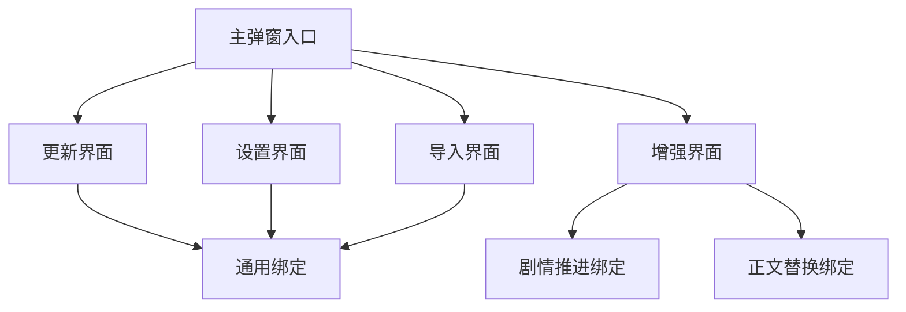

# 更新文档

## 项目目标
将超大单文件 [`index.js`](../index.js) 逐步模块化，在保持行为不变的前提下，持续拆分为更易维护的源码结构，并通过固定顺序拼接回单文件。

---

## 关键里程碑

### 第 1 轮：三大板块粗拆分
已完成从单文件到三段结构的第一次拆分：

- [`src/01_core.js`](../src/01_core.js)
- [`src/02_features.js`](../src/02_features.js)
- [`src/03_bootstrap.js`](../src/03_bootstrap.js)

并建立：
- [`backups/index.baseline.js`](../backups/index.baseline.js)
- [`scripts/build-index.js`](../scripts/build-index.js)
- [`dist/index.bundle.js`](../dist/index.bundle.js)

结果：第一轮拼接结果与 [`index.js`](../index.js) 完全一致。

### 第 2 轮：建立 `core + ui + features + bootstrap` 分层
已完成第二轮细分，并清理掉第一轮过期文件。

当前有效结构为：
- [`src/core/`](../src/core/)
- [`src/ui/`](../src/ui/)
- [`src/features/`](../src/features/)
- [`src/03_bootstrap.js`](../src/03_bootstrap.js)

第二轮完成后：
- [`scripts/build-index.js`](../scripts/build-index.js) 已升级为多文件拼接脚本
- [`scripts/split-round2.js`](../scripts/split-round2.js) 作为第二轮迁移脚本保留
- 拼接结果仍与 [`index.js`](../index.js) 完全一致
- 用户已确认功能测试成功

---

## 当前状态

### 当前有效源码结构

#### Core 层
- [`src/core/01_header_and_env.js`](../src/core/01_header_and_env.js)
- [`src/core/02_storage_and_profile.js`](../src/core/02_storage_and_profile.js)
- [`src/core/03_runtime_api.js`](../src/core/03_runtime_api.js)
- [`src/core/04_shared_helpers.js`](../src/core/04_shared_helpers.js)
- [`src/core/05_core_tail.js`](../src/core/05_core_tail.js)

#### UI 层
- [`src/ui/01_window_system.js`](../src/ui/01_window_system.js)
- [`src/ui/02_shared_editors_and_selectors.js`](../src/ui/02_shared_editors_and_selectors.js)
- [`src/ui/03_theme_and_toast.js`](../src/ui/03_theme_and_toast.js)
- [`src/ui/04_table_selectors.js`](../src/ui/04_table_selectors.js)
- [`src/ui/05_main_popup.js`](../src/ui/05_main_popup.js)
- [`src/ui/06_visualizer.js`](../src/ui/06_visualizer.js)

#### Features 层（第三轮已完成重组）
```
src/features/
├─ startup/
│  └─ 01_ready_and_menu.js          (53行)
├─ import/
│  ├─ 01_import_cleanup.js          (125行)
│  ├─ 02_import_lorebook_snapshot.js (128行)
│  └─ 03_import_processing.js       (365行)
├─ worldbook/
│  ├─ 01_plot_worldbook.js          (185行)
│  ├─ 02_selection_support.js       (351行)
│  ├─ 03_worldbook_list.js          (136行)
│  └─ 04_pipeline_core.js           (344行)
├─ runtime/
│  └─ 01_runtime_state.js           (241行)
├─ ai/
│  ├─ 01_prompt_prepare.js          (4行)
│  ├─ 02_api_call.js               (1532行)
│  └─ direct_bridge.js              (36行)
├─ table/
│  └─ 01_update_process.js          (243行)
├─ summary/
│  └─ 01_summary_logic.js           (364行)
├─ ui/
│  └─ 01_update_trigger.js          (721行)
└─ data/
   └─ 01_data_admin.js              (740行)
```

#### 收尾层
- [`src/03_bootstrap.js`](../src/03_bootstrap.js)

### 当前构建链路
- 输入源码位于 [`src/`](../src/)
- 由 [`scripts/build-index.js`](../scripts/build-index.js) 按固定顺序拼接
- 输出到 [`dist/index.bundle.js`](../dist/index.bundle.js)
- 并与 [`index.js`](../index.js) 做文本一致性校验

### 当前辅助文档
- 目录说明见 [`docs/目录结构说明.md`](../docs/目录结构说明.md)
- 本文档只保留关键里程碑与下一步计划

---

## 已清理内容
以下历史旧文件已移除：

**第一轮：**
- [`src/01_core.js`](../src/01_core.js)
- [`src/02_features.js`](../src/02_features.js)
- [`src/01_core_temp.js`](../src/01_core_temp.js)
- [`scripts/split-index.js`](../scripts/split-index.js)

**第三轮：**
- [`src/features/01_features_head.js`](../src/features/01_features_head.js)
- [`src/features/02_features_middle.js`](../src/features/02_features_middle.js)
- [`src/features/03_features_tail.js`](../src/features/03_features_tail.js)

---

## 下一轮规划

## 第 3 轮：功能层模块化重组

### 目标方向
下一轮不再优先细分 UI，而是优先把 [`src/features/`](../src/features/) 从现在的“前段、中段、尾段切片”重组为“按业务域命名”的功能层结构。

核心目标：
- 让后续新增功能时能直接定位到对应业务域
- 让导入、世界书、AI 调用、表格更新、纪要合并、模板操作这些能力各自成组
- 保持 [`src/ui/05_main_popup.js`](../src/ui/05_main_popup.js) 和 [`src/ui/06_visualizer.js`](../src/ui/06_visualizer.js) 暂时不动
- 继续保证最终拼接结果与 [`index.js`](../index.js) 等价

### 这一轮为什么先拆功能层
当前最影响后续维护与新增功能的，不是 UI 文件本身，而是 [`src/features/01_features_head.js`](../src/features/01_features_head.js)、[`src/features/02_features_middle.js`](../src/features/02_features_middle.js)、[`src/features/03_features_tail.js`](../src/features/03_features_tail.js) 仍然按历史切片组织，业务含义不直观。

例如当前功能层里混在一起的能力包括：
- 菜单入口与初始化
- 外部导入缓存与注入
- 世界书来源与条目筛选
- AI 提示词准备与请求发送
- 表格编辑指令解析
- 批量更新主流程
- 自动合并纪要与手动合并纪要
- 配置导入导出
- 聊天本地数据删除与模板覆盖

这些能力如果继续保留在“head / middle / tail”结构里，后续增加功能会越来越难定位。

### 本轮设计原则
- 不改 UI 结构，暂不拆 [`src/ui/05_main_popup.js`](../src/ui/05_main_popup.js) 与 [`src/ui/06_visualizer.js`](../src/ui/06_visualizer.js)
- 不改变原始执行顺序
- 不引入 ES Module
- 不引入打包器
- 不顺手重构业务逻辑
- 允许同一业务域在构建顺序中被 UI 文件隔开，但目录命名必须能体现业务归属
- 继续使用纯文本拼接和全文一致性校验

### 目标目录方案
建议将 [`src/features/`](../src/features/) 重组为下面这套结构：

```text
src/features/
├─ startup/
│  └─ 01_ready_and_menu.js
├─ import/
│  ├─ 01_import_cleanup.js
│  ├─ 02_import_lorebook_snapshot.js
│  └─ 03_import_processing.js
├─ worldbook/
│  ├─ 01_plot_worldbook.js
│  ├─ 02_selection_support.js
│  └─ 03_content_pipeline.js
├─ runtime/
│  ├─ 01_status_and_chat.js
│  └─ 02_manual_update_entry.js
├─ ai/
│  ├─ 01_prepare_input.js
│  ├─ 02_request_pipeline.js
│  └─ 03_direct_bridge.js
├─ table_update/
│  ├─ 01_table_edit_parser.js
│  ├─ 02_batch_scheduler.js
│  └─ 03_update_executor.js
├─ summary/
│  ├─ 01_auto_merge.js
│  └─ 02_manual_merge.js
└─ data_admin/
   ├─ 01_settings_exchange.js
   ├─ 02_chat_data_cleanup.js
   └─ 03_template_operations.js
```

### 各模块职责说明

#### [`src/features/startup/01_ready_and_menu.js`](../src/features/startup/01_ready_and_menu.js)
职责：
- ready 边界后的初始化收束
- 菜单入口注册
- 主入口触发逻辑

价值：
- 后续新增入口、菜单项、初始化动作时，只看这一处

#### [`src/features/import/01_import_cleanup.js`](../src/features/import/01_import_cleanup.js)
职责：
- 导入缓存清理
- 导入条目清理
- 已注入条目删除

价值：
- 导入生命周期里的“清理和回收”集中管理

#### [`src/features/import/02_import_lorebook_snapshot.js`](../src/features/import/02_import_lorebook_snapshot.js)
职责：
- 导入目标世界书解析
- 导入 JSON 备份条目读写
- 导入快照存储

价值：
- 导入过程里的“世界书持久化”单独成层

#### [`src/features/import/03_import_processing.js`](../src/features/import/03_import_processing.js)
职责：
- TXT 分块导入
- 导入注入主流程
- 导入状态推进
- 导入兼容入口

价值：
- 后续新增导入策略、导入格式、导入断点机制时，直接扩展这一层

#### [`src/features/worldbook/01_plot_worldbook.js`](../src/features/worldbook/01_plot_worldbook.js)
职责：
- 剧情推进世界书配置
- 剧情推进世界书列表与条目来源控制

价值：
- 剧情推进相关世界书逻辑不再散落在 UI 代码周围

#### [`src/features/worldbook/02_selection_support.js`](../src/features/worldbook/02_selection_support.js)
职责：
- 世界书选择辅助能力
- 条目懒加载状态
- 条目筛选与过滤辅助
- 常规世界书和导入世界书的选择支撑逻辑

价值：
- 世界书选择相关增强功能将有统一落点

#### [`src/features/runtime/01_status_and_chat.js`](../src/features/runtime/01_status_and_chat.js)
职责：
- 数据库状态统计
- 聊天记录加载
- 运行时状态展示所需的非 UI 计算

价值：
- 后续新增状态面板和运行时统计时，只需扩展这一层

#### [`src/features/worldbook/03_content_pipeline.js`](../src/features/worldbook/03_content_pipeline.js)
职责：
- 世界书名称获取
- 世界书条目获取
- 世界书内容组合
- 注入前内容筛选与排序

价值：
- 世界书注入策略会变成独立业务域，而不是附着在更新流程里

#### [`src/features/ai/01_prepare_input.js`](../src/features/ai/01_prepare_input.js)
职责：
- 表格上下文构建
- 对话上下文构建
- 占位符动态内容准备
- 世界书内容装载到 AI 输入

价值：
- 以后新增 `$0`、`$1`、`$4` 之外的输入拼装能力时，有清晰归属

#### [`src/features/ai/02_request_pipeline.js`](../src/features/ai/02_request_pipeline.js)
职责：
- API 模式切换
- 提示词组装
- 自定义 API 与酒馆 API 调用
- 重试与响应处理

价值：
- 以后接入新模型、新请求策略、新限流策略时，直接改这一层

#### [`src/features/table_update/01_table_edit_parser.js`](../src/features/table_update/01_table_edit_parser.js)
职责：
- `<tableEdit>` 提取
- JSON 清洗管线
- 指令解析与宽松容错
- 表格编辑命令应用

价值：
- “AI 输出不规范”相关问题会集中在这一层处理

#### [`src/features/table_update/02_batch_scheduler.js`](../src/features/table_update/02_batch_scheduler.js)
职责：
- 批次切分
- 批次上下文范围决定
- 批量更新调度

价值：
- 自动更新和手动更新的批处理策略将更容易维护

#### [`src/features/summary/01_auto_merge.js`](../src/features/summary/01_auto_merge.js)
职责：
- 自动合并纪要检测
- 自动合并纪要执行
- 自动合并结果回写

价值：
- 自动合并纪要逻辑从更新主链中抽离成独立业务域

#### [`src/features/table_update/03_update_executor.js`](../src/features/table_update/03_update_executor.js)
职责：
- 单批次更新执行
- 调用 AI
- 应用更新
- 保存聊天记录
- 成功与失败控制

价值：
- “真正执行一次更新”的主链会单独稳定下来

#### [`src/features/summary/02_manual_merge.js`](../src/features/summary/02_manual_merge.js)
职责：
- 手动合并纪要
- 合并范围控制
- 手动合并进度与落盘

价值：
- 手动合并和自动合并不再互相缠绕

#### [`src/features/runtime/02_manual_update_entry.js`](../src/features/runtime/02_manual_update_entry.js)
职责：
- 手动更新入口
- 手动更新的上下文范围选择
- 手动模式的调度入口

价值：
- 后续增加新的手动模式时更容易扩展

#### [`src/features/data_admin/01_settings_exchange.js`](../src/features/data_admin/01_settings_exchange.js)
职责：
- 合并配置导出
- 合并配置导入

价值：
- 配置交换能力集中，不会混进表格更新主流程

#### [`src/features/data_admin/02_chat_data_cleanup.js`](../src/features/data_admin/02_chat_data_cleanup.js)
职责：
- 删除聊天本地数据
- 清理隔离标识数据
- 删除辅助世界书包装条目
- 导出当前聊天数据库

价值：
- 数据清理和数据导出形成独立维护区

#### [`src/features/data_admin/03_template_operations.js`](../src/features/data_admin/03_template_operations.js)
职责：
- 模板导出导入
- 恢复默认模板
- 使用模板覆盖最新层
- 其他模板运维动作

价值：
- 模板相关变更会和 AI 更新流程彻底分开

#### [`src/features/ai/03_direct_bridge.js`](../src/features/ai/03_direct_bridge.js)
职责：
- 直接消息调用桥接
- 为后续独立请求场景保留桥梁

价值：
- 这个尾段文件本来就很薄，适合作为独立桥接模块保留

### 推荐拼接顺序
本轮最关键的不是目录是否好看，而是要继续保持原始执行顺序。因此建议未来在 [`scripts/build-index.js`](../scripts/build-index.js) 中使用下面这套顺序。

```text
src/core/01_header_and_env.js
src/ui/01_window_system.js
src/core/02_storage_and_profile.js
src/ui/02_shared_editors_and_selectors.js
src/core/03_runtime_api.js
src/ui/03_theme_and_toast.js
src/core/04_shared_helpers.js
src/ui/04_table_selectors.js
src/core/05_core_tail.js
src/features/startup/01_ready_and_menu.js
src/features/import/01_import_cleanup.js
src/features/import/02_import_lorebook_snapshot.js
src/features/import/03_import_processing.js
src/features/worldbook/01_plot_worldbook.js
src/features/worldbook/02_selection_support.js
src/ui/05_main_popup.js
src/features/runtime/01_status_and_chat.js
src/features/worldbook/03_content_pipeline.js
src/features/ai/01_prepare_input.js
src/features/ai/02_request_pipeline.js
src/features/table_update/01_table_edit_parser.js
src/features/table_update/02_batch_scheduler.js
src/features/summary/01_auto_merge.js
src/features/table_update/03_update_executor.js
src/features/summary/02_manual_merge.js
src/features/runtime/02_manual_update_entry.js
src/features/data_admin/01_settings_exchange.js
src/features/data_admin/02_chat_data_cleanup.js
src/features/data_admin/03_template_operations.js
src/ui/06_visualizer.js
src/features/ai/03_direct_bridge.js
src/03_bootstrap.js
```

这意味着：
- 目录按业务域组织
- 构建按原始顺序拼接
- 即使同一业务域被 UI 文件隔开，也不要为了目录分组而强行重排代码顺序

### 推荐实施顺序

#### 阶段 A：先拆 [`src/features/01_features_head.js`](../src/features/01_features_head.js)
建议先完成：
- [`src/features/startup/01_ready_and_menu.js`](../src/features/startup/01_ready_and_menu.js)
- [`src/features/import/01_import_cleanup.js`](../src/features/import/01_import_cleanup.js)
- [`src/features/import/02_import_lorebook_snapshot.js`](../src/features/import/02_import_lorebook_snapshot.js)
- [`src/features/import/03_import_processing.js`](../src/features/import/03_import_processing.js)
- [`src/features/worldbook/01_plot_worldbook.js`](../src/features/worldbook/01_plot_worldbook.js)
- [`src/features/worldbook/02_selection_support.js`](../src/features/worldbook/02_selection_support.js)

原因：
- 这一段边界相对清晰
- 适合作为功能层模块化第一步
- 风险明显低于一开始就拆 AI 更新主链

#### 阶段 B：再拆 [`src/features/02_features_middle.js`](../src/features/02_features_middle.js)
建议按下面顺序拆：
- [`src/features/runtime/01_status_and_chat.js`](../src/features/runtime/01_status_and_chat.js)
- [`src/features/worldbook/03_content_pipeline.js`](../src/features/worldbook/03_content_pipeline.js)
- [`src/features/ai/01_prepare_input.js`](../src/features/ai/01_prepare_input.js)
- [`src/features/ai/02_request_pipeline.js`](../src/features/ai/02_request_pipeline.js)
- [`src/features/table_update/01_table_edit_parser.js`](../src/features/table_update/01_table_edit_parser.js)
- [`src/features/table_update/02_batch_scheduler.js`](../src/features/table_update/02_batch_scheduler.js)
- [`src/features/summary/01_auto_merge.js`](../src/features/summary/01_auto_merge.js)
- [`src/features/table_update/03_update_executor.js`](../src/features/table_update/03_update_executor.js)
- [`src/features/summary/02_manual_merge.js`](../src/features/summary/02_manual_merge.js)
- [`src/features/runtime/02_manual_update_entry.js`](../src/features/runtime/02_manual_update_entry.js)
- [`src/features/data_admin/01_settings_exchange.js`](../src/features/data_admin/01_settings_exchange.js)
- [`src/features/data_admin/02_chat_data_cleanup.js`](../src/features/data_admin/02_chat_data_cleanup.js)
- [`src/features/data_admin/03_template_operations.js`](../src/features/data_admin/03_template_operations.js)

原因：
- 这段是功能层核心
- 拆完之后后续新增业务功能会轻松很多

#### 阶段 C：收尾 [`src/features/03_features_tail.js`](../src/features/03_features_tail.js)
将其转成：
- [`src/features/ai/03_direct_bridge.js`](../src/features/ai/03_direct_bridge.js)

#### 阶段 D：调整脚本与验证
- 扩展 [`scripts/build-index.js`](../scripts/build-index.js)
- 视需要建立 [`scripts/split-round3-features.js`](../scripts/split-round3-features.js)
- 重新生成 [`dist/index.bundle.js`](../dist/index.bundle.js)
- 再次比对 [`dist/index.bundle.js`](../dist/index.bundle.js) 与 [`index.js`](../index.js)
- 通过后再做功能冒烟验证

### 本轮风险与应对

#### 风险 1：功能域与原始顺序并不完全连续
例如世界书逻辑既出现在 [`src/features/01_features_head.js`](../src/features/01_features_head.js)，也出现在 [`src/features/02_features_middle.js`](../src/features/02_features_middle.js)。

应对：
- 允许同一功能域拆成多个顺序模块
- 不为了概念纯粹而打乱拼接顺序

#### 风险 2：UI 会调用部分功能层辅助函数
例如世界书选择、导入状态、手动更新入口等，虽然服务于 UI，但本质上仍属于功能域支撑逻辑。

应对：
- 本轮不再强行把这类代码塞回 [`src/ui/`](../src/ui/)
- 以“功能归属优先”来命名文件

#### 风险 3：更新链与纪要合并链交叉
当前批处理调度、自动合并、单次更新执行、手动合并在原文件中彼此穿插。

应对：
- 本轮允许 [`src/features/table_update/`](../src/features/table_update/) 与 [`src/features/summary/`](../src/features/summary/) 在构建顺序中交错出现
- 只保证职责命名清晰，不强求文件在构建时必须连续排列

#### 风险 4：功能层改动后更容易想顺手重构
这一轮很容易在拆分时顺手优化 API 调用、表格解析、模板逻辑。

应对：
- 严格限制为“搬运 + 拼接 + 比对”
- 所有功能优化留到结构稳定之后

---

## 当前结论
当前项目已经进入“适合按功能域继续模块化”的阶段。

如果继续实施，最推荐的下一步不是再拆 UI，而是先把 [`src/features/01_features_head.js`](../src/features/01_features_head.js)、[`src/features/02_features_middle.js`](../src/features/02_features_middle.js)、[`src/features/03_features_tail.js`](../src/features/03_features_tail.js) 重组为按业务域命名的功能层结构，并继续保持与 [`index.js`](../index.js) 的全文等价。

---

## 本轮补充说明

### 关于“为什么还会提到 CSS”
这次第三轮的目标并不是把“所有和界面相关的内容”都抽离到纯 UI 目录，而是：

- 尽量把明确的 UI 文件保留在 [`src/ui/`](../src/ui/)
- 优先把 [`src/features/`](../src/features/) 从“head / middle / tail”改成“按业务域命名”
- 在不改变原始执行顺序的前提下完成拆分

因此，当前结构里仍然存在两种情况：

#### 1. 主要 UI 代码，确实已经集中在 [`src/ui/`](../src/ui/)
例如：
- [`src/ui/05_main_popup.js`](../src/ui/05_main_popup.js)
- [`src/ui/06_visualizer.js`](../src/ui/06_visualizer.js)

这里面包含了大部分窗口、弹层、可视化、主题和样式相关逻辑。

#### 2. 少量“功能文件附近的界面痕迹”仍然保留了原始位置
这不是因为要把 UI 再塞回功能层，而是因为第三轮采用的是“搬运式拆分”，要求：

- 不顺手重构业务逻辑
- 不主动改执行时序
- 先保证拼接后与 [`index.js`](../index.js) 全文一致

我之前提到 CSS，是因为原始 [`index.js`](../index.js) 在 [`src/features/02_features_middle.js`](../src/features/02_features_middle.js) 的尾部附近，确实存在一个和 visualizer 相关的 CSS 注释边界；而真正的 visualizer 样式与界面主体代码，仍然在 [`src/ui/06_visualizer.js`](../src/ui/06_visualizer.js)。

换句话说：
- **真正的 visualizer UI 与样式主体仍在 [`src/ui/06_visualizer.js`](../src/ui/06_visualizer.js)**
- 我提到 CSS，是在说明“原始单文件里的拼接边界和顺序”，不是说这轮又把 UI 主体拆回 [`src/features/`](../src/features/)

### 现在可以怎样理解当前结构
可以把现在的结构理解成：

- **UI 主体已集中**：窗口、主弹窗、visualizer 主代码在 [`src/ui/`](../src/ui/)
- **功能层已重组**：导入、世界书、AI、更新流程、数据管理在 [`src/features/`](../src/features/)
- **仍保留少量历史边界痕迹**：这是为了保证本轮是“安全拆分”，而不是“边拆边重构”

### 后续如果要更纯粹地分离 UI
下一轮可以继续做一次“UI 纯化”整理，目标会是：

- 检查 [`src/features/`](../src/features/) 里是否还残留 DOM、样式、按钮状态更新等代码
- 能迁到 [`src/ui/`](../src/ui/) 的再迁过去
- 但这一步应该放在当前结构稳定、功能验证完成之后

这样风险会更低，也更容易定位问题。

---

## 最新推进记录

### 已完成的清理动作
- 已删除旧功能切片文件：[`src/features/01_features_head.js`](../src/features/01_features_head.js)、[`src/features/02_features_middle.js`](../src/features/02_features_middle.js)、[`src/features/03_features_tail.js`](../src/features/03_features_tail.js)
- 已重新运行 [`scripts/build-index.js`](../scripts/build-index.js)
- 已确认 [`dist/index.bundle.js`](../dist/index.bundle.js) 与 [`index.js`](../index.js) 仍然全文一致

这说明第三轮功能层重组已经真正收尾完成，旧切片文件不再需要保留。

## 第 4 轮建议：优先拆 [`src/ui/05_main_popup.js`](../src/ui/05_main_popup.js)

### 为什么下一步先拆它
当前最值得优先处理的文件，已经不是 [`src/features/`](../src/features/) ，而是 [`src/ui/05_main_popup.js`](../src/ui/05_main_popup.js)。

原因：
- 它仍然是当前最大的单体 UI 文件之一
- 一个 [`openAutoCardPopup_ACU`](../src/ui/05_main_popup.js) 主入口里同时塞入了样式、导航、8 个分页内容、DOM 缓存、事件绑定、剧情推进绑定、正文替换绑定
- 它的复杂度已经明显高于 [`src/features/data/01_data_admin.js`](../src/features/data/01_data_admin.js) 或 [`src/features/summary/01_summary_logic.js`](../src/features/summary/01_summary_logic.js)
- 只要把主弹窗拆开，后续无论继续拆设置区、导入区还是更新区，都会容易很多

### 这一轮不要直接拆得太碎
虽然你的目标是把“设置界面、导入界面、更新界面”拆开，但从安全性来看，不建议一上来就把 [`src/ui/05_main_popup.js`](../src/ui/05_main_popup.js) 直接切成十几个很碎的小文件。

更稳的原因是：
- 当前主弹窗的大段 HTML 都包在同一个模板字符串里
- 大量事件绑定依赖同一个 [`$popupInstance_ACU`](../src/ui/05_main_popup.js)
- 剧情推进与正文替换还有各自的局部 helper 和作用域状态
- 如果第一次就切得过细，很容易在拼接时打断模板字符串边界、闭包边界或事件绑定时序

所以更推荐采用“两步式拆分”。

### 推荐方案：先做安全拆分，再做语义细分

#### 阶段 A：先按连续代码块做一次安全拆分
建议先把 [`src/ui/05_main_popup.js`](../src/ui/05_main_popup.js) 重组为：

```text
src/ui/main_popup/
├─ 01_shell_and_update_tab.js
├─ 02_settings_tabs.js
├─ 03_import_tab.js
├─ 04_plot_and_optimization_tabs.js
├─ 05_common_bindings.js
├─ 06_plot_bindings_and_helpers.js
└─ 07_optimization_bindings_and_tail.js
```

各文件职责建议如下：

#### [`src/ui/main_popup/01_shell_and_update_tab.js`](../src/ui/main_popup/01_shell_and_update_tab.js)
职责：
- [`openAutoCardPopup_ACU`](../src/ui/05_main_popup.js) 的函数开头
- 主弹窗样式
- 头部标题与左侧导航
- `status` 分页
- 手动更新表选择与更新参数区

这一块对应你说的“更新界面”主体，应该最先独立出来。

#### [`src/ui/main_popup/02_settings_tabs.js`](../src/ui/main_popup/02_settings_tabs.js)
职责：
- `prompt` 分页
- `api` 分页
- `worldbook` 分页
- `data` 分页中的设置与模板管理主体

这一块对应“设置界面”主体。

#### [`src/ui/main_popup/03_import_tab.js`](../src/ui/main_popup/03_import_tab.js)
职责：
- `import` 分页完整 HTML
- 导入世界书目标、编码、拆分长度、导入表选择等 UI

这一块单独独立，最符合你提到的“导入界面单独拆出”。

#### [`src/ui/main_popup/04_plot_and_optimization_tabs.js`](../src/ui/main_popup/04_plot_and_optimization_tabs.js)
职责：
- `plot` 分页 HTML
- `optimization` 分页 HTML
- 弹窗模板字符串收尾
- `createACUWindow` 调用起始段

原因：
- 这两块都属于增强型 UI
- 目前体量较大，但逻辑彼此相邻且都在主弹窗尾段
- 第一刀先合并成一个增强区文件，比强行拆太细更稳

#### [`src/ui/main_popup/05_common_bindings.js`](../src/ui/main_popup/05_common_bindings.js)
职责：
- DOM 查询缓存
- Tab 切换
- 通用输入保存
- 更新区、设置区、数据区、导入区的通用事件绑定

这一层的目标，是把“主弹窗通用装配逻辑”从 plot 和 optimization 的重绑定逻辑里分离出来。

#### [`src/ui/main_popup/06_plot_bindings_and_helpers.js`](../src/ui/main_popup/06_plot_bindings_and_helpers.js)
职责：
- 剧情推进分页事件绑定
- 剧情推进预设管理
- 剧情推进世界书选择 UI
- 紧跟其后的 popup 专属 plot helper

#### [`src/ui/main_popup/07_optimization_bindings_and_tail.js`](../src/ui/main_popup/07_optimization_bindings_and_tail.js)
职责：
- 正文替换分页事件绑定
- 正文替换预设管理
- 测试按钮与提示词组逻辑
- 弹窗尾部收束代码

### 阶段 A 的核心价值
这一步的重点不是“最终目录多漂亮”，而是：
- 先把 [`src/ui/05_main_popup.js`](../src/ui/05_main_popup.js) 的超大体积拆开
- 同时继续保持“纯文本拼接 + 行为不变”
- 不在第一刀里就大改函数结构
- 让下一轮再做“设置界面 / 导入界面 / 更新界面”的更细语义整理时，风险更低

### 阶段 B：再按你想要的语义继续细分
等阶段 A 验证通过后，再继续把 [`src/ui/main_popup/`](../src/ui/main_popup/) 内部往下切成更纯粹的业务文件：

- 更新界面：状态、手动更新、自动更新参数
- 设置界面：提示词、API、世界书、模板/数据设置
- 导入界面：导入目标、TXT 拆分、注入控制
- 增强界面：剧情推进、正文替换

也就是说：
- **阶段 A 是安全拆分**
- **阶段 B 才是更纯粹的语义拆分**

这样更符合当前项目一直坚持的“先搬运、再验证、再细化”的节奏。

### 建议的第四轮实施顺序
1. 先读取并标出 [`src/ui/05_main_popup.js`](../src/ui/05_main_popup.js) 的连续边界
2. 先拆 HTML 结构块，再拆事件绑定块
3. 更新 [`scripts/build-index.js`](../scripts/build-index.js) 中 [`src/ui/05_main_popup.js`](../src/ui/05_main_popup.js) 对应的拼接顺序
4. 重新构建 [`dist/index.bundle.js`](../dist/index.bundle.js)
5. 再次与 [`index.js`](../index.js) 做全文一致性校验
6. 通过后再进入更细的设置界面、导入界面、更新界面二次细分

### 第四轮完成后的预期收益
如果这一轮顺利完成，后续会直接获得三个好处：

- 主弹窗不再是一个几千行的单体文件
- 你想改“设置界面、导入界面、更新界面”时，终于有明确落点
- 后面再拆 [`src/ui/06_visualizer.js`](../src/ui/06_visualizer.js) 时，整个 UI 层会进入更清晰的分层状态


