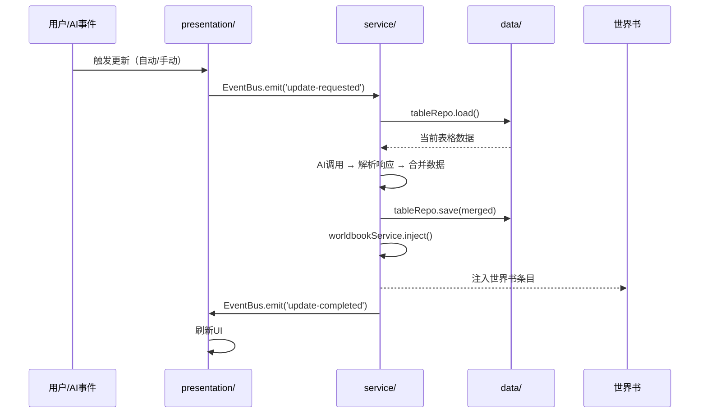
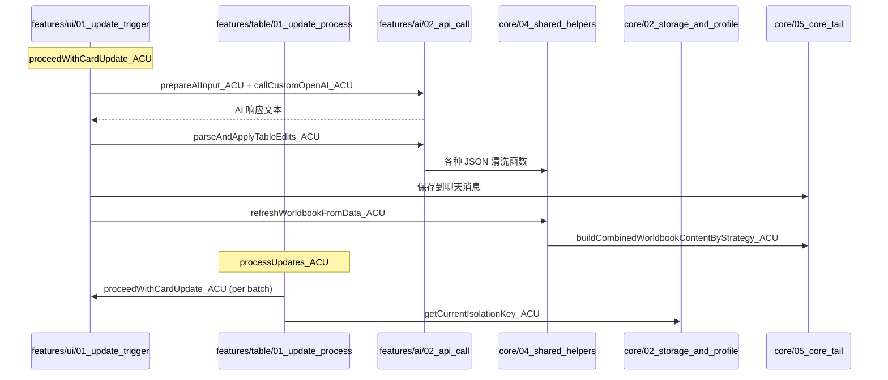
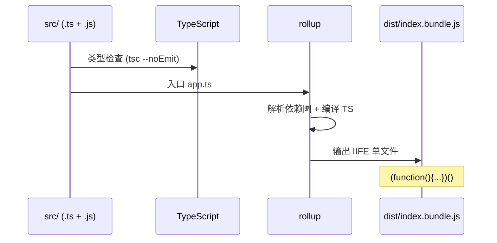

# 实施计划：三层架构重构

分支：`001-three-layer-refactor` | 日期：2026-04-12 | 规范：[spec.md](./spec.md)
输入：来自 `/specs/001-three-layer-refactor/spec.md` 的功能规范

## 摘要

将星·数据库 III（35,283 行 Tampermonkey 脚本）从当前 core/ui/features 粗拆结构重构为 data/service/presentation 三层架构，同步引入 rollup + TypeScript 构建工具链。6 个 Phase 严格串行，每步保证产物与基线行为等价。

## 背景介绍（必选）

- 系统背景：星·数据库 III（ACU）是运行在 SillyTavern iframe 中的 Tampermonkey 用户脚本，核心功能是在 AI 对话中自动更新结构化数据表并注入世界书。
- 需求内容：将 28 个源码文件（现有 core/ui/features 三层）重组为 data/service/presentation/shared 四目录架构，引入 rollup + TypeScript 替代手工文本拼接。
- 当前存在的问题（基于实际代码调研）：
  1. **文件间交错依赖**：buildOrder 中 core 和 ui 文件严格交错（core/01 → ui/01 → core/02 → ui/02 → ...），变量声明在前一个文件、使用在后一个文件，不能简单按目录移动
  2. **UI 层直接操作持久化**：`saveSettings_ACU()` 在 9 个文件中被调用 134 次，其中 UI 文件（04_table_selectors、02_shared_editors、05_main_popup）共 67 次直接调用，presentation → data 直接依赖
  3. **features 层全部含 DOM 操作**：12/12 个 features 文件均包含 DOM 操作（jQuery .find/.html/.css/.append 等），所谓"业务逻辑"与 UI 高度耦合
  4. **状态声明位置错乱**：核心状态变量（isAutoUpdatingCard_ACU、wasStoppedByUser_ACU、currentAbortController_ACU 等 9 个 let）声明在 ui/02_shared_editors_and_selectors.js 中，而非 core 层
  5. **巨型文件**：04_shared_helpers.js（8459 行/375KB）、05_main_popup.js（5734 行/348KB）、06_visualizer.js（2755 行/120KB）
  6. **构建脚本极简**：build-index.js 仅做纯文本拼接 + CRLF→LF 标准化，32 个文件按 buildOrder 数组 join('\n')，无任何转译/压缩

## 目标 or 问题（必选）

- 最终目标：获得职责分明、类型安全、依赖自动管理的现代化代码库，同时对最终用户完全透明（零功能变化）。
- 约束与边界：产物 MUST 是单文件 IIFE JS；运行在 Tampermonkey + SillyTavern iframe；不引入运行时依赖；80+ 外部 API 接口不变。

## 业界方案 or 选型思考（必选）

### 构建工具选型

| 方案 | 产物格式 | TS 支持 | 开发成本 | 维护难度 | 备注 |
|------|----------|---------|----------|----------|------|
| A: 继续手工拼接 | IIFE ✅ | ❌ 不支持 | 低 | 高（32 文件不可持续） | 现状 |
| B: rollup | IIFE ✅ | ✅ 插件支持 | 中 | 低（自动依赖图） | 选择此方案 |
| C: esbuild | IIFE ✅ | ✅ 原生支持 | 中 | 低 | Tree-shaking 弱于 rollup |
| D: webpack | IIFE（需配置） | ✅ | 高 | 中（配置复杂） | 过重 |

- 选型结论：**方案 B — rollup**
- 选择理由：`output.format: 'iife'` 直接输出与当前 index.js 相同的 IIFE 结构；自动按依赖图排序消除隐式顺序依赖；插件生态成熟（@rollup/plugin-typescript）；配置简洁。放弃 esbuild 的原因是其 IIFE 输出对全局变量注入的控制不如 rollup 精细。

### 架构模式选型

| 方案 | 分层清晰度 | 迁移成本 | 适合渐进重构 | 备注 |
|------|-----------|----------|-------------|------|
| A: 保持 core/ui/features | 低 | 无 | N/A | 现状，不解决问题 |
| B: data/service/presentation | 高 | 中 | ✅ | 选择此方案 |
| C: 领域驱动(DDD) | 极高 | 极高 | ❌ | 对用户脚本过重 |

- 选型结论：**方案 B — 经典三层架构**
- 选择理由：职责边界清晰、迁移成本可控、适合渐进式重构；DDD 对 Tampermonkey 用户脚本过于复杂。

## 概要设计（必选）

- 总体描述：将现有 28 个源码文件（加上 bootstrap 共 29 个）按职责重新归类到 data/（数据库层）、service/（服务层）、presentation/（表示层）、shared/（共享层）四个目录。引入 rollup 构建工具链自动管理依赖，产物仍为单文件 IIFE。TypeScript 作为可选的编译期类型检查工具，新文件用 `.ts`，旧文件保持 `.js`。

## 系统架构（必选）

```
┌─────────────────────────────────────────────────────────┐
│                表示层 (presentation/)                      │
│  窗口系统 | 主题/Toast | 组件 | 主弹窗(8分页) | 可视化编辑器 │
│  职责：UI 渲染、用户交互、DOM 操作                          │
├─────────────────────────────────────────────────────────┤
│                 服务层 (service/)                          │
│  AI调用 | 表格更新编排 | 世界书注入 | 导入 | 纪要合并        │
│  数据管理 | 状态管理器 | 事件总线                            │
│  职责：业务逻辑编排、工作流控制                              │
├─────────────────────────────────────────────────────────┤
│                数据库层 (data/)                            │
│  存储后端(酒馆设置/IDB/聊天字段) | 数据模型 | Repository    │
│  职责：数据持久化、CRUD 接口                                │
├─────────────────────────────────────────────────────────┤
│                共享层 (shared/)                            │
│  常量 | 环境检测 | 纯工具函数 | JSON工具 | HTML工具         │
│  职责：跨层公用的无业务依赖工具                              │
└─────────────────────────────────────────────────────────┘
```

依赖方向：`presentation → service → data`，`shared` 被所有层依赖。

### 源码调研发现的关键耦合点

基于对所有 29 个源文件（约 35,000 行）的逐文件分析，发现以下会影响重构策略的关键耦合：

#### 1. buildOrder 的交错排列（核心约束）

现有构建顺序不是按目录聚集的，而是严格交错的：

```
core/01_header_and_env.js        ← IIFE 开头、环境常量
ui/01_window_system.js           ← 窗口系统（依赖上一个文件的常量）
core/02_storage_and_profile.js   ← 存储后端、默认配置（5146 行）
ui/02_shared_editors_and_selectors.js ← 剧情编辑器（依赖上一个文件的配置）
core/03_runtime_api.js           ← API 组装（依赖上两个文件的函数）
ui/03_theme_and_toast.js         ← Toast（依赖上一个文件的变量）
core/04_shared_helpers.js        ← 工具函数（8459 行，引用前面所有文件的函数）
ui/04_table_selectors.js         ← 表格选择器（依赖上一个文件的函数）
core/05_core_tail.js             ← 持久化+世界书（3143 行，引用前面所有）
```

这意味着不能简单地"把 core/ 搬到 data/"——文件间有精确的声明顺序依赖关系，rollup 需要通过 import/export 显式化这些依赖。

#### 2. `saveSettings_ACU()` 的跨层渗透（134 处调用）

| 文件 | 层级 | 调用次数 |
|------|------|---------|
| core/04_shared_helpers.js | 应归 shared/service | 22 |
| core/02_storage_and_profile.js | 应归 data | 7 |
| core/03_runtime_api.js | 应归 service | 10 |
| core/05_core_tail.js | 应归 data/service | 3 |
| ui/04_table_selectors.js | 应归 presentation | 10 |
| ui/02_shared_editors_and_selectors.js | 应归 presentation | 5 |
| ui/05_main_popup.js | 应归 presentation | 3 |
| features/data/01_data_admin.js | 应归 service | 4 |
| features/import/03_import_processing.js | 应归 service | 1 |
| features/worldbook/01_plot_worldbook.js | 应归 service | 1 |
| features/worldbook/03_worldbook_list.js | 应归 service | 1 |

**影响**：presentation 层不应直接调用 `saveSettings_ACU()`。需要引入中间层（service 方法或事件），让 UI 通过 service 层间接触发持久化。但在 Phase 1~2（行为等价优先期间），先保留直接调用，在 Phase 3 引入 ACU_State 时统一替换。

#### 3. 全局状态变量的位置错乱（9 个关键状态在 UI 层声明）

`ui/02_shared_editors_and_selectors.js` 的第 517~531 行声明了：

```javascript
let isAutoUpdatingCard_ACU = false;
let wasStoppedByUser_ACU = false;
let newMessageDebounceTimer_ACU = null;
let currentAbortController_ACU = null;
let activePlotEditorSettings_ACU = null;
let currentPlotTaskEditorId_ACU = '';
let currentEditablePlotPresetState_ACU = { ... };
let plotTaskEditorAutoSaveTimer_ACU = null;
let activeAbortControllers_ACU = new Set();
let manualExtraHint_ACU = '';
```

这些是核心运行时状态（如"是否正在更新"、"中止控制器"），不应该在 UI 层。它们被 features/table/、features/ai/、features/ui/ 等多个文件引用。

**影响**：Phase 3 引入 ACU_State 时需要把这些变量迁移到 service/runtime/，但由于它们声明在 buildOrder 的第 4 个文件（非常靠前），迁移时需确保新的声明位置在所有引用者之前。

#### 4. features 层的 DOM 操作渗透

| features 文件 | 行数 | DOM 操作 | 全局变量依赖 |
|---|---|---|---|
| worldbook/02_selection_support.js | 370 | jQuery_API_ACU 读取 DOM | settings_ACU |
| worldbook/01_plot_worldbook.js | 200 | DOM 选择器 | settings_ACU |
| worldbook/03_worldbook_list.js | 136 | DOM 列表渲染 | settings_ACU, TavernHelper_API_ACU |
| worldbook/04_pipeline_core.js | 340 | document 访问 | SillyTavern_API_ACU, TavernHelper_API_ACU |
| runtime/01_runtime_state.js | 241 | 全量 DOM 操作（.html/.text/.css） | currentJsonTableData_ACU, settings_ACU |
| import/02_import_lorebook_snapshot.js | 128 | $popupInstance_ACU DOM 查询 | settings_ACU |
| import/03_import_processing.js | 365 | DOM + 持久化混合 | currentJsonTableData_ACU, settings_ACU |
| summary/01_summary_logic.js | 365 | Toast DOM | settings_ACU, currentJsonTableData_ACU |
| ai/02_api_call.js | 1532 | 无直接 DOM（含间接 Toast） | settings_ACU, currentJsonTableData_ACU |
| table/01_update_process.js | 243 | Toast DOM | settings_ACU, SillyTavern_API_ACU |
| ui/01_update_trigger.js | 720 | 大量 DOM 操作 | settings_ACU, currentJsonTableData_ACU |
| data/01_data_admin.js | 720 | DOM + 文件下载 | settings_ACU |

**影响**：`runtime/01_runtime_state.js` 名义上是"运行时状态"，实际是纯 UI 状态展示（updateCardUpdateStatusDisplay_ACU），应归入 presentation 层。`ui/01_update_trigger.js` 包含 proceedWithCardUpdate_ACU（核心更新编排），应拆分为 service + presentation 两部分。

#### 5. 05_main_popup.js 的内部结构

5734 行，主入口函数 `openAutoCardPopup_ACU()` 从第 1 行到约第 5170 行是一个巨型异步函数，内含：
- 第 1~2580 行：弹窗 HTML 模板字符串（CSS + 8 个分页 HTML）
- 第 2581~5170 行：弹窗内部事件绑定逻辑
- 第 5178~5734 行：14 个独立函数（loadPlotSettingsToUI、loadOptimizationPresetSelect 等）

**影响**：拆分方案 — 5 个文件：(1) CSS 样式 (2) HTML 模板 (3) 事件绑定入口 (4) 各分页事件处理 (5) 独立辅助函数。但切割点必须在 HTML 模板字符串的完整标签边界。

### 模块实现方法要点

- 模块：**data/storage/**（存储后端抽象）
  - 核心流程：统一配置存储门面，自动降级策略（酒馆设置 → IndexedDB → 默认值）
  - 主要数据来源：extensionSettings、IndexedDB、聊天消息 TavernDB_ACU_* 字段
  - 已有实现位置：core/02_storage_and_profile.js 的前 1000 行（getConfigStorage_ACU、IndexedDB 封装等）
  - 错误处理：存储不可用时静默降级到下一级
  - 向后兼容：现有存储键名和数据格式完全保留

- 模块：**data/models/**（数据模型与默认配置）
  - 核心流程：DEFAULT_SETTINGS_ACU、DEFAULT_PLOT_SETTINGS_ACU 等 50+ 字段的默认值定义
  - 已有实现位置：core/02_storage_and_profile.js 的 1000~5146 行
  - 注意：这些默认值被 UI 层（弹窗初始化）和 service 层（配置重置）共同引用

- 模块：**service/ai/**（AI 调用服务）
  - 核心流程：提示词组装 → API 调用（自定义/酒馆/直连）→ 响应解析（流式/非流式）
  - 已有实现位置：features/ai/01_prompt_prepare.js（4 行，仅声明）、features/ai/02_api_call.js（1532 行，含 JSON 清洗管线）、features/ai/direct_bridge.js（36 行）
  - 关键发现：02_api_call.js 内置了一个完整的 JSON 修复管线（normalizeQuotes → escapeUnescapedQuotes → sanitizeControlChars → removeTrailingCommas → fixNumericKeys），共 600+ 行，应抽取到 shared/json-helpers

- 模块：**service/table/**（表格更新服务）
  - 核心流程：接收 AI 返回的更新指令 → 解析 → 合并到当前表格 → 保存 → 触发世界书刷新
  - 已有实现位置：features/table/01_update_process.js（243 行）、features/ui/01_update_trigger.js 中的 proceedWithCardUpdate_ACU（前 300 行）

- 模块：**service/runtime/**（运行时服务）
  - 核心流程：ACU_State 统一管理全局状态；ACU_EventBus 发布/订阅事件；ACU_Services 服务定位
  - 关键迁移：9 个全局 let 变量从 ui/02_shared_editors_and_selectors.js 迁出
  - 错误处理：事件监听器异常不影响其他监听器

- 模块：**presentation/pages/main-popup/**（主弹窗）
  - 核心流程：弹窗外壳 → 导航切换 → 各分页渲染 → 事件绑定 → 通过服务层提交操作
  - 已有实现位置：ui/05_main_popup.js（5734 行单文件）
  - 拆分策略：CSS 字符串 → 独立文件；HTML 模板按分页拆分；事件绑定按分页拆分
  - 错误处理：UI 渲染失败显示 Toast 通知

语言/版本：JavaScript ES2020+ / TypeScript 5.x
主要依赖：rollup + @rollup/plugin-typescript（开发依赖，不进入产物）
存储：酒馆 extensionSettings（主存）、IndexedDB（本地缓存）、聊天消息自定义字段
目标平台：Tampermonkey + SillyTavern iframe（Chrome/Firefox/Edge）
约束：产物单文件 IIFE，无运行时外部依赖

## 关键逻辑 / 系统流程（必选）

### 核心数据流（重构后）



### 现有调用链（需重构的关键路径）



### 构建流程



## 数据模型 / 协议设计（必选）

关键数据结构概要：
- **chatSheets**：`{ mate: MetaData, sheet_0: Sheet, sheet_1: Sheet, ... }`
- **Sheet**：`{ name: string, content: string[][], sourceData: { headers: string[] } }`
- **Settings**：包含 AI 配置、更新参数、世界书配置、合并纪要配置等 50+ 字段
- **PlotPreset**：`{ name, promptGroup[], rateMain, ratePersonal, ..., loopSettings }`
- **ApiPreset**：`{ name, apiMode, apiConfig: { url, key, model }, tavernProfile }`

## 接口设计（必选）

### 层间接口

- 接口名：**Repository 接口**（data 层向 service 层暴露）
  - 用途：统一的数据 CRUD 抽象
  - 入参：实体键名/ID
  - 出参：实体数据对象
  - 实现说明：每种 Repository（settings/table/template/import/isolation）实现 load/save/delete

- 接口名：**EventBus**（service 层与 presentation 层解耦）
  - 用途：发布/订阅事件，替代直接函数调用
  - 入参：事件名 + 负载对象
  - 出参：无（异步通知）
  - 实现说明：简单的 on/off/emit 模式；监听器异常隔离

- 接口名：**ACU_State**（全局状态管理器）
  - 用途：集中管理 30+ 个全局可变状态
  - 入参：key + value
  - 出参：当前状态值
  - 实现说明：getter/setter 模式，为未来变更通知预留扩展点

### 外部接口（保持不变）

- 接口名：**window.AutoCardUpdaterAPI**
  - 用途：向其他插件/脚本暴露 80+ 个编程接口
  - 实现说明：接口签名和行为 MUST 与基线完全一致；内部实现改为代理到 service 层

## 实施计划（必选）

### 分阶段路线图

| Phase | 名称 | 预估工时 | 依赖 | 关键输出 |
|-------|------|---------|------|---------|
| 0 | 准备阶段 | 2-3 天 | 无 | rollup + TS 配置，构建产物与基线逐字节一致 |
| 1 | 共享层抽取 | 3-5 天 | Phase 0 | shared/ 目录，函数分类表 |
| 2 | 数据库层建立 | 4-6 天 | Phase 1 | data/ 目录，Repository 接口 |
| 3 | 服务层建立 | 6-8 天 | Phase 2 | service/ 目录，EventBus + ACU_State |
| 4 | 表示层重组 | 6-8 天 | Phase 3 | presentation/ 目录，弹窗拆分 |
| 5 | 清理与收束 | 2-3 天 | Phase 4 | 最终目录结构，文档更新 |

总计预估：23-33 天

### Phase 0 详细方案：rollup + TypeScript 搭建

**目标**：rollup 构建产物与现有 build-index.js 拼接结果**逐字节一致**

**关键挑战**：
- 现有构建是纯文本拼接（`join('\n')`），每个文件之间只有一个换行符
- 所有文件在同一 IIFE 闭包内，共享作用域
- 没有任何 import/export
- UserScript 头在第一个文件开头

**方案**：
1. 初始化 `package.json`，安装 rollup + @rollup/plugin-typescript + typescript
2. 创建 `rollup.config.js`，使用 `rollup-plugin-string-concat` 或自定义插件复现 build-index.js 的拼接行为
3. 或者——使用 rollup 的 `intro`/`outro` 选项手动控制 IIFE 包裹
4. 创建 `tsconfig.json`，启用 `allowJs: true`、`noEmit: true`（仅检查）
5. 验证：`diff dist/index.bundle.js index.js` 应无差异

**Phase 0 的关键决策点**：rollup 在 Phase 0 阶段是否就用 import/export，还是先用自定义拼接插件复现现状？

- 方案 A（推荐）：Phase 0 用自定义 rollup 插件复现 build-index.js 的拼接行为，确保逐字节一致后再逐步引入 import/export
- 方案 B：Phase 0 直接用 import/export + rollup 标准 IIFE 输出，但可能因为闭包作用域变化导致行为差异

选择**方案 A**，因为行为等价是宪章原则 II 的不可协商要求。

### Phase 1 详细方案：共享层抽取

**04_shared_helpers.js 分类矩阵**（基于代码调研）：

| 分类 | 估计函数数 | 目标位置 | 判定标准 |
|------|-----------|---------|---------|
| 🟢 纯工具函数 | ~80 | shared/utils.ts | 无 settings_ACU / currentJsonTableData_ACU 依赖，无 DOM |
| 🟢 JSON 清洗管线 | ~15 | shared/json-helpers.ts | normalizeQuotes、sanitizeControlChars 等，从 ai/02_api_call.js 抽取 |
| 🟡 数据操作函数 | ~60 | data/helpers/ | 读写 settings_ACU / currentJsonTableData_ACU，不含 DOM |
| 🔴 业务逻辑函数 | ~50 | service/ 各子模块 | 涉及业务编排（世界书刷新、更新调度等） |
| 🔴 含 DOM 操作函数 | ~45 | presentation/ | 含 jQuery / document.* 调用 |

**关键操作**：
1. 对 8459 行 04_shared_helpers.js 逐函数标记分类
2. 先只搬 🟢 纯工具函数到 shared/，保留其他在原位
3. 用 export/import 替代闭包内直接引用
4. 每搬完一个函数立即 rollup 构建 + 验证

### Phase 2 详细方案：数据库层建立

**02_storage_and_profile.js 拆分方案**（基于代码调研，5146 行）：

| 行号范围 | 内容 | 目标位置 |
|---------|------|---------|
| 1~200 | 存储键常量定义 | data/constants.ts |
| 201~600 | getConfigStorage_ACU、persistTavernSettings_ACU | data/storage/tavern-storage.ts |
| 601~1000 | IndexedDB 封装（openDB、importTempGet/Set） | data/storage/idb-storage.ts |
| 1001~2500 | DEFAULT_SETTINGS_ACU 及其他默认值 | data/models/defaults.ts |
| 2501~3500 | loadSettings_ACU、saveSettings_ACU、profile 管理 | data/repositories/settings-repo.ts |
| 3501~4500 | 表格模板解析、聊天数据读写 | data/repositories/table-repo.ts |
| 4501~5146 | 数据隔离逻辑 | data/repositories/isolation-repo.ts |

### Phase 3 详细方案：服务层建立

**关键新增组件**：
1. **ACU_State**：收归 9 个全局 let 变量（从 ui/02 迁出）+ 其他散落的全局状态
2. **ACU_EventBus**：替代 presentation → service 的直接函数调用
3. 业务编排从 features/ui/01_update_trigger.js 拆分：proceedWithCardUpdate_ACU → service/table/

**features/ 目录迁移映射**：

| 源文件 | 目标 | 说明 |
|--------|------|------|
| features/ai/02_api_call.js | service/ai/ + shared/json-helpers | JSON 清洗管线抽到 shared |
| features/ai/direct_bridge.js | service/ai/ | 直连桥接 |
| features/table/01_update_process.js | service/table/ | 批量更新编排 |
| features/summary/01_summary_logic.js | service/summary/ | 纪要合并 |
| features/worldbook/04_pipeline_core.js | service/worldbook/ | 世界书构建管道 |
| features/data/01_data_admin.js | service/data-admin/ | 配置导入导出 |
| features/import/01~03 | service/import/ + data/repositories/ | 缓存归 data，流程归 service |
| features/ui/01_update_trigger.js | service/table/ + presentation/ | 拆分编排 vs UI |
| features/runtime/01_runtime_state.js | presentation/ | 实际是纯 UI 状态展示 |
| features/startup/01_ready_and_menu.js | presentation/bootstrap/ | 启动入口 |
| features/worldbook/01~03 | presentation/components/ + service/ | UI 部分归表示层 |

### Phase 4 详细方案：表示层重组

**05_main_popup.js 拆分方案**（5734 行）：

| 行号范围 | 内容 | 目标文件 |
|---------|------|---------|
| 1~第 11 行 | openAutoCardPopup_ACU 入口 | popup-entry.ts |
| 12~800 | CSS 样式字符串 | popup-styles.ts |
| 801~2580 | HTML 模板字符串 | popup-template.ts |
| 2581~5170 | 事件绑定（按分页可进一步拆分 7 块） | popup-bindings.ts / 各分页文件 |
| 5178~5734 | 独立函数（plot/optimization UI） | popup-helpers.ts |

**06_visualizer.js 拆分方案**（2755 行）：

| 行号范围 | 内容 | 目标文件 |
|---------|------|---------|
| 1~1290 | CSS 样式字符串 | visualizer-styles.ts |
| 1294~1345 | 状态管理 _acuVisState | visualizer-state.ts |
| 1346~1500 | 入口 + 键排序 | visualizer-entry.ts |
| 1500~2400 | 侧栏渲染 + 各模式渲染 | visualizer-render.ts |
| 2400~2755 | 保存逻辑 | visualizer-save.ts |

### 兼容/迁移与回滚计划

- 回滚策略：每个 Phase 在独立 commit 中完成，回滚只需 git revert 到对应 Phase 起始点
- 基线保护：`index.js` 和 `backups/index.baseline.js` 在整个重构过程中不被修改
- 风险控制：每个 Phase 完成后必须通过构建一致性 + 功能等价双重验证

## 存量代码影响与变更计划

### 发现的重叠（来自仓库扫描）

| 组件 | 当前路径 | 处置 | 理由 |
|------|---------|------|------|
| 存储后端 | core/02_storage_and_profile.js | 拆分 → data/storage/ + data/repositories/ + data/models/ | 存储、配置、模型三职责混杂（5146 行） |
| 工具函数 | core/04_shared_helpers.js | 分流 → shared/ + data/ + service/ + presentation/ | 375KB 包含纯工具、数据操作、业务逻辑、DOM 操作四类（基于实际逐函数分析） |
| 数据持久化 | core/05_core_tail.js | 拆分 → data/repositories/ + service/worldbook/ + service/table/ | 世界书注入 + 持久化 + 初始化混杂 |
| 主弹窗 | ui/05_main_popup.js | 拆分 → presentation/pages/main-popup/ (5个子文件) | 5734 行单文件包含 CSS + HTML + 8 分页事件绑定 |
| 可视化编辑器 | ui/06_visualizer.js | 拆分 → presentation/pages/visualizer/ (5个子文件) | 2755 行含样式 + 状态 + 渲染 + 保存 |
| AI 调用 | features/ai/ | 迁移 → service/ai/ + shared/json-helpers | JSON 修复管线(600行)抽到 shared |
| 表格更新 | features/table/ | 迁移 → service/table/ | 位置调整，逻辑不变 |
| 纪要合并 | features/summary/ | 迁移 → service/summary/ | 位置调整，逻辑不变 |
| 外部导入 | features/import/ | 拆分 → data/repositories/import-repo + service/import/ | 缓存管理归 data，流程编排归 service |
| 配置管理 | features/data/ | 迁移 → service/data-admin/ | 位置调整，逻辑不变 |
| 更新触发器 | features/ui/ | 拆分 → presentation/ + service/table/ | proceedWithCardUpdate 是 service 编排 |
| 运行时状态展示 | features/runtime/ | 迁移 → presentation/ | 实际是纯 UI（全量 DOM 操作） |
| 世界书 UI | features/worldbook/01~03 | 拆分 → presentation/ + service/ | DOM 渲染归表示层 |
| 构建脚本 | scripts/build-index.js | 替换 → rollup.config.js | Phase 0 中完成 |

### 文件级变更计划

| 文件/路径 | 类型 | Phase | 影响范围 |
|-----------|------|-------|---------|
| rollup.config.js | 新增 | 0 | 构建系统 |
| tsconfig.json | 新增 | 0 | 构建系统 |
| package.json | 新增 | 0 | 依赖管理 |
| src/shared/ | 新增 | 1 | 所有层 |
| src/data/ | 新增 | 2 | service 层 |
| src/service/ | 新增 | 3 | presentation 层 |
| src/presentation/ | 新增 | 4 | 终端用户 |
| src/app.ts | 新增 | 5 | 应用入口 |
| src/core/ | 逐步清空 | 1-5 | 全部 |
| src/features/ | 逐步清空 | 3-5 | 全部 |
| src/ui/ | 逐步清空 | 4-5 | 全部 |

## 宪章检查（Constitution Check）

- 宪章文件：`.specify/memory/constitution.md`（v1.0.2）

| 宪章条款 | 适用性 | 违反/豁免 | 结论 |
|---------|--------|-----------|------|
| I. 严格三层分离 | 是 | 否 | 通过 — 目标架构完全符合 |
| II. 渐进式重构与行为等价 | 是 | 否 | 通过 — 6 Phase 串行，每步验证 |
| III. 现代构建工具链 | 是 | 否 | 通过 — rollup + TypeScript 在 Phase 0 引入 |
| IV. 全局状态统一管理 | 是 | 否 | 通过 — ACU_State 在 Phase 3 引入 |
| V. 产物约束与运行环境兼容 | 是 | 否 | 通过 — IIFE 单文件，无运行时依赖 |
| Git 操作用户确认 | 是 | 否 | 通过 — 所有 git 操作需用户确认 |

## 风险登记

| 风险 | 概率 | 影响 | 缓解措施 |
|------|------|------|---------|
| rollup IIFE 输出与手动拼接不一致 | 中 | 高 | Phase 0 用自定义插件复现拼接行为，逐字节比对 |
| 函数隐式依赖链断裂 | 高 | 高 | 每搬一个函数立即构建验证；保留 build-index.js 作为回退 |
| saveSettings_ACU 134 处调用的替换遗漏 | 中 | 中 | 搜索替换后 grep 验证零残留 |
| 05_main_popup.js HTML 模板截断 | 低 | 高 | 切割点选在 `</div>` 标签边界 |
| @types/ 类型定义与新 TS 文件冲突 | 低 | 低 | @types/ 是外部 API 类型，不影响内部模块 |

## 项目结构

### 文档（本功能）

```
specs/001-three-layer-refactor/
├── spec.md              # 功能规范
├── plan.md              # 本文件
├── checklists/
│   └── requirements.md  # 规范质量检查清单
└── tasks.md             # 待生成（/speckit.tasks）
```

### 源码（目标态）

```
src/
├── data/                    # 数据库层
│   ├── constants.ts         #   存储键常量
│   ├── models/              #   数据模型与默认值
│   ├── storage/             #   存储后端抽象（tavern/idb）
│   ├── repositories/        #   数据仓库（settings/table/template/isolation/import）
│   └── index.ts             #   统一出口
├── service/                 # 服务层
│   ├── ai/                  #   AI 调用（提示词组装+API+响应解析）
│   ├── table/               #   表格更新编排（processUpdates+proceedWithCardUpdate）
│   ├── worldbook/           #   世界书注入（pipeline_core）
│   ├── import/              #   外部导入流程
│   ├── summary/             #   纪要合并
│   ├── data-admin/          #   配置管理
│   ├── runtime/             #   ACU_State + ACU_EventBus + ACU_Services
│   └── index.ts             #   统一出口
├── presentation/            # 表示层
│   ├── window/              #   窗口系统
│   ├── theme/               #   主题 + Toast
│   ├── components/          #   共享 UI 组件（表格选择器、世界书选择器等）
│   ├── pages/               #   页面
│   │   ├── main-popup/      #     主弹窗(拆分为5文件)
│   │   └── visualizer/      #     可视化编辑器(拆分为5文件)
│   ├── bootstrap/           #   启动入口 + 菜单注册
│   └── index.ts             #   统一出口
├── shared/                  # 共享层
│   ├── constants.ts         #   环境常量
│   ├── env.ts               #   运行环境检测
│   ├── utils.ts             #   纯工具函数
│   ├── json-helpers.ts      #   JSON 清洗管线
│   └── html-helpers.ts      #   HTML 转义工具
├── app.ts                   # 应用入口
└── bootstrap.ts             # IIFE 闭合
```
