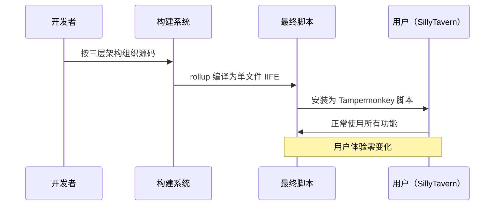

# 功能规范：三层架构重构

功能分支：`001-three-layer-refactor`
创建时间：2026-04-12
状态：Draft（草案）
输入：用户描述："将星·数据库III（AutoCardUpdater）从当前的 core/ui/features 三层粗拆结构，重构为 data / service / presentation 三层架构"

## 需求总览（必填）

### 完整故事（Epic）

星·数据库 III 是一款运行在 SillyTavern 中的 AI 对话数据库插件，用户通过它在 AI 角色扮演对话中自动追踪和更新结构化数据表（角色属性、背包物品、关系状态等），并将数据同步到酒馆的世界书中供 AI 感知。

经过三轮模块化拆分，项目已从单文件（35,283 行）拆为 28 个源码文件，但架构仍存在严重的职责混杂问题：存储逻辑、业务逻辑和界面代码交织在同一文件中，375KB 的工具函数文件和 348KB 的单体弹窗成为维护瓶颈，30+ 个全局变量散落各处。

本次重构的目标是将现有代码重新组织为清晰的三层架构（数据库层 / 服务层 / 表示层），同时引入现代构建工具链（rollup + TypeScript）替代手工文本拼接，让项目在保持对最终用户完全透明的前提下，获得可持续维护的代码结构。

重构全程渐进式推进，分为 6 个阶段（Phase 0~5），每一步都保证构建产物与基线功能完全等价——用户不会感知到任何变化，但开发者将获得职责分明、类型安全、依赖自动管理的现代化代码库。

### 核心功能点概述

- 将 28 个源码文件重新组织为 data/ service/ presentation/ shared/ 四个目录层级
- 引入 rollup + TypeScript 构建工具链替代手工文本拼接
- 将 30+ 个全局变量收归到统一状态管理器
- 拆分 375KB 工具函数文件和 348KB 单体弹窗为合理粒度的模块
- 全程保持构建产物与基线功能等价

### 业务价值

这是一次纯内部架构重构，不改变任何面向用户的功能。其价值在于：
- 消除职责混杂带来的维护瓶颈，使后续功能开发效率提升
- 通过 TypeScript 类型检查在编译期捕获错误，降低运行时 bug 率
- 通过 rollup 自动依赖管理消除手动维护拼接顺序的脆弱性
- 为未来的功能扩展（如插件化、国际化）打下架构基础

## 现有功能审计（迭代特性必填）

### 现有业务能力盘点

| 业务能力 | 当前提供的功能 | 变更类型 | 用户影响 | 备注 |
|---------|-------------|---------|---------|------|
| 表格自动更新 | AI 回复后自动分析对话并更新数据表 | 不变 | 无 | 核心功能，重构后行为完全等价 |
| 表格手动更新 | 用户手动触发指定表格的 AI 更新 | 不变 | 无 | |
| 可视化编辑器 | 直接查看和编辑表格数据，支持单元格级操作 | 不变 | 无 | |
| 模板管理 | 全局/聊天级模板预设的导入导出切换 | 不变 | 无 | |
| 剧情推进 | 独立的 AI 调用，生成剧情规划/记忆回溯 | 不变 | 无 | 支持多预设、数据隔离 |
| 正文替换 | 对 AI 回复进行后处理优化 | 不变 | 无 | 支持并行模式 |
| 外部导入 | TXT 文件导入、分块、多种注入方式 | 不变 | 无 | |
| 配置管理 | 一键导出/导入所有设置和数据 | 不变 | 无 | |
| 纪要合并 | 自动/手动合并历史对话纪要 | 不变 | 无 | |
| 世界书注入 | 表格数据转换为世界书条目注入酒馆 | 不变 | 无 | |
| 外部 API | 通过全局对象向其他插件暴露编程接口 | 不变 | 无 | 80+ 个 API 方法 |
| 0TK 占用模式 | 快速切换世界书条目启用/禁用状态 | 不变 | 无 | |

### 业务能力差异分析

| 业务场景 | 当前能力 | 目标能力 | 差异说明 | 用户影响 |
|---------|---------|---------|---------|---------|
| 所有用户功能 | 完整可用 | 完整可用 | 无功能变化 | 零影响 |
| 安装脚本 | 安装单文件 JS | 安装单文件 JS | 产物格式不变 | 零影响 |
| 与其他插件集成 | 通过全局 API 对象交互 | 通过同一全局 API 对象交互 | API 接口不变 | 零影响 |

### 兼容性与影响

- 向后兼容约束：所有面向用户的功能和 API 接口 MUST 保持完全兼容
- 迁移/废弃计划：无需用户侧迁移
- 用户影响：零影响——用户拿到的仍然是同一个 Tampermonkey 脚本

### 业务约束与已知问题

- 当前限制：项目运行在 Tampermonkey + SillyTavern iframe 环境中，最终产物必须是单个 IIFE 闭包 JS 文件
- 已知痛点：375KB 的工具函数文件和 348KB 的单体弹窗是维护瓶颈；30+ 个全局变量散落各处；手工拼接构建脆弱
- 业务规则：三种存储后端（酒馆设置、IndexedDB、聊天消息自定义字段）需要统一抽象

## 详细用户故事（必填）

### 用户故事 1 - 构建工具链搭建（优先级：P1）

作为开发者，我需要将手工文本拼接替换为 rollup + TypeScript 构建工具链，以便后续的模块拆分可以使用标准的 import/export 语法，并获得类型检查的安全网。

优先级原因：这是所有后续重构步骤的前提——没有构建工具链，就无法使用模块化语法。

独立测试：构建后产物与基线 index.js 逐字节一致，在 SillyTavern 中全部功能正常。

功能要点：
- rollup 配置输出 IIFE 格式单文件，复现现有拼接行为
- TypeScript 配置启用 allowJs 让 .js 和 .ts 共存
- 构建产物保留 UserScript 头
- 构建产物不包含任何 ES Module 或 TypeScript 语法残留

验收场景：
1. 给定当前 28 个源码文件，当执行 rollup 构建，则产物与 index.js 完全一致
2. 给定构建产物，当在 SillyTavern 中安装，则 8 个分页、手动更新、自动更新、可视化编辑器、外部导入、纪要合并、配置导入导出、数据隔离全部正常

---

### 用户故事 2 - 共享层抽取（优先级：P1）

作为开发者，我需要从巨型工具函数文件中提取跨层共用的纯工具函数到独立的共享层，并对 235+ 个函数进行分类，为后续三层分流做准备。

优先级原因：共享层是三层架构的基座，决定了后续每个函数放到哪一层。

独立测试：构建产物功能等价，函数分类表完整覆盖所有工具函数。

功能要点：
- 从 375KB 工具函数文件中提取纯工具函数到 shared/utils.js
- 提取 JSON 解析/清洗工具到 shared/json-helpers.js
- 提取环境常量到 shared/env.js 和 shared/constants.js
- 对 235+ 个函数建立「纯工具/数据操作/业务逻辑」三类分类表

验收场景：
1. 给定函数分类表，当审查每个函数，则每个函数有且仅有一个分类归属
2. 给定构建产物，当在 SillyTavern 中测试，则所有功能正常

---

### 用户故事 3 - 数据库层建立（优先级：P1）

作为开发者，我需要将散落在多个文件中的存储逻辑、数据模型和持久化操作收归到统一的数据库层，并建立 Repository 接口抽象。

优先级原因：数据库层是最关键的一步，决定了后续服务层和表示层的接口形态。

独立测试：构建产物功能等价，三种存储后端通过统一接口访问。

功能要点：
- 提取存储后端抽象（酒馆设置、IndexedDB、聊天消息字段）到 data/storage/
- 提取数据模型定义（设置默认值、表格结构、模板结构）到 data/models/
- 提取数据持久化逻辑到 data/repositories/
- 创建统一的 Repository CRUD 接口

验收场景：
1. 给定数据库层代码，当检查依赖关系，则不存在对 DOM 或业务逻辑的直接依赖
2. 给定构建产物，当执行配置导入导出和数据隔离切换，则行为与基线一致

---

### 用户故事 4 - 服务层建立（优先级：P2）

作为开发者，我需要将业务逻辑从 core/ 和 features/ 迁移到独立的服务层，实现业务逻辑与 UI 和存储的完全解耦。

优先级原因：服务层是连接数据库层和表示层的枢纽，但依赖数据库层先完成。

独立测试：构建产物功能等价，服务层代码不包含 DOM 操作或直接存储访问。

功能要点：
- 迁移 AI 调用链路（提示词组装、API 调用、响应解析）到 service/ai/
- 迁移表格更新编排（批次、重试、并行组、合并引擎）到 service/table/
- 迁移世界书注入服务到 service/worldbook/
- 迁移外部导入服务、纪要合并、配置管理到对应 service 子目录
- 建立事件总线和全局状态管理器

验收场景：
1. 给定服务层代码，当检查依赖关系，则不存在 DOM 操作或直接存储后端调用
2. 给定构建产物，当执行手动更新和自动更新，则 AI 调用、数据合并、世界书注入全部正常

---

### 用户故事 5 - 表示层重组（优先级：P2）

作为开发者，我需要将 348KB 的单体弹窗和 120KB 的可视化编辑器拆分为合理粒度的页面组件，表示层只负责渲染和交互，通过服务层获取/提交数据。

优先级原因：表示层是最大的单体文件所在，但依赖服务层先完成。

独立测试：构建产物功能等价，主弹窗 8 个分页和可视化编辑器全部可用。

功能要点：
- 拆分主弹窗为外壳+导航、各分页、事件绑定等独立模块
- 拆分可视化编辑器为外壳、侧栏、主编辑区
- 迁移窗口系统、主题引擎、Toast 通知到表示层
- 分离世界书 UI 选择部分和运行时状态展示部分

验收场景：
1. 给定构建产物，当打开主弹窗，则 8 个分页（状态&操作、AI指令预设、API&连接、世界书、数据管理、外部导入、剧情推进、正文替换）全部可访问且功能正常
2. 给定构建产物，当打开可视化编辑器，则侧栏导航、主编辑区、保存功能全部正常

---

### 用户故事 6 - 清理与收束（优先级：P3）

作为开发者，我需要清理残留的旧目录结构，统一应用入口，更新构建配置和文档，完成整个重构闭环。

优先级原因：这是收尾工作，依赖前面所有步骤完成。

独立测试：最终构建产物功能完全等价，目录结构符合目标三层架构。

功能要点：
- 清理残留的 core/ 碎片
- 统一入口 app.js 替代 startup/
- 更新 rollup 构建配置为最终依赖图顺序
- 更新项目文档

验收场景：
1. 给定最终目录结构，当检查每个文件，则全部位于正确的层级（data/ service/ presentation/ shared/）
2. 给定构建产物，当执行完整功能测试，则所有 12 项业务能力全部正常

### 边界情况

- 当 rollup 构建产物与基线不一致时，MUST 停止后续步骤，排查差异原因
- 当某个函数同时被多层依赖时，SHOULD 放入 shared/ 而非强行归入某一层
- 当旧文件中存在隐式依赖（函数 A 依赖先于 B 声明的变量）时，MUST 通过依赖分析确定正确的 import 顺序
- 当拆分 HTML 模板字符串时，切割点 MUST 选在完整语句边界，不截断模板

## 功能性需求（必填）

- FR-001：重构后的构建产物 MUST 是单个 IIFE 闭包 JS 文件，可直接作为 Tampermonkey UserScript 安装
- FR-002：重构后的所有面向用户的功能 MUST 与基线 index.js 行为完全等价
- FR-003：重构后的外部 API（window.AutoCardUpdaterAPI）MUST 保持所有 80+ 个方法的接口签名和行为不变
- FR-004：每个 Phase 完成后 MUST 通过构建一致性验证（Phase 0 为逐字节一致，后续为功能等价）
- FR-005：源码 MUST 按三层架构组织：data/ service/ presentation/ shared/，层间单向依赖
- FR-006：构建工具链 MUST 使用 rollup 输出 IIFE 格式，支持 TypeScript 编译
- FR-007：新拆出的文件 MUST 使用 import/export 模块化语法
- FR-008：全局可变状态 MUST 通过统一的状态管理器访问
- FR-009：构建产物中 MUST NOT 包含 ES Module 语法或 TypeScript 语法残留
- FR-010：UserScript 头 MUST 保留在构建产物顶部

### 关键实体

- **表格数据（chatSheets）**：包含 mate 元数据和多个 sheet_* 表格，每个表格有 name/content/sourceData
- **设置（settings）**：包含 AI 配置、更新参数、世界书配置、合并纪要配置等
- **模板（template）**：定义表格结构，分全局和聊天级两个作用域
- **剧情推进预设（plotPresets）**：独立的提示词组和参数配置，支持数据隔离
- **API 预设（apiPresets）**：保存不同的 AI API 连接配置

## 成功标准（必填）

### 业务与体验结果

- SC-001：重构完成后，用户在 SillyTavern 中安装脚本的方式和使用体验与重构前完全一致
- SC-002：所有 12 项业务能力（表格自动/手动更新、可视化编辑器、模板管理、剧情推进、正文替换、外部导入、配置管理、纪要合并、世界书注入、外部 API、0TK 模式、数据隔离）在重构后全部正常可用
- SC-003：依赖本插件外部 API 的第三方插件/脚本无需任何修改即可继续正常工作
- SC-004：重构后的代码库中，每个源码文件只属于一个架构层级（data/service/presentation/shared），不存在跨层职责混杂
